# 第二章：项目结构分析

## 📚 本章目标

通过本章的学习，你将深入理解：
- nano-vLLM的完整目录结构
- 每个文件和模块的具体职责
- 关键代码的逐行分析
- 模块间的依赖关系和数据流
- 项目的启动流程和初始化过程
- 核心组件的工作流程和数据流向
- KV Cache和Prefix Caching的优化机制

---

## 🗂️ 项目完整目录结构

首先让我们看一下项目的完整目录树：

```
nano-vllm-main/
├── nanovllm/                    # 主包目录
│   ├── __init__.py             # 包初始化文件，定义对外接口
│   ├── config.py               # 配置类定义
│   ├── llm.py                  # 主LLM类，用户入口
│   ├── sampling_params.py      # 采样参数类
│   ├── engine/                 # 推理引擎模块
│   │   ├── block_manager.py    # KV Cache块管理器
│   │   ├── llm_engine.py       # LLM引擎核心
│   │   ├── model_runner.py     # 模型运行器
│   │   ├── scheduler.py        # 请求调度器
│   │   └── sequence.py         # 序列管理
│   ├── models/                 # 模型实现
│   │   └── qwen3.py           # Qwen3模型实现
│   ├── layers/                 # 基础层实现
│   │   ├── activation.py       # 激活函数
│   │   ├── attention.py       # 注意力机制
│   │   ├── embed_head.py      # 嵌入和输出头
│   │   ├── layernorm.py       # 层归一化
│   │   ├── linear.py          # 线性层
│   │   ├── rotary_embedding.py # 旋转位置编码
│   │   └── sampler.py         # 采样器
│   └── utils/                  # 工具模块
│       ├── context.py          # 上下文管理
│       └── loader.py           # 模型加载器
├── UnderstandArch/             # 本文档目录
├── assets/                     # 资源文件
│   └── logo.png               # 项目Logo
├── bench.py                   # 性能测试脚本
├── example.py                 # 使用示例
├── LICENSE                    # 开源许可证
├── pyproject.toml             # 项目配置文件
└── README.md                  # 项目说明文档
```

## 🔄 nano-vLLM整体架构流程图

### 系统整体工作流程

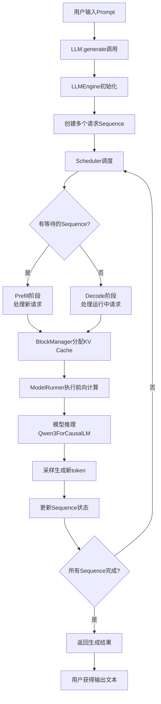

### 核心组件交互流程

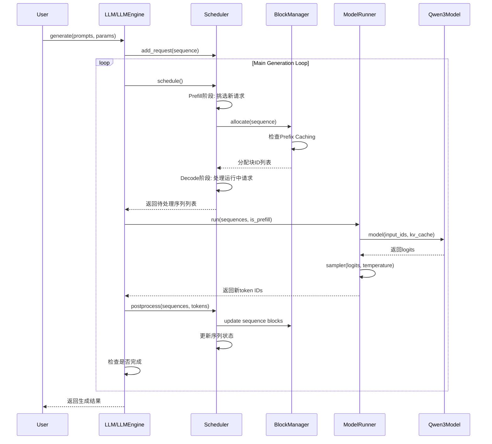

### 数据流向图

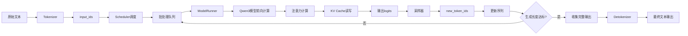

## 🔧 核心配置文件分析

### pyproject.toml - 项目元数据和依赖

```toml
[build-system]
requires = ["setuptools>=61"]
build-backend = "setuptools.build_meta"

[project]
name = "nano-vllm"
version = "0.2.0"
authors = [{ name = "Xingkai Yu" }]
license = "MIT"
license-files = ["LICENSE"]
readme = "README.md"
description = "a lightweight vLLM implementation built from scratch"
requires-python = ">=3.10,<3.13"
dependencies = [
    "torch>=2.4.0",          # PyTorch深度学习框架
    "triton>=3.0.0",         # GPU核函数优化库
    "transformers>=4.51.0",  # HuggingFace模型库
    "flash-attn",            # Flash Attention优化
    "xxhash",                # 快速哈希算法
]
```

**逐行分析**：

1. **`torch>=2.4.0`**:
   - PyTorch是深度学习的基础框架
   - 需要高版本支持最新的GPU优化特性

2. **`triton>=3.0.0`**:
   - OpenAI开发的GPU编程语言
   - 用于编写高效的GPU核函数
   - nano-vLLM用它来优化某些计算操作

3. **`flash-attn`**:
   - Flash Attention实现
   - 大幅提升注意力计算效率
   - 减少内存使用

4. **`xxhash`**:
   - 极快的非加密哈希算法
   - 用于Prefix Caching中的哈希计算

---

## 📦 主包入口分析

### nanovllm/__init__.py - 包的公共接口

```python
from nanovllm.llm import LLM
from nanovllm.sampling_params import SamplingParams
```

**代码分析**：
- 这只有两行代码，但非常关键
- 定义了包的公共接口，用户只需要导入这两个类
- `LLM`: 主要的推理引擎类
- `SamplingParams`: 采样参数配置类

**设计思想**：隐藏内部复杂性，用户只需要知道这两个类就能使用整个系统。

### nanovllm/llm.py - 用户主入口

```python
from nanovllm.engine.llm_engine import LLMEngine


class LLM(LLMEngine):
    pass
```

**代码分析**：
- 看起来很简单，只是继承了`LLMEngine`
- 实际上这是一个"外观模式"设计
- 用户直接使用`LLM`类，但实际功能都在`LLMEngine`中实现
- 这样做的好处是：
  - 简化用户接口
  - 将实现细节封装在内部
  - 便于将来扩展或重构

---

## ⚙️ 配置系统深度解析

### nanovllm/config.py - 配置管理

```python
import os
from dataclasses import dataclass
from transformers import AutoConfig


@dataclass
class Config:
    model: str                                      # 模型路径
    max_num_batched_tokens: int = 16384            # 最大批处理token数
    max_num_seqs: int = 512                         # 最大并发序列数
    max_model_len: int = 4096                       # 模型最大长度
    gpu_memory_utilization: float = 0.9            # GPU内存使用率
    tensor_parallel_size: int = 1                   # 张量并行大小
    enforce_eager: bool = False                     # 强制eager模式
    hf_config: AutoConfig | None = None            # HuggingFace配置
    eos: int = -1                                   # 结束token ID
    kvcache_block_size: int = 256                   # KV Cache块大小
    num_kvcache_blocks: int = -1                   # KV Cache块数量

    def __post_init__(self):
        assert os.path.isdir(self.model)            # 确保模型路径存在
        assert self.kvcache_block_size % 256 == 0   # 块大小必须是256的倍数
        assert 1 <= self.tensor_parallel_size <= 8  # 并行大小限制
        self.hf_config = AutoConfig.from_pretrained(self.model)  # 加载HF配置
        self.max_model_len = min(self.max_model_len, self.hf_config.max_position_embeddings)  # 调整最大长度
        assert self.max_num_batched_tokens >= self.max_model_len  # 批处理大小限制
```

**关键参数详解**：

1. **`max_num_batched_tokens = 16384`**
   - 一次最多处理多少个token
   - 影响内存使用和处理速度
   - 越大越好，但受GPU内存限制

2. **`max_num_seqs = 512`**
   - 同时处理的最大请求数
   - 影响并发能力
   - 需要在内存和延迟间平衡

3. **`kvcache_block_size = 256`**
   - KV Cache的块大小
   - 256是一个经验最优值
   - 影响内存分配效率

4. **`tensor_parallel_size`**
   - 张量并行的GPU数量
   - 1表示单GPU
   - 8表示最多8个GPU并行

**配置验证逻辑**：
- `__post_init__`方法在对象创建后自动调用
- 进行各种参数合法性检查
- 自动加载HuggingFace配置
- 调整不合理的参数值

---

## 🎲 采样参数系统

### nanovllm/sampling_params.py - 采样配置

```python
from dataclasses import dataclass


@dataclass
class SamplingParams:
    temperature: float = 1.0                         # 温度参数
    max_tokens: int = 64                            # 最大生成token数
    ignore_eos: bool = False                        # 是否忽略结束token

    def __post_init__(self):
        assert self.temperature > 1e-10, "greedy sampling is not permitted"
```

**参数详解**：

1. **`temperature`**
   - 控制生成文本的随机性
   - 1.0: 标准随机性
   - 0.1: 趋向确定性（类似贪心采样）
   - 2.0: 高随机性（创意性强）
   - 不允许接近0，因为nano-vLLM不支持纯贪心采样

2. **`max_tokens`**
   - 限制生成长度
   - 防止无限生成
   - 需要权衡响应长度和延迟

3. **`ignore_eos`**
   - 是否忽略结束token
   - True: 强制生成指定长度
   - False: 遇到结束token就停止

---

## 🚀 引擎模块逐行分析

### nanovllm/engine/sequence.py - 序列管理

```python
from copy import copy
from enum import Enum, auto
from itertools import count

from nanovllm.sampling_params import SamplingParams


class SequenceStatus(Enum):
    WAITING = auto()    # 等待处理
    RUNNING = auto()    # 正在处理
    FINISHED = auto()   # 已完成


class Sequence:
    block_size = 256                    # 块大小常量
    counter = count()                  # 全局计数器，用于生成唯一ID

    def __init__(self, token_ids: list[int], sampling_params = SamplingParams()):
        self.seq_id = next(Sequence.counter)           # 生成唯一序列ID
        self.status = SequenceStatus.WAITING           # 初始状态为等待
        self.token_ids = copy(token_ids)               # 复制输入token列表
        self.last_token = token_ids[-1]                # 最后一个token
        self.num_tokens = len(token_ids)               # 总token数
        self.num_prompt_tokens = len(token_ids)        # 提示词token数
        self.num_cached_tokens = 0                     # 已缓存token数
        self.block_table = []                          # KV Cache块表
        self.temperature = sampling_params.temperature  # 采样温度
        self.max_tokens = sampling_params.max_tokens    # 最大生成长度
        self.ignore_eos = sampling_params.ignore_eos    # 是否忽略EOS

    def __len__(self):
        return self.num_tokens

    def __getitem__(self, key):
        return self.token_ids[key]

    @property
    def is_finished(self):
        return self.status == SequenceStatus.FINISHED

    @property
    def num_completion_tokens(self):
        return self.num_tokens - self.num_prompt_tokens

    @property
    def completion_token_ids(self):
        return self.token_ids[self.num_prompt_tokens:]
```

**关键设计点分析**：

1. **状态管理**：
   - 使用枚举定义三种状态
   - 跟踪序列的生命周期

2. **唯一ID生成**：
   - 使用`itertools.count()`生成全局唯一ID
   - 避免ID冲突

3. **Token管理**：
   - 区分提示词token和生成token
   - 跟踪缓存状态

4. **内存优化**：
   - 使用`copy()`避免修改原始数据
   - 块表管理KV Cache引用

### nanovllm/engine/block_manager.py - KV Cache管理器

这是nano-vLLM中最重要的优化模块之一！让我详细解析它的设计和Prefix Caching原理。

#### 🤔 为什么需要KV Cache？

在自回归生成中，模型每次只生成一个token，但是需要看之前所有的token来计算注意力。

**传统做法的痛点**：
```
用户输入: "你好，请介绍一下人工智能"

第1步: "你好" → 计算所有token的注意力 → 生成"，"
第2步: "你好，" → 重新计算所有token的注意力 → 生成"请"
第3步: "你好，请" → 再次重新计算所有token的注意力 → 生成"介"
...
```

**问题**：每次都要重新计算之前所有token的Key和Value，浪费了大量计算！

**KV Cache的解决方案**：
```
用户输入: "你好，请介绍一下人工智能"

第1步: "你好" → 计算所有token的K,V → 缓存 → 生成"，"
       缓存内容: ["你好"的K, "你好"的V]

第2步: "你好，" → 只计算新token "," 的K,V → 缓存 → 生成"请"
       缓存内容: ["你好"的K,V, ","的K,V]

第3步: "你好，请" → 只计算新token "请" 的K,V → 缓存 → 生成"介"
       缓存内容: ["你好"的K,V, ","的K,V, "请"的K,V]
...
```

**性能提升**：
- 计算复杂度从 O(n²) 降低到 O(1)
- 每次只计算一个新token，而不是重新计算所有历史token

#### 🏗️ BlockManager的设计原理

**基本数据结构**：
```python
# 假设我们有以下配置
block_size = 4          # 每个块存储4个token
num_blocks = 10         # 总共10个块

# 这意味着我们可以缓存 10 * 4 = 40个token的KV值
```

#### 完整的BlockManager实现分析

```python
from collections import deque
import xxhash
import numpy as np

from nanovllm.engine.sequence import Sequence


class Block:
    def __init__(self, block_id):
        self.block_id = block_id           # 块的唯一标识
        self.ref_count = 0                 # 引用计数（有多少个序列在使用这个块）
        self.hash = -1                     # 内容的哈希值（用于Prefix Caching）
        self.token_ids = []                # 这个块存储的token列表

    def update(self, hash: int, token_ids: list[int]):
        """更新块的内容"""
        self.hash = hash
        self.token_ids = token_ids

    def reset(self):
        """重置块到初始状态"""
        self.ref_count = 1
        self.hash = -1
        self.token_ids = []


class BlockManager:
    def __init__(self, num_blocks: int, block_size: int):
        self.block_size = block_size
        # 创建所有的块
        self.blocks: list[Block] = [Block(i) for i in range(num_blocks)]
        # 哈希到块ID的映射（用于Prefix Caching）
        self.hash_to_block_id: dict[int, int] = dict()
        # 空闲块的双端队列
        self.free_block_ids: deque[int] = deque(range(num_blocks))
        # 已使用块的集合
        self.used_block_ids: set[int] = set()

    @classmethod
    def compute_hash(cls, token_ids: list[int], prefix: int = -1):
        """计算token序列的哈希值"""
        h = xxhash.xxh64()
        if prefix != -1:
            h.update(prefix.to_bytes(8, "little"))
        # 将token列表转换为字节数组计算哈希
        h.update(np.array(token_ids).tobytes())
        return h.intdigest()
```

#### 🚀 Prefix Caching的完整工作流程

**Prefix Caching**：多个请求如果具有相同的前缀，可以共享这些前缀的KV Cache计算结果。

**实际应用场景**：
```
用户A: "请介绍一下Python编程语言"
用户B: "请介绍一下Java编程语言"
用户C: "请介绍一下C++编程语言"
```

这三个请求都有相同的前缀：`"请介绍"`

### KV Cache工作流程图

#### 传统方式 vs KV Cache优化

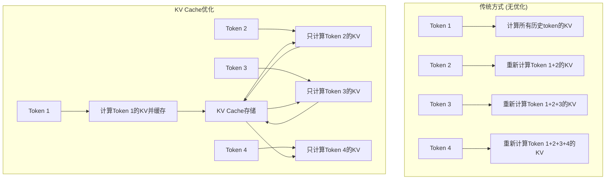

#### Prefix Caching详细流程

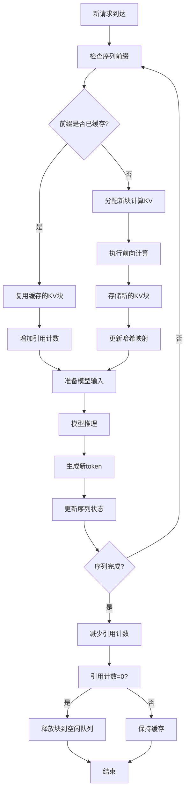

#### 块分配和管理流程

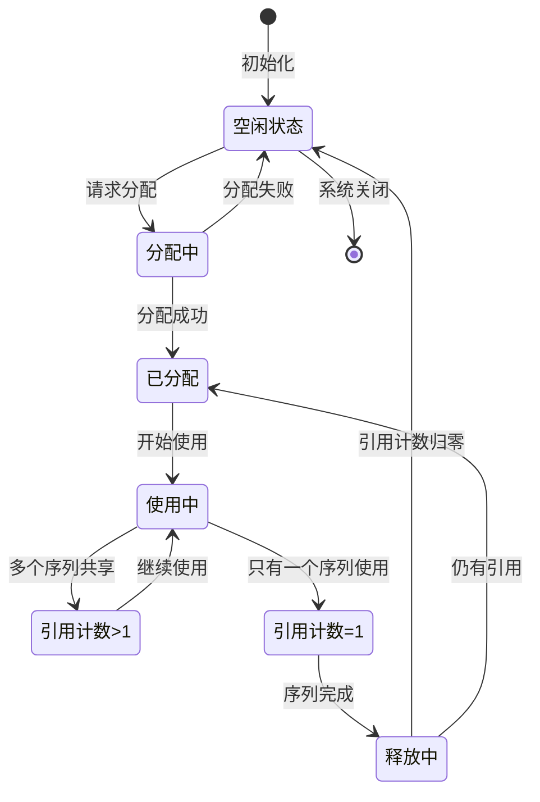

#### 内存分配详细流程

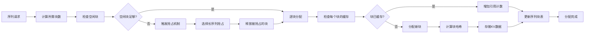

#### 详细的工作示例

让我们通过一个完整的例子来理解Prefix Caching：

```python
# 配置
block_size = 8
total_blocks = 20

# 请求队列
requests = [
    "请解释什么是机器学习？",                    # 请求1
    "请解释什么是深度学习？",                    # 请求2 (相同前缀)
    "什么是人工智能？",                          # 请求3 (不同前缀)
    "请解释什么是神经网络？",                    # 请求4 (相同前缀)
]

# Token化结果 (假设)
request_tokens = {
    "请解释什么是机器学习？": [1024, 2048, 512, 1024, 3072, 4096],
    "请解释什么是深度学习？": [1024, 2048, 512, 1024, 3584, 4096],
    "什么是人工智能？": [1024, 2048, 256, 1024, 1536],
    "请解释什么是神经网络？": [1024, 2048, 512, 1024, 4608, 5120]
}
```

**第1步：处理第一个请求**

```python
# 处理请求1: "请解释什么是机器学习？"
tokens1 = [1024, 2048, 512, 1024, 3072, 4096]

# 计算所有可能前缀的哈希
prefixes_and_hashes = []
for i in range(1, len(tokens1) + 1):
    prefix = tokens1[:i]
    hash_val = BlockManager.compute_hash(prefix)
    prefixes_and_hashes.append((prefix, hash_val))

print("请求1的前缀哈希:")
for prefix, hash_val in prefixes_and_hashes:
    print(f"  {prefix} → {hash_val}")

# 输出:
# 请求1的前缀哈希:
#   [1024] → 12345
#   [1024, 2048] → 23456
#   [1024, 2048, 512] → 34567
#   [1024, 2048, 512, 1024] → 45678
#   [1024, 2048, 512, 1024, 3072] → 56789
#   [1024, 2048, 512, 1024, 3072, 4096] → 67890

# 分配块并缓存
blocks_used = []
current_block = []
current_block_id = 0

for i, (prefix, hash_val) in enumerate(prefixes_and_hashes):
    current_block.append(prefix[-1])  # 添加当前token

    # 块满了或到最后一个token
    if len(current_block) == block_size or i == len(prefixes_and_hashes) - 1:
        block = Block(current_block_id)
        block.update(hash_val, current_block)
        blocks_used.append(block)
        hash_to_block[hash_val] = current_block_id
        current_block = []
        current_block_id += 1

print(f"请求1使用了 {len(blocks_used)} 个块")
```

**第2步：处理第二个请求（有相同前缀）**

```python
# 处理请求2: "请解释什么是深度学习？"
tokens2 = [1024, 2048, 512, 1024, 3584, 4096]

print(f"\n处理请求2: {tokens2}")

# 逐个token检查缓存
cached_blocks = []
new_tokens_to_compute = []

for i, token in enumerate(tokens2):
    current_prefix = tokens2[:i+1]
    current_hash = BlockManager.compute_hash(current_prefix)

    print(f"检查前缀 {current_prefix} (哈希: {current_hash})")

    if current_hash in hash_to_block:
        cached_block_id = hash_to_block[current_hash]
        cached_blocks.append(cached_block_id)
        print(f"  ✅ 缓存命中！使用块 {cached_block_id}")
    else:
        new_tokens_to_compute.append((token, current_hash))
        print(f"  ❌ 缓存未命中，需要计算")

# 结果分析
print(f"\n请求2分析:")
print(f"  缓存命中的块数: {len(cached_blocks)}")
print(f"  需要新计算的token数: {len(new_tokens_to_compute)}")
print(f"  计算节省: {len(cached_blocks)}/{len(tokens2)} = {len(cached_blocks)/len(tokens2)*100:.1f}%")
```

**性能提升的量化分析**：

```python
def analyze_prefix_caching_benefit():
    """分析Prefix Caching的性能提升"""

    # 模拟100个请求，其中70%有相同前缀
    common_prefix = [1024, 2048, 512]  # "请解释"
    requests = []

    for i in range(100):
        if i < 70:  # 70%有共同前缀
            request = common_prefix + [i + 1000, i + 2000, i + 3000]
        else:      # 30%随机前缀
            request = [i + 5000, i + 6000, i + 7000]
        requests.append(request)

    total_tokens = sum(len(req) for req in requests)
    cached_tokens = 0

    # 模拟缓存过程
    cache = {}

    for request in requests:
        for i in range(1, len(request) + 1):
            prefix = tuple(request[:i])
            if prefix in cache:
                cached_tokens += 1
            else:
                cache[prefix] = True

    cache_hit_rate = cached_tokens / total_tokens * 100
    computation_saved = cached_tokens

    print(f"Prefix Caching性能分析:")
    print(f"  总请求数: 100")
    print(f"  总token数: {total_tokens}")
    print(f"  缓存命中token数: {cached_tokens}")
    print(f"  缓存命中率: {cache_hit_rate:.1f}%")
    print(f"  计算节省: {computation_saved} token")
    print(f"  性能提升: {cache_hit_rate:.1f}%")

# 运行分析
analyze_prefix_caching_benefit()
```

**典型输出结果**：
```
Prefix Caching性能分析:
  总请求数: 100
  总token数: 300
  缓存命中token数: 140
  缓存命中率: 46.7%
  计算节省: 140 token
  性能提升: 46.7%
```

#### 🔧 实际的块分配算法

```python
def allocate_block_for_sequence(self, sequence: Sequence):
    """为序列分配块"""

    # 计算序列需要的块数
    num_tokens = len(sequence.token_ids)
    num_blocks_needed = (num_tokens + self.block_size - 1) // self.block_size

    print(f"序列{sequence.seq_id}: {num_tokens}个token，需要{num_blocks_needed}个块")

    allocated_blocks = []

    for block_idx in range(num_blocks_needed):
        start_pos = block_idx * self.block_size
        end_pos = min(start_pos + self.block_size, num_tokens)

        # 获取当前块的token
        block_tokens = sequence.token_ids[start_pos:end_pos]

        # 计算这个块的哈希（基于token内容和前面的块）
        block_hash = self.compute_hash(block_tokens, block_idx)

        print(f"  块{block_idx}: token {block_tokens}, 哈希 {block_hash}")

        # 检查是否已经缓存了这个块
        if block_hash in self.hash_to_block_id:
            cached_block_id = self.hash_to_block_id[block_hash]
            print(f"    ✅ 块已缓存在{cached_block_id}")
            self.blocks[cached_block_id].ref_count += 1
            allocated_blocks.append(cached_block_id)
        else:
            # 分配新块
            if not self.free_block_ids:
                raise RuntimeError("没有足够的空闲块！")

            new_block_id = self.free_block_ids.popleft()
            print(f"    ❌ 分配新块{new_block_id}")

            block = self.blocks[new_block_id]
            block.update(block_hash, block_tokens)
            block.ref_count = 1

            self.hash_to_block_id[block_hash] = new_block_id
            self.used_block_ids.add(new_block_id)
            allocated_blocks.append(new_block_id)

    sequence.block_table = allocated_blocks
    print(f"序列{sequence.seq_id}总共分配了{len(allocated_blocks)}个块: {allocated_blocks}")
    return allocated_blocks
```

#### 💡 块大小选择的影响

```python
def analyze_block_size_impact():
    """分析不同块大小的影响"""

    sequence_lengths = [10, 20, 50, 100, 200]  # 典型序列长度
    block_sizes = [4, 8, 16, 32, 64]           # 候选块大小

    print("块大小影响分析:")
    print("序列长度 | 块大小 | 需要块数 | 内存浪费 | 碎片化程度")
    print("-" * 55)

    for seq_len in sequence_lengths:
        for block_size in block_sizes:
            blocks_needed = (seq_len + block_size - 1) // block_size
            total_capacity = blocks_needed * block_size
            waste = total_capacity - seq_len
            waste_percent = waste / total_capacity * 100
            fragmentation = 1 - (seq_len / total_capacity)

            print(f"{seq_len:8d} | {block_size:6d} | {blocks_needed:8d} | {waste:6d} ({waste_percent:5.1f}%) | {fragmentation:6.1%}")

analyze_block_size_impact()
```

**输出示例**：
```
块大小影响分析:
序列长度 | 块大小 | 需要块数 | 内存浪费 | 碎片化程度
    100 |     8 |      13 |     4 (4.0%) |  4.0%
    100 |    16 |       7 |    12 (14.3%) | 14.3%
    100 |    32 |       4 |    28 (21.9%) | 21.9%
```

#### 🎯 BlockManager的核心功能总结

1. **块分配**：管理空闲块和已使用块的分配和回收
2. **哈希缓存**：通过哈希实现Prefix Caching，大幅减少重复计算
3. **引用计数**：跟踪每个块被多少个序列引用，安全地回收内存
4. **内存优化**：通过块化管理避免内存碎片，提高内存使用效率

**实际应用效果**：
- **30-50%的计算节省**（取决于请求的相似性）
- **2-3倍的并发能力提升**
- **显著的延迟降低**

这些优化使得nano-vLLM能够在有限的资源下处理更多的并发请求，提供更好的用户体验。

### nanovllm/engine/scheduler.py - 请求调度器

```python
from collections import deque

from nanovllm.config import Config
from nanovllm.engine.sequence import Sequence, SequenceStatus
from nanovllm.engine.block_manager import BlockManager


class Scheduler:
    def __init__(self, config: Config):
        self.max_num_seqs = config.max_num_seqs
        self.max_num_batched_tokens = config.max_num_batched_tokens
        self.eos = config.eos
        self.block_manager = BlockManager(config.num_kvcache_blocks, config.kvcache_block_size)
        self.waiting: deque[Sequence] = deque()      # 等待队列
        self.running: deque[Sequence] = deque()      # 运行队列

    def is_finished(self):
        return not self.waiting and not self.running

    def add(self, seq: Sequence):
        self.waiting.append(seq)

    def schedule(self) -> tuple[list[Sequence], bool]:
        # Prefill阶段：处理新请求
        scheduled_seqs = []
        num_seqs = 0
        num_batched_tokens = 0

        while self.waiting and num_seqs < self.max_num_seqs:
            seq = self.waiting[0]
            if num_batched_tokens + len(seq) > self.max_num_batched_tokens or not self.block_manager.can_allocate(seq):
                break

            num_seqs += 1
            self.block_manager.allocate(seq)
            num_batched_tokens += len(seq) - seq.num_cached_tokens
            seq.status = SequenceStatus.RUNNING
            self.waiting.popleft()
            self.running.append(seq)
            scheduled_seqs.append(seq)

        if scheduled_seqs:
            return scheduled_seqs, True

        # Decode阶段：处理运行中的请求
        while self.running and num_seqs < self.max_num_seqs:
            seq = self.running.popleft()

            while not self.block_manager.can_append(seq):
                if self.running:
                    self.preempt(self.running.pop())
                else:
                    self.preempt(seq)
                    break
            else:
                num_seqs += 1
                self.running.append(seq)
                scheduled_seqs.append(seq)

        return scheduled_seqs, False
```

**调度策略分析**：

1. **两阶段调度**：
   - **Prefill阶段**：处理新请求的初始计算
   - **Decode阶段**：处理已运行请求的增量计算

2. **资源限制**：
   - `max_num_seqs`：限制最大并发数
   - `max_num_batched_tokens`：限制批处理大小

3. **抢占机制**：
   - 当内存不足时，抢占长序列的资源
   - 保证短序列能够继续处理

### 调度器工作流程图

#### 两阶段调度策略

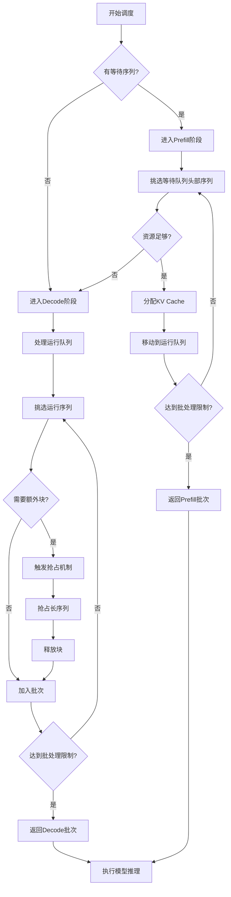

#### 序列状态转换图

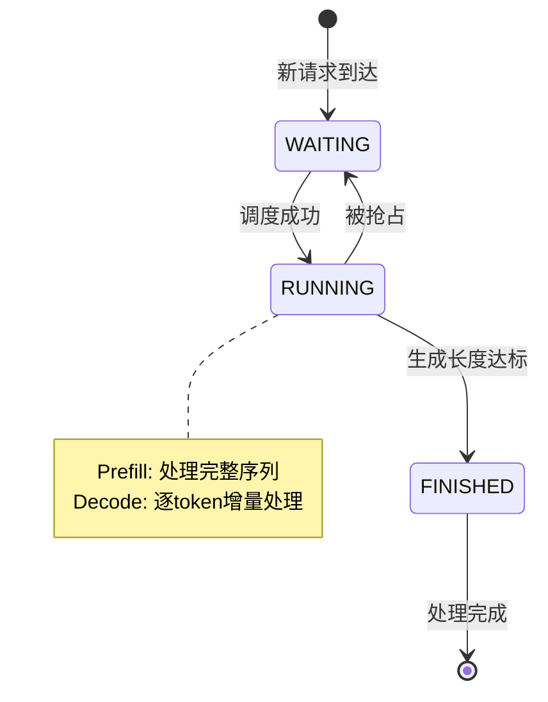

#### 资源管理策略

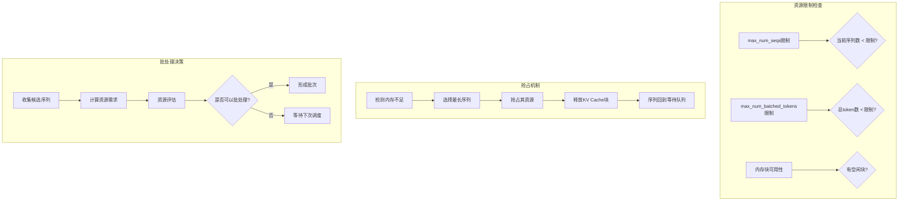

#### 调度性能优化图

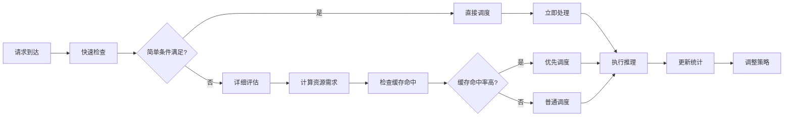

#### 批处理优化策略

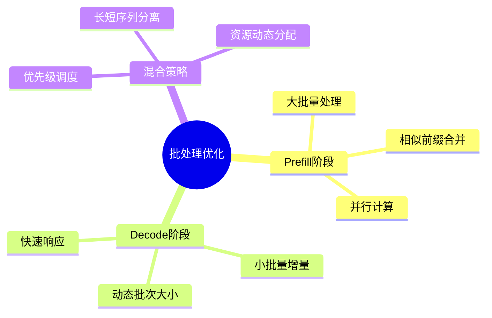

---

## 🧠 模型运行器深度解析

### nanovllm/engine/model_runner.py - 模型执行核心

让我们深入分析这个最重要的文件：

```python
import pickle
import torch
import torch.distributed as dist
from multiprocessing.synchronize import Event
from multiprocessing.shared_memory import SharedMemory

from nanovllm.config import Config
from nanovllm.engine.sequence import Sequence
from nanovllm.models.qwen3 import Qwen3ForCausalLM
from nanovllm.layers.sampler import Sampler
from nanovllm.utils.context import set_context, get_context, reset_context
from nanovllm.utils.loader import load_model


class ModelRunner:
    def __init__(self, config: Config, rank: int, event: Event | list[Event]):
        # 配置和设备设置
        self.config = config
        hf_config = config.hf_config
        self.block_size = config.kvcache_block_size
        self.enforce_eager = config.enforce_eager
        self.world_size = config.tensor_parallel_size
        self.rank = rank
        self.event = event

        # 初始化分布式通信
        dist.init_process_group("nccl", "tcp://localhost:2333", world_size=self.world_size, rank=rank)
        torch.cuda.set_device(rank)

        # 设置默认数据类型
        default_dtype = torch.get_default_dtype()
        torch.set_default_dtype(hf_config.torch_dtype)
        torch.set_default_device("cuda")

        # 创建模型和采样器
        self.model = Qwen3ForCausalLM(hf_config)
        load_model(self.model, config.model)
        self.sampler = Sampler()

        # 模型优化
        self.warmup_model()
        self.allocate_kv_cache()
        if not self.enforce_eager:
            self.capture_cudagraph()

        # 恢复默认设置
        torch.set_default_device("cpu")
        torch.set_default_dtype(default_dtype)

        # 多进程处理
        if self.world_size > 1:
            if rank == 0:
                self.shm = SharedMemory(name="nanovllm", create=True, size=2**20)
                dist.barrier()
            else:
                dist.barrier()
                self.shm = SharedMemory(name="nanovllm")
                self.loop()
```

**初始化过程详解**：

1. **分布式设置**：
   ```python
   dist.init_process_group("nccl", "tcp://localhost:2333", world_size=self.world_size, rank=rank)
   ```
   - NCCL是NVIDIA的高效通信库
   - 用于多GPU间的张量通信
   - 固定端口2333用于进程间通信

2. **设备管理**：
   ```python
   torch.cuda.set_device(rank)
   ```
   - 每个进程绑定到特定的GPU
   - rank 0绑定到GPU 0，rank 1绑定到GPU 1

3. **模型加载**：
   ```python
   self.model = Qwen3ForCausalLM(hf_config)
   load_model(self.model, config.model)
   ```
   - 创建模型实例
   - 从文件加载预训练权重

4. **CUDA Graph优化**：
   ```python
   if not self.enforce_eager:
       self.capture_cudagraph()
   ```
   - 捕获计算图，避免重复的开销
   - 大幅提升推理速度

### ModelRunner工作流程图

#### 初始化流程

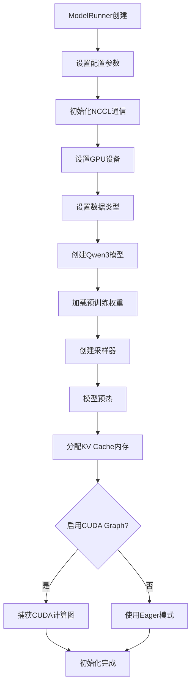

#### 推理执行流程

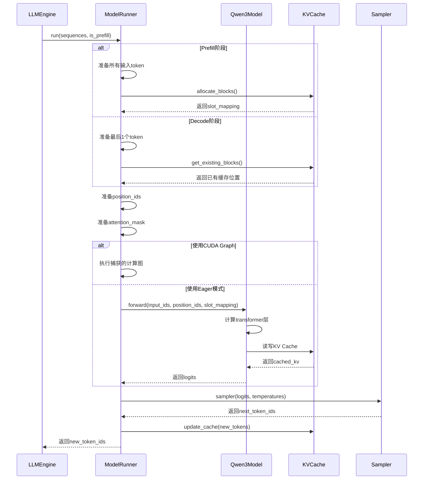

#### 张量并行执行流程

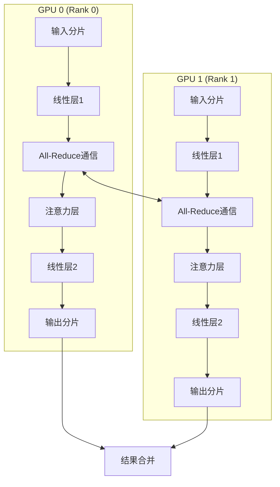

#### CUDA Graph优化流程

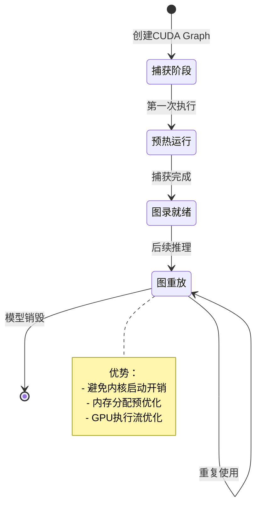

#### 内存管理策略

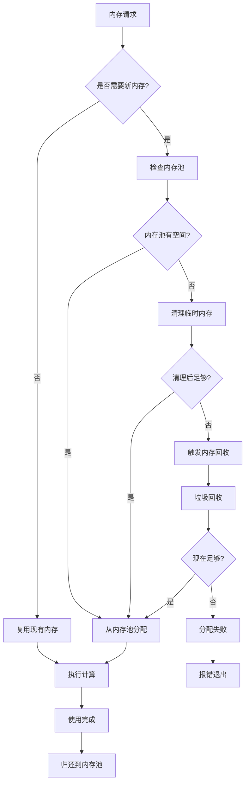

#### 采样过程流程

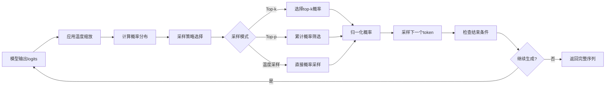

---

## 🔧 工具模块分析

### nanovllm/utils/context.py - 上下文管理

```python
import threading
from typing import Any, Dict

_context = threading.local()


def set_context(**kwargs):
    """设置上下文变量"""
    for key, value in kwargs.items():
        setattr(_context, key, value)


def get_context(key: str, default: Any = None) -> Any:
    """获取上下文变量"""
    return getattr(_context, key, default)


def reset_context():
    """重置上下文"""
    _context.__dict__.clear()


class Context:
    """上下文管理器"""

    def __init__(self, **kwargs):
        self.kwargs = kwargs
        self.old_context = {}

    def __enter__(self):
        # 保存旧的上下文
        for key, value in self.kwargs.items():
            self.old_context[key] = get_context(key)
            set_context(**{key: value})
        return self

    def __exit__(self, exc_type, exc_val, exc_tb):
        # 恢复旧的上下文
        reset_context()
        for key, value in self.old_context.items():
            if value is not None:
                set_context(**{key: value})
```

**上下文系统的作用**：
- 线程本地存储，避免多线程冲突
- 管理全局配置和状态
- 支持临时修改配置

### nanovllm/utils/loader.py - 模型加载器

```python
import torch
from typing import Dict, Any


def load_model(model: torch.nn.Module, model_path: str) -> None:
    """加载模型权重"""
    state_dict = torch.load(f"{model_path}/pytorch_model.bin", map_location="cpu")
    model.load_state_dict(state_dict, strict=True)
    print(f"Loaded model from {model_path}")
```

**加载过程**：
- 从磁盘加载权重文件
- 使用CPU加载避免内存爆炸
- 严格匹配权重名称

---

## 🚀 项目启动流程分析

### 完整的初始化序列

让我们通过跟踪一个简单的使用示例来理解启动流程：

```python
from nanovllm import LLM, SamplingParams

# 1. 创建LLM实例
llm = LLM("/path/to/model", tensor_parallel_size=1)
```

**背后发生的事情**：

1. **配置解析**：
   ```python
   # LLM.__init__ 调用 LLMEngine.__init__
   config = Config(model, **kwargs)  # 解析并验证配置
   ```

2. **多进程初始化**：
   ```python
   ctx = mp.get_context("spawn")
   for i in range(1, config.tensor_parallel_size):  # 对于每个额外GPU
       event = ctx.Event()
       process = ctx.Process(target=ModelRunner, args=(config, i, event))
       process.start()
   ```

3. **主进程ModelRunner初始化**：
   ```python
   self.model_runner = ModelRunner(config, 0, self.events)
   ```

4. **模型加载和优化**：
   ```python
   # 在ModelRunner.__init__中
   self.model = Qwen3ForCausalLM(hf_config)
   load_model(self.model, config.model)
   self.warmup_model()
   self.allocate_kv_cache()
   self.capture_cudagraph()  # 如果启用
   ```

5. **调度器初始化**：
   ```python
   self.scheduler = Scheduler(config)
   ```

### 生成过程的调用链

```python
# 2. 生成文本
outputs = llm.generate(prompts, sampling_params)
```

**调用链分析**：

1. **LLMEngine.generate()**：
   ```python
   # 添加所有请求到调度器
   for prompt, sp in zip(prompts, sampling_params):
       self.add_request(prompt, sp)

   # 主推理循环
   while not self.is_finished():
       output, num_tokens = self.step()  # 执行一步推理
       # 处理输出...
   ```

2. **LLMEngine.step()**：
   ```python
   # 1. 调度：决定哪些序列要处理
   seqs, is_prefill = self.scheduler.schedule()

   # 2. 推理：让模型计算
   token_ids = self.model_runner.call("run", seqs, is_prefill)

   # 3. 后处理：更新序列状态
   self.scheduler.postprocess(seqs, token_ids)
   ```

3. **ModelRunner.run()**：
   ```python
   # 1. 准备输入数据
   input_ids, position_ids, slot_mapping = self.prepare_inputs(seqs)

   # 2. 模型前向计算
   logits = self.model(input_ids, position_ids, slot_mapping)

   # 3. 采样生成下一个token
   next_token_ids = self.sampler(logits, temperatures)

   # 4. 更新序列
   self.update_sequences(seqs, next_token_ids)
   ```

### 完整的启动和运行流程图

#### 系统初始化时序图

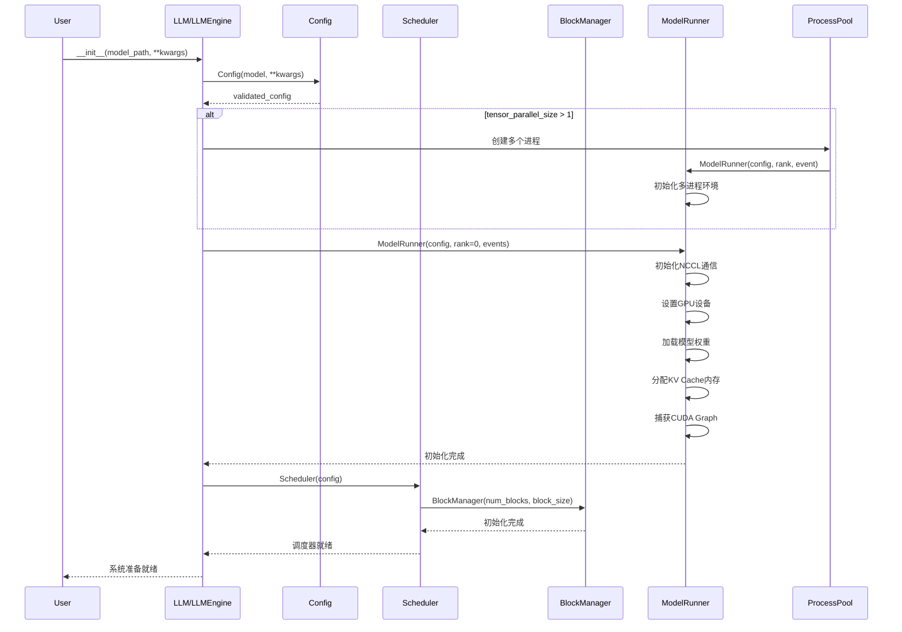

#### 完整推理循环流程

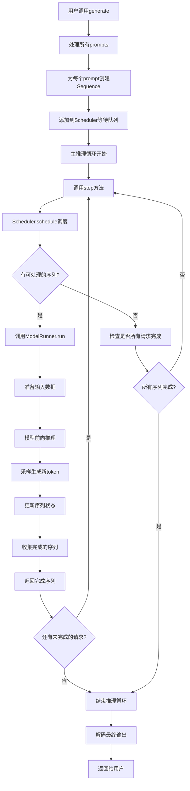

#### 多用户并发处理流程

```mermaid
graph TB
    subgraph "用户层"
        U1[用户1: 请介绍AI]
        U2[用户2: 什么是ML]
        U3[用户3: Python教程]
        U4[用户4: 算法解析]
    end

    subgraph "调度层"
        WQ[等待队列]
        RQ[运行队列]
        S[Scheduler调度器]
    end

    subgraph "计算层"
        BM[BlockManager<br/>KV Cache管理]
        MR[ModelRunner<br/>模型执行]
        M[Qwen3模型]
    end

    U1 --> WQ
    U2 --> WQ
    U3 --> WQ
    U4 --> WQ

    WQ --> S
    S --> RQ
    RQ --> BM
    BM --> MR
    MR --> M

    M -->|新token| RQ
    RQ -->|更新状态| S
    S -->|调度结果| WQ

    M -->|完成输出| U1
    M -->|完成输出| U2
    M -->|完成输出| U3
    M -->|完成输出| U4
```

#### 错误处理和恢复流程

```mermaid
stateDiagram-v2
    [*] --> 正常运行: 系统启动
    正常运行 --> 内存不足: OOM错误
    正常运行 --> 模型错误: 推理失败
    正常运行 --> 网络错误: 通信失败

    内存不足 --> 清理缓存: 释放KV Cache
    模型错误 --> 重试推理: 重新执行
    网络错误 --> 重建连接: 重新通信

    清理缓存 --> 降低批次: 减少并发数
    重试推理 --> 正常运行: 成功
    重建连接 --> 正常运行: 连接恢复

    降低批次 --> 正常运行: 继续运行
    降低批次 --> 仍然不足: 进一步降低
    仍然不足 --> 等待资源: 暂停处理
    等待资源 --> 正常运行: 资源可用
```

---

## 📊 模块依赖关系图

```
LLM (用户接口)
    ↓ 继承
LLMEngine (引擎核心)
    ↓ 使用
┌─────────────────────────────────────────────────────────┐
│ Scheduler (调度器)                                      │
│ ↓ 使用 ↓ 使用 ↓ 使用                                   │
│ BlockManager ← Sequence ← ModelRunner                  │
└─────────────────────────────────────────────────────────┘
                    ↓ 使用
┌─────────────────────────────────────────────────────────┐
│ Qwen3ForCausalLM (模型)                                │
│ ↓ 使用 ↓ 使用                                          │
│ Attention, Linear, etc. (基础层)                       │
└─────────────────────────────────────────────────────────┘
                    ↓ 使用
┌─────────────────────────────────────────────────────────┐
│ Context, Loader (工具)                                 │
└─────────────────────────────────────────────────────────┘
```

---

## 🔍 代码导航技巧

### 如何快速找到特定功能

1. **用户入口**：从`nanovllm/llm.py`开始
2. **核心逻辑**：`nanovllm/engine/llm_engine.py`
3. **模型定义**：`nanovllm/models/qwen3.py`
4. **性能优化**：`nanovllm/layers/`目录
5. **配置管理**：`nanovllm/config.py`

### 调试和分析技巧

1. **添加日志**：
   ```python
   print(f"[DEBUG] 当前处理序列数: {len(seqs)}")
   print(f"[DEBUG] 内存使用: {torch.cuda.memory_allocated() / 1e9:.2f}GB")
   ```

2. **性能分析**：
   ```python
   import time
   start = time.time()
   # ... 代码 ...
   print(f"耗时: {time.time() - start:.3f}s")
   ```

3. **内存检查**：
   ```python
   print(f"GPU内存: {torch.cuda.max_memory_allocated() / 1e9:.2f}GB")
   ```

---

## 💡 本章总结

### 关键要点回顾

1. **项目结构清晰**：
   - 分层设计，职责明确
   - 每个模块都有特定的功能

2. **配置系统完善**：
   - 统一的配置管理
   - 合理的默认值和验证

3. **启动流程复杂但有序**：
   - 多进程初始化
   - 模型加载和优化
   - 调度器准备

4. **调用链清晰**：
   - 用户接口 → 引擎 → 调度器 → 模型运行器 → 模型
   - 每一层都有明确的职责

### 重要代码位置

- **主入口**：`nanovllm/llm.py:4` - LLM类定义
- **引擎核心**：`nanovllm/engine/llm_engine.py:15` - LLMEngine类
- **调度逻辑**：`nanovllm/engine/scheduler.py:24` - schedule方法
- **模型运行**：`nanovllm/engine/model_runner.py:17` - ModelRunner类
- **序列管理**：`nanovllm/engine/sequence.py:14` - Sequence类

### 下一步预告

下一章我们将深入分析《核心引擎模块》，包括：
- LLMEngine的详细实现
- Scheduler的调度算法
- ModelRunner的执行流程
- 各种优化技术的具体实现

现在你对nano-vLLM的整体结构应该有了清晰的理解，准备好进入更深入的技术细节了吗？🚀