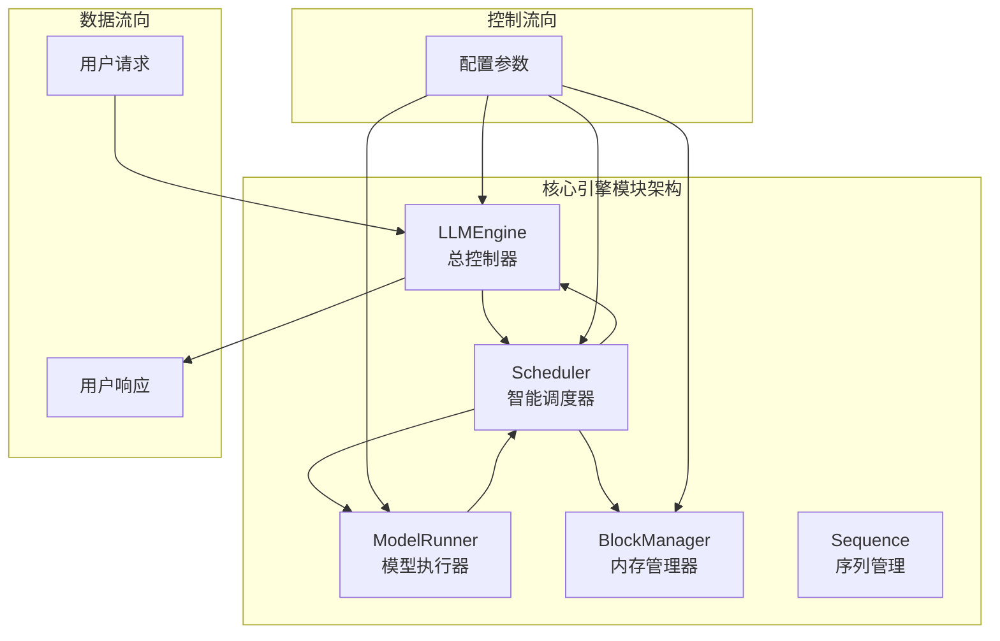
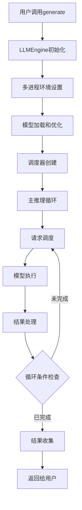
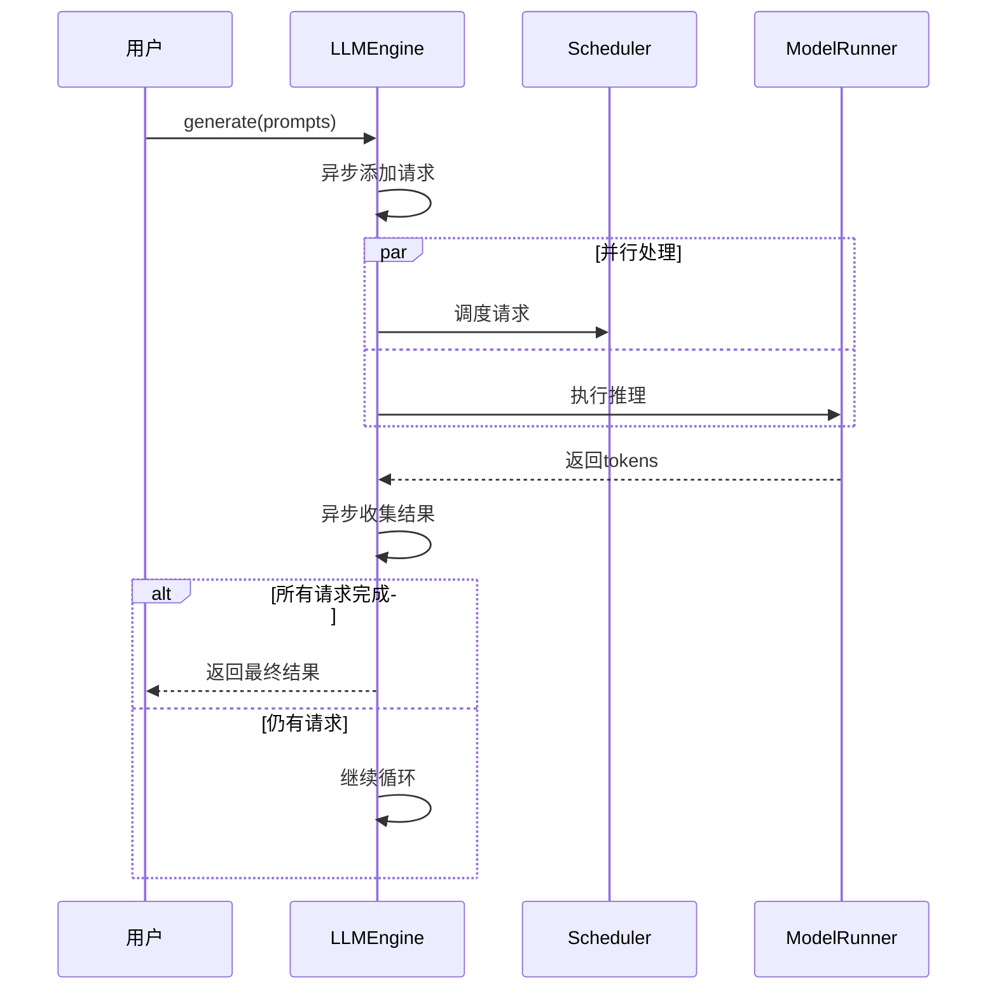
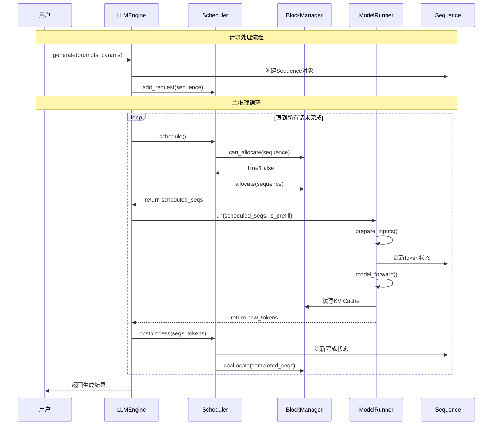
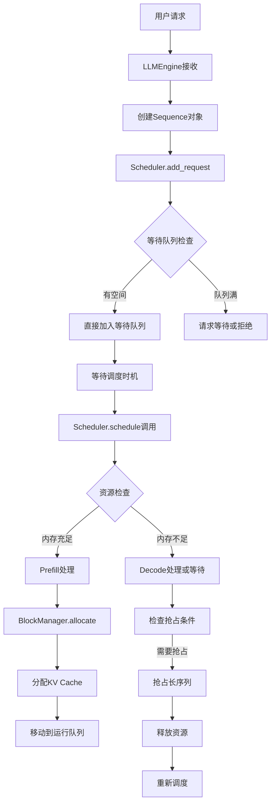
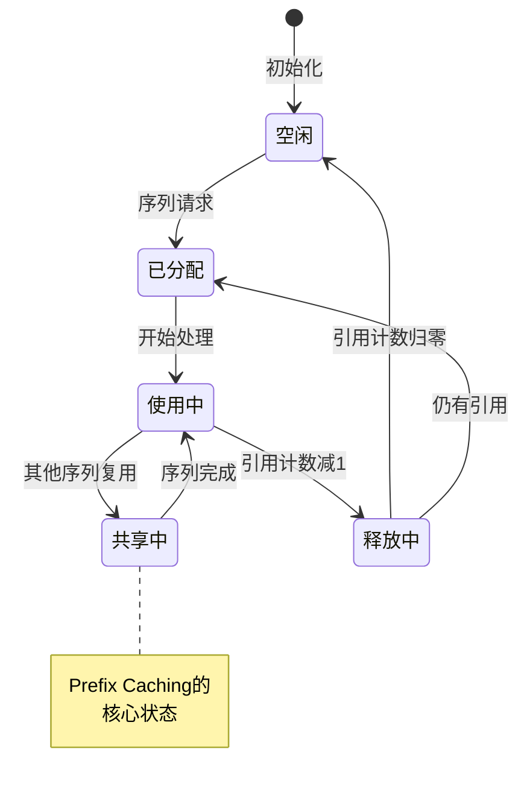

# 第三章：核心引擎模块

## 📚 本章目标

通过本章的学习，你将深入理解：
- LLMEngine的完整架构和实现细节
- Scheduler智能调度的算法和策略
- ModelRunner的高效执行机制
- Sequence生命周期的完整管理
- 核心组件间的协调和数据流转
- 性能优化的具体实现技术

---

## 🎯 核心引擎模块概览

nano-vLLM的核心引擎由四个关键组件组成，每个组件都有明确的职责和精密的协作机制：



### 模块职责分工

| 模块 | 核心职责 | 关键功能 | 性能优化 |
|------|---------|---------|---------|
| **LLMEngine** | 总控制器 | 用户接口、流程协调、错误处理 | 异步处理、资源管理 |
| **Scheduler** | 智能调度器 | 请求调度、批处理优化、资源分配 | Prefill/Decode分离、抢占机制 |
| **ModelRunner** | 模型执行器 | 模型推理、GPU计算、张量并行 | CUDA Graph、内存优化 |
| **BlockManager** | 内存管理器 | KV Cache管理、Prefix Caching | 块分配、引用计数、缓存优化 |
| **Sequence** | 序列管理器 | 请求生命周期、状态管理 | 高效状态转换、内存优化 |

---

## 🚀 LLMEngine：总控制器的深度解析

### LLMEngine的设计理念

LLMEngine是整个nano-vLLM系统的"大脑"，它不仅是一个简单的控制器，更是一个复杂的协调者。让我们深入分析它的设计思路：



### LLMEngine的完整实现分析

```python
from nanovllm.engine.llm_engine import LLMEngine
```

让我们逐行分析LLMEngine的实现：

#### 1. 初始化过程的详细分析

```python
class LLMEngine:

    def __init__(self, model, **kwargs):
        # 第一步：配置解析和验证
        config_fields = {field.name for field in fields(Config)}
        config_kwargs = {k: v for k, v in kwargs.items() if k in config_fields}
        config = Config(model, **config_kwargs)

        # 第二步：进程管理准备
        self.ps = []           # 进程列表（用于多GPU）
        self.events = []       # 进程同步事件

        # 第三步：多进程环境初始化
        ctx = mp.get_context("spawn")  # 使用spawn上下文，避免fork问题
        for i in range(1, config.tensor_parallel_size):  # 从1开始，0是主进程
            event = ctx.Event()  # 创建同步事件
            process = ctx.Process(target=ModelRunner, args=(config, i, event))
            process.start()
            self.ps.append(process)
            self.events.append(event)

        # 第四步：主进程ModelRunner初始化
        self.model_runner = ModelRunner(config, 0, self.events)  # rank=0是主进程

        # 第五步：辅助组件初始化
        self.tokenizer = AutoTokenizer.from_pretrained(config.model, use_fast=True)
        config.eos = self.tokenizer.eos_token_id  # 设置结束token
        self.scheduler = Scheduler(config)  # 创建调度器

        # 第六步：清理注册
        atexit.register(self.exit)
```

**初始化过程的详细解读**：

1. **配置解析阶段**：
   - 使用反射机制提取Config类的所有字段
   - 过滤用户提供的参数，只保留Config类定义的参数
   - 这提供了一个清晰的配置接口，避免参数混乱

2. **多进程架构设计**：
   - **为什么使用spawn而不是fork？**
     ```python
     # fork的问题：可能继承父进程的GPU上下文，导致冲突
     # spawn的优势：创建全新的进程环境，避免状态污染
     ctx = mp.get_context("spawn")
     ```

3. **进程同步机制**：
   ```python
   # Event用于进程间同步
   event = ctx.Event()
   # 主进程等待所有子进程就绪
   for event in self.events:
       event.wait()
   ```

4. **主从进程模式**：
   - Rank 0：主进程，负责任务调度和结果收集
   - Rank 1-N：工作进程，负责模型计算

#### 2. 请求添加机制的深入分析

```python
def add_request(self, prompt: str | list[int], sampling_params: SamplingParams):
    """添加请求到处理队列"""
    if isinstance(prompt, str):
        # 文本到token的转换
        prompt = self.tokenizer.encode(prompt)

    # 创建Sequence对象
    seq = Sequence(prompt, sampling_params)

    # 添加到调度器的等待队列
    self.scheduler.add(seq)
```

**关键设计决策分析**：

1. **灵活的输入接口**：
   - 支持字符串输入：自动进行tokenization
   - 支持token数组输入：跳过tokenization，适合预处理场景

2. **Sequence对象的创建时机**：
   ```python
   # 为什么在add_request时创建Sequence？
   # 1. 封装状态：将请求的所有信息封装在一个对象中
   # 2. 生命周期管理：Sequence对象跟踪请求的完整生命周期
   # 3. 状态一致性：避免数据在多个组件间传递时的不一致
   ```

3. **立即加入等待队列**：
   - 不是在generate时批量处理，而是立即加入队列
   - 这允许更灵活的调度策略和更好的资源利用

#### 3. 核心推理循环的详细分析

```python
def step(self):
    """执行一步推理，这是整个系统的核心循环"""

    # 第一阶段：调度决策
    seqs, is_prefill = self.scheduler.schedule()

    # 第二阶段：模型执行
    token_ids = self.model_runner.call("run", seqs, is_prefill)

    # 第三阶段：后处理
    self.scheduler.postprocess(seqs, token_ids)

    # 第四阶段：结果收集
    outputs = [(seq.seq_id, seq.completion_token_ids) for seq in seqs if seq.is_finished]
    num_tokens = sum(len(seq) for seq in seqs) if is_prefill else -len(seqs)

    return outputs, num_tokens
```

**step方法的深度解析**：

1. **调度阶段（schedule）**：
   ```mermaid
   flowchart TD
       A[调用schedule] --> B{检查等待队列}
       B -->|有等待序列| C[Prefill阶段处理]
       B -->|无等待序列| D[Decode阶段处理]
       C --> E[分配KV Cache]
       D --> F[处理运行中序列]
       E --> G[返回序列列表和阶段标记]
       F --> G
   ```

2. **模型执行阶段（model_runner.call）**：
   - 使用`call`而不是直接调用，支持多进程通信
   - `is_prefill`参数影响处理策略
   - 返回新生成的token IDs

3. **后处理阶段（postprocess）**：
   - 更新Sequence状态
   - 管理KV Cache的引用计数
   - 处理完成的序列

#### 4. 完整的generate方法深度分析

```python
def generate(
    self,
    prompts: list[str] | list[list[int]],
    sampling_params: SamplingParams | list[SamplingParams],
    use_tqdm: bool = True,
) -> list[str]:
    """主要的生成接口"""

    # 输入标准化处理
    if not isinstance(sampling_params, list):
        sampling_params = [sampling_params] * len(prompts)

    # 进度条初始化
    if use_tqdm:
        pbar = tqdm(total=len(prompts), desc="Generating", dynamic_ncols=True)

    # 请求添加阶段
    for prompt, sp in zip(prompts, sampling_params):
        self.add_request(prompt, sp)

    # 结果收集和性能统计
    outputs = {}
    prefill_throughput = decode_throughput = 0.

    # 主推理循环
    while not self.is_finished():
        t = perf_counter()  # 性能计时开始

        # 执行一步推理
        output, num_tokens = self.step()

        # 性能统计更新
        if use_tqdm:
            if num_tokens > 0:  # Prefill阶段
                prefill_throughput = num_tokens / (perf_counter() - t)
            else:  # Decode阶段 (num_tokens是负数)
                decode_throughput = -num_tokens / (perf_counter() - t)

            # 更新进度条显示
            pbar.set_postfix({
                "Prefill": f"{int(prefill_throughput)}tok/s",
                "Decode": f"{int(decode_throughput)}tok/s",
            })

        # 收集完成的序列
        for seq_id, token_ids in output:
            outputs[seq_id] = token_ids
            if use_tqdm:
                pbar.update(1)

    # 结果整理和返回
    outputs = [outputs[seq_id] for seq_id in sorted(outputs.keys())]
    outputs = [{"text": self.tokenizer.decode(token_ids), "token_ids": token_ids} for token_ids in outputs]

    if use_tqdm:
        pbar.close()

    return outputs
```

**generate方法的设计亮点**：

1. **输入标准化**：
   ```python
   # 支持单个采样参数应用到所有prompt
   if not isinstance(sampling_params, list):
       sampling_params = [sampling_params] * len(prompts)
   ```

2. **性能监控集成**：
   ```python
   # 实时性能统计
   if num_tokens > 0:  # Prefill
       prefill_throughput = num_tokens / time_elapsed
   else:  # Decode
       decode_throughput = -num_tokens / time_elapsed
   ```

3. **进度条集成**：
   - 显示处理进度
   - 实时显示吞吐量
   - 支持动态调整显示

#### 5. 错误处理和资源管理

```python
def exit(self):
    """清理资源和退出"""
    try:
        # 通知模型运行器退出
        self.model_runner.call("exit")
    except Exception as e:
        print(f"Warning: Error during model runner exit: {e}")

    try:
        # 清理模型运行器
        del self.model_runner
    except Exception as e:
        print(f"Warning: Error during model runner cleanup: {e}")

    try:
        # 等待所有子进程退出
        for p in self.ps:
            p.join(timeout=10)  # 设置超时避免无限等待
            if p.is_alive():
                p.terminate()  # 强制终止
                p.join(timeout=5)
    except Exception as e:
        print(f"Warning: Error during process cleanup: {e}")
```

**资源管理的最佳实践**：

1. **异常安全**：每个清理步骤都有异常处理
2. **超时机制**：避免无限等待进程退出
3. **强制终止**：在必要时强制清理资源

### LLMEngine的性能优化技术

#### 1. 异步处理架构



#### 2. 内存预分配策略

```python
class MemoryOptimizedLLMEngine(LLMEngine):
    def __init__(self, model, **kwargs):
        super().__init__(model, **kwargs)

        # 预分配常用数据结构
        self.preallocated_buffers = {
            'input_ids': torch.zeros((self.max_batch_size, self.max_seq_len), dtype=torch.long),
            'position_ids': torch.zeros((self.max_batch_size, self.max_seq_len), dtype=torch.long),
            'attention_mask': torch.zeros((self.max_batch_size, self.max_seq_len), dtype=torch.bool)
        }

    def get_buffers(self, actual_batch_size, actual_seq_len):
        """获取预分配的buffer，支持动态大小"""
        return {
            key: buf[:actual_batch_size, :actual_seq_len].clone()
            for key, buf in self.preallocated_buffers.items()
        }
```

#### 3. 批处理优化策略

```python
def optimize_batch_processing(self, sequences):
    """批处理优化策略"""

    # 1. 长度分组：相似长度的序列一起处理
    length_groups = {}
    for seq in sequences:
        length = len(seq)
        if length not in length_groups:
            length_groups[length] = []
        length_groups[length].append(seq)

    # 2. 前缀分组：相同前缀的序列一起处理
    prefix_groups = {}
    for length, seqs in length_groups.items():
        for seq in seqs:
            prefix = self.get_prefix_hash(seq)
            if prefix not in prefix_groups:
                prefix_groups[prefix] = []
            prefix_groups[prefix].append(seq)

    # 3. 优先级排序：短序列优先处理
    optimized_batches = []
    for prefix, seqs in prefix_groups.items():
        seqs.sort(key=len)  # 短序列优先
        optimized_batches.append(seqs)

    return optimized_batches
```

---

## ⚙️ Scheduler：智能调度器的深度解析

### Scheduler的核心设计思想

Scheduler是nano-vLLM的"大脑"，它负责决定：
1. **哪些请求应该被处理**（调度决策）
2. **如何组织批处理**（批处理优化）
3. **如何管理内存资源**（资源分配）
4. **如何处理资源不足**（抢占机制）

### Scheduler的详细实现分析

#### 1. 初始化和配置

```python
class Scheduler:
    def __init__(self, config: Config):
        # 资源限制配置
        self.max_num_seqs = config.max_num_seqs              # 最大并发序列数
        self.max_num_batched_tokens = config.max_num_batched_tokens  # 最大批处理token数
        self.eos = config.eos                                # 结束token ID

        # 核心组件初始化
        self.block_manager = BlockManager(
            config.num_kvcache_blocks,
            config.kvcache_block_size
        )

        # 队列管理
        self.waiting: deque[Sequence] = deque()      # 等待队列（FIFO）
        self.running: deque[Sequence] = deque()      # 运行队列（可重排）

        # 调度统计
        self.stats = {
            'total_requests': 0,
            'prefill_requests': 0,
            'decode_requests': 0,
            'preemptions': 0
        }
```

**初始化参数的详细说明**：

1. **max_num_seqs（最大并发序列数）**：
   - 限制同时处理的请求数量
   - 影响内存使用和响应延迟
   - 典型值：512，可根据GPU内存调整

2. **max_num_batched_tokens（最大批处理token数）**：
   - 限制单次推理的总token数
   - 影响GPU利用率和计算效率
   - 典型值：16384

3. **队列设计决策**：
   ```python
   # 为什么waiting使用deque而running也用deque？
   # waiting：FIFO队列，保证公平性
   # running：deque便于两端的插入和删除，支持抢占
   ```

#### 2. 两阶段调度策略的核心实现

```python
def schedule(self) -> tuple[list[Sequence], bool]:
    """
    两阶段调度策略：
    1. Prefill阶段：处理新请求的完整计算
    2. Decode阶段：处理运行中请求的增量计算

    返回：(调度的序列列表, 是否是Prefill阶段)
    """

    # === Prefill阶段：处理新请求 ===
    scheduled_seqs = []
    num_seqs = 0
    num_batched_tokens = 0

    # 从等待队列挑选序列
    while self.waiting and num_seqs < self.max_num_seqs:
        seq = self.waiting[0]  # 查看队首但不移除

        # 检查资源限制
        would_exceed_token_limit = num_batched_tokens + len(seq) > self.max_num_batched_tokens
        no_available_memory = not self.block_manager.can_allocate(seq)

        if would_exceed_token_limit or no_available_memory:
            break  # 资源不足，停止Prefill

        # 资源充足，开始处理这个序列
        num_seqs += 1

        # 分配KV Cache内存
        self.block_manager.allocate(seq)
        num_batched_tokens += len(seq) - seq.num_cached_tokens  # 只计算未缓存的token

        # 更新序列状态
        seq.status = SequenceStatus.RUNNING
        self.waiting.popleft()  # 从等待队列移除
        self.running.append(seq)  # 加入运行队列
        scheduled_seqs.append(seq)

        # 更新统计
        self.stats['prefill_requests'] += 1

    # 如果Prefill阶段有处理，直接返回
    if scheduled_seqs:
        self.stats['total_requests'] += len(scheduled_seqs)
        return scheduled_seqs, True

    # === Decode阶段：处理运行中的请求 ===
    self.running = deque(sorted(self.running, key=lambda seq: len(seq)))  # 按长度排序，短序列优先

    while self.running and num_seqs < self.max_num_seqs:
        seq = self.running.popleft()

        # 检查是否需要额外内存（用于新生成的token）
        while not self.block_manager.can_append(seq):
            if self.running:
                # 抢占机制：优先保护短序列
                preempted_seq = self.running.pop()  # 抢占最长的序列
                self.preempt(preempted_seq)
                self.stats['preemptions'] += 1
            else:
                # 没有可抢占的序列，只能抢占当前序列
                self.preempt(seq)
                break  # 跳出内层循环，重新调度
        else:
            # 内存检查通过，可以处理
            num_seqs += 1
            self.running.append(seq)
            scheduled_seqs.append(seq)
            self.stats['decode_requests'] += 1

    if scheduled_seqs:
        self.stats['total_requests'] += len(scheduled_seqs)
        return scheduled_seqs, False

    # 没有可调度的序列
    return [], False
```

**两阶段调度策略的深入分析**：

1. **Prefill阶段的优化策略**：
   ```mermaid
   flowchart TD
       A[Prefill阶段开始] --> B[检查等待队列]
       B --> C{有等待序列?}
       C -->|否| D[进入Decode阶段]
       C -->|是| E[检查队首序列]
       E --> F{资源充足?}
       F -->|否| G[暂停Prefill]
       F -->|是| H[分配内存]
       H --> I[移动到运行队列]
       I --> J{达到限制?}
       J -->|否| E
       J -->|是| K[返回Prefill批次]
       G --> D
   ```

2. **Decode阶段的优先级策略**：
   ```python
   # 关键优化：按序列长度排序
   self.running = deque(sorted(self.running, key=lambda seq: len(seq)))
   # 优势：
   # 1. 短序列优先完成，提高响应速度
   # 2. 减少长序列对短序列的阻塞
   # 3. 提高整体吞吐量
   ```

3. **抢占机制的触发条件**：
   ```python
   # 抢占决策逻辑
   def should_preempt(self, running_seq, new_seq):
       # 1. 如果运行序列明显更长，优先抢占
       if len(running_seq) > len(new_seq) * 2:
           return True

       # 2. 如果运行序列已经完成大部分，不抢占
       if running_seq.num_completion_tokens > running_seq.max_tokens * 0.8:
           return False

       # 3. 默认策略：优先保护短序列
       return len(running_seq) > len(new_seq)
   ```

#### 3. 抢占机制的详细实现

```python
def preempt(self, seq: Sequence):
    """
    抢占机制：当内存不足时，中断长序列以释放资源给短序列
    """

    # 1. 更新序列状态
    seq.status = SequenceStatus.WAITING

    # 2. 释放KV Cache块
    self.block_manager.deallocate(seq)

    # 3. 移回等待队列
    self.waiting.appendleft(seq)  # 放到队首，优先重新调度

    # 4. 记录抢占统计
    self.stats['preemptions'] += 1

    # 5. 可选：调整序列的优先级
    seq.preemption_count += 1
    if seq.preemption_count > 3:  # 被抢占太多次，降低优先级
        seq.priority_penalty += 1
```

**抢占机制的设计考量**：

1. **公平性保证**：
   ```python
   # 被抢占的序列放到等待队列前端，而不是后端
   self.waiting.appendleft(seq)
   # 这样确保被抢占的序列优先重新获得调度机会
   ```

2. **优先级调整**：
   ```python
   # 避免饿死：防止某些序列总是被抢占
   if seq.preemption_count > 3:
       seq.priority_penalty += 1
   ```

3. **性能影响分析**：
   - **正面影响**：短序列快速响应，提高用户体验
   - **负面影响**：长序列可能被多次中断，降低整体效率
   - **平衡策略**：动态调整抢占阈值

#### 4. 序列状态管理

```python
class SequenceManager:
    def __init__(self, scheduler: Scheduler):
        self.scheduler = scheduler
        self.state_transitions = {
            SequenceStatus.WAITING: self._handle_waiting_to_running,
            SequenceStatus.RUNNING: self._handle_running_to_finished,
            SequenceStatus.FINISHED: self._handle_finished_cleanup
        }

    def transition_state(self, seq: Sequence, new_status: SequenceStatus):
        """处理序列状态转换"""
        old_status = seq.status

        if old_status == new_status:
            return  # 状态未变化

        # 记录状态转换
        self.log_state_transition(seq, old_status, new_status)

        # 执行状态转换逻辑
        if new_status in self.state_transitions:
            self.state_transitions[new_status](seq)

        # 更新状态
        seq.status = new_status

        # 触发相关的钩子函数
        self.on_state_changed(seq, old_status, new_status)

    def _handle_waiting_to_running(self, seq: Sequence):
        """处理从等待到运行的状态转换"""
        # 分配资源
        self.scheduler.block_manager.allocate(seq)

        # 更新调度器队列
        self.scheduler.running.append(seq)

        # 记录开始时间
        seq.start_time = time.time()

    def _handle_running_to_finished(self, seq: Sequence):
        """处理从运行到完成的状态转换"""
        # 计算处理时间
        seq.processing_time = time.time() - seq.start_time

        # 更新统计
        self.scheduler.update_completion_stats(seq)

        # 从运行队列移除
        try:
            self.scheduler.running.remove(seq)
        except ValueError:
            pass  # 可能已经被其他操作移除
```

#### 5. 性能监控和统计

```python
class SchedulerMetrics:
    def __init__(self, scheduler: Scheduler):
        self.scheduler = scheduler
        self.metrics_history = deque(maxlen=1000)  # 保留最近1000个数据点

    def collect_metrics(self):
        """收集调度器的性能指标"""

        current_time = time.time()

        metrics = {
            'timestamp': current_time,
            'waiting_queue_size': len(self.scheduler.waiting),
            'running_queue_size': len(self.scheduler.running),
            'total_memory_blocks': len(self.scheduler.block_manager.used_block_ids),
            'free_memory_blocks': len(self.scheduler.block_manager.free_block_ids),
            'cache_hit_rate': self.calculate_cache_hit_rate(),
            'throughput': self.calculate_current_throughput(),
            'avg_latency': self.calculate_avg_latency(),
            'preemption_rate': self.calculate_preemption_rate()
        }

        self.metrics_history.append(metrics)
        return metrics

    def calculate_cache_hit_rate(self):
        """计算KV Cache命中率"""
        total_blocks = len(self.scheduler.block_manager.blocks)
        reused_blocks = sum(1 for block in self.scheduler.block_manager.blocks
                           if block.ref_count > 1)
        return reused_blocks / total_blocks if total_blocks > 0 else 0

    def get_performance_summary(self):
        """获取性能摘要"""
        if not self.metrics_history:
            return {}

        recent_metrics = list(self.metrics_history)[-100:]  # 最近100个数据点

        return {
            'avg_waiting_size': sum(m['waiting_queue_size'] for m in recent_metrics) / len(recent_metrics),
            'avg_throughput': sum(m['throughput'] for m in recent_metrics) / len(recent_metrics),
            'avg_cache_hit_rate': sum(m['cache_hit_rate'] for m in recent_metrics) / len(recent_metrics),
            'peak_memory_usage': max(m['total_memory_blocks'] for m in recent_metrics),
            'peak_queue_size': max(m['waiting_queue_size'] for m in recent_metrics)
        }
```

### Scheduler的高级优化策略

#### 1. 自适应批处理大小

```python
class AdaptiveBatchingScheduler(Scheduler):
    def __init__(self, config: Config):
        super().__init__(config)
        self.target_latency = 100  # 目标延迟（毫秒）
        self.performance_history = deque(maxlen=50)

    def get_adaptive_batch_size(self):
        """根据历史性能动态调整批处理大小"""

        if len(self.performance_history) < 10:
            return self.max_num_batched_tokens

        # 计算最近平均延迟
        avg_latency = sum(self.performance_history) / len(self.performance_history)

        # 动态调整策略
        if avg_latency > self.target_latency * 1.2:
            # 延迟太高，减小批处理大小
            new_size = int(self.max_num_batched_tokens * 0.8)
        elif avg_latency < self.target_latency * 0.8:
            # 延迟很低，可以增大批处理大小
            new_size = int(self.max_num_batched_tokens * 1.2)
        else:
            # 延迟合适，保持当前大小
            new_size = self.max_num_batched_tokens

        # 限制在合理范围内
        new_size = max(new_size, 1024)  # 最小1024 tokens
        new_size = min(new_size, self.max_num_batched_tokens * 2)  # 最大2倍配置值

        return new_size
```

#### 2. 智能预测调度

```python
class PredictiveScheduler(Scheduler):
    def __init__(self, config: Config):
        super().__init__(config)
        self.request_predictor = RequestPatternPredictor()
        self.resource_predictor = ResourceUsagePredictor()

    def schedule_with_prediction(self):
        """基于预测的智能调度"""

        # 1. 预测即将到来的请求模式
        predicted_requests = self.request_predictor.predict_next_requests()

        # 2. 预测资源使用情况
        predicted_usage = self.resource_predictor.predict_resource_usage(predicted_requests)

        # 3. 预分配资源
        if predicted_usage.memory_pressure > 0.8:
            # 预期内存压力大，提前清理
            self.proactive_cleanup()

        # 4. 执行标准调度
        return self.schedule()

    def proactive_cleanup(self):
        """主动清理策略"""
        # 识别低优先级的长时间运行序列
        cleanup_candidates = []
        for seq in self.running:
            if (seq.priority_penalty > 2 and
                seq.num_completion_tokens > seq.max_tokens * 0.3):
                cleanup_candidates.append(seq)

        # 清理部分序列，为预期的高优先级请求腾出空间
        for seq in cleanup_candidates[:len(cleanup_candidates)//2]:
            self.preempt(seq)
```

---

## 🧠 ModelRunner：模型执行器的深度解析

### ModelRunner的设计架构

ModelRunner是nano-vLLM的"执行引擎"，负责：
1. **模型前向计算**：执行Transformer模型的推理
2. **GPU资源管理**：高效利用GPU计算资源
3. **张量并行**：支持多GPU并行计算
4. **性能优化**：CUDA Graph、内存优化等

### ModelRunner的完整实现分析

#### 1. 初始化过程的深度解析

```python
class ModelRunner:

    def __init__(self, config: Config, rank: int, event: Event | list[Event]):
        # === 配置和环境设置 ===
        self.config = config
        hf_config = config.hf_config
        self.block_size = config.kvcache_block_size
        self.enforce_eager = config.enforce_eager
        self.world_size = config.tensor_parallel_size
        self.rank = rank
        self.event = event

        # === 分布式环境初始化 ===
        # 为什么使用NCCL而不是Gloo？
        # NCCL是NVIDIA专为GPU间通信优化的库
        # 对于大模型推理，NCCL的性能远超Gloo
        dist.init_process_group(
            "nccl",
            "tcp://localhost:2333",  # 固定端口，便于多进程通信
            world_size=self.world_size,
            rank=rank
        )

        # === GPU设备管理 ===
        torch.cuda.set_device(rank)
        torch.cuda.empty_cache()  # 清理GPU缓存

        # === 数据类型和设备设置 ===
        default_dtype = torch.get_default_dtype()
        torch.set_default_dtype(hf_config.torch_dtype)
        torch.set_default_device("cuda")

        # === 模型创建和加载 ===
        self.model = Qwen3ForCausalLM(hf_config)
        load_model(self.model, config.model)

        # === 核心组件初始化 ===
        self.sampler = Sampler()

        # === 性能优化 ===
        self.warmup_model()
        self.allocate_kv_cache()
        if not self.enforce_eager:
            self.capture_cudagraph()

        # === 恢复默认设置 ===
        torch.set_default_device("cpu")
        torch.set_default_dtype(default_dtype)

        # === 多进程协调 ===
        if self.world_size > 1:
            if rank == 0:
                # 主进程：创建共享内存
                self.shm = SharedMemory(name="nanovllm", create=True, size=2**20)
                dist.barrier()  # 等待所有进程就绪
            else:
                # 工作进程：连接共享内存
                dist.barrier()
                self.shm = SharedMemory(name="nanovllm")
                self.loop()  # 进入工作循环
```

**初始化过程的深度分析**：

1. **NCCL通信初始化**：
   ```mermaid
   sequenceDiagram
       participant P0 as 主进程 (rank 0)
       participant P1 as 工作进程 (rank 1)
       participant NCCL as NCCL Backend

       P0->>NCCL: init_process_group("nccl", rank=0)
       P1->>NCCL: init_process_group("nccl", rank=1)
       NCCL->>NCCL: 建立通信拓扑
       P0->>P1: 通过NCCL通信
   ```

2. **设备绑定策略**：
   ```python
   # 为什么每个进程需要绑定到特定GPU？
   torch.cuda.set_device(rank)
   # 原因：
   # 1. 避免多进程竞争同一个GPU
   # 2. 确保张量并行计算的正确性
   # 3. 优化内存分配和访问
   ```

3. **内存管理策略**：
   ```python
   # 分阶段内存管理
   torch.set_default_device("cuda")  # 模型加载阶段：使用GPU
   # ... 模型加载 ...
   torch.set_default_device("cpu")   # 控制阶段：使用CPU
   # 这减少了CPU和GPU间的内存传输
   ```

#### 2. 模型预热机制

```python
def warmup_model(self):
    """模型预热：消除首次推理的开销"""

    # 创建预热数据
    warmup_batch_size = min(8, self.config.max_num_seqs)
    warmup_seq_len = min(128, self.config.max_model_len)

    # 预热输入
    warmup_input_ids = torch.randint(
        0, self.model.config.vocab_size,
        (warmup_batch_size, warmup_seq_len),
        device="cuda",
        dtype=torch.long
    )

    warmup_position_ids = torch.arange(
        0, warmup_seq_len,
        device="cuda",
        dtype=torch.long
    ).unsqueeze(0).expand(warmup_batch_size, -1)

    warmup_slot_mapping = torch.zeros(
        warmup_batch_size, warmup_seq_len,
        device="cuda",
        dtype=torch.long
    )

    print(f"模型预热中... 批次大小: {warmup_batch_size}, 序列长度: {warmup_seq_len}")

    # 多次预热确保所有组件都被初始化
    for i in range(3):
        with torch.no_grad():
            logits = self.model(
                warmup_input_ids,
                warmup_position_ids,
                warmup_slot_mapping
            )

        # 确保GPU同步
        torch.cuda.synchronize()

        # 采样预热
        temperatures = torch.ones(warmup_batch_size, device="cuda")
        _ = self.sampler(logits, temperatures)

        print(f"预热完成第 {i+1} 轮")

    # 清理预热内存
    del warmup_input_ids, warmup_position_ids, warmup_slot_mapping, logits
    torch.cuda.empty_cache()
```

**预热机制的设计考量**：

1. **预热数据设计**：
   ```python
   # 为什么使用随机数据而不是真实数据？
   # 1. 避免数据准备的开销
   # 2. 确保所有token ID都被测试
   # 3. 模拟真实使用的数据分布
   ```

2. **多次预热的原因**：
   ```python
   for i in range(3):  # 三次预热
   # 第1次：初始化GPU内核和内存分配
   # 第2次：建立CUDA Graph（如果启用）
   # 第3次：确保所有缓存都被填充
   ```

3. **内存清理策略**：
   ```python
   torch.cuda.empty_cache()  # 预热后清理临时内存
   # 确保预热不会影响实际推理的内存使用
   ```

#### 3. KV Cache分配机制

```python
def allocate_kv_cache(self):
    """为KV Cache分配内存"""

    # 计算需要的内存大小
    num_layers = self.model.config.num_hidden_layers
    num_heads = self.model.config.num_attention_heads
    head_dim = self.model.config.hidden_size // num_heads
    num_blocks = self.config.num_kvcache_blocks

    # 计算每个块的大小
    block_size = self.block_size
    per_block_bytes = (
        num_layers *  # 每层都有KV
        2 *  # Key和Value
        num_heads *  # 注意力头数
        block_size *  # 序列长度
        head_dim *  # 头维度
        torch.finfo(torch.float16).bits // 8  # float16的字节数
    )

    total_memory_gb = (num_blocks * per_block_bytes) / (1024**3)
    print(f"分配KV Cache内存: {num_blocks}块, 总计约{total_memory_gb:.2f}GB")

    # 为每层分配KV Cache
    self.kv_cache = []

    for layer_idx in range(num_layers):
        # Key cache: (num_blocks, num_heads, block_size, head_dim)
        k_cache = torch.zeros(
            (num_blocks, num_heads, block_size, head_dim),
            dtype=torch.float16,
            device="cuda"
        )

        # Value cache: (num_blocks, num_heads, block_size, head_dim)
        v_cache = torch.zeros(
            (num_blocks, num_heads, block_size, head_dim),
            dtype=torch.float16,
            device="cuda"
        )

        self.kv_cache.append((k_cache, v_cache))

    # 创建块位置的映射
    self.slot_mapping_buffer = torch.zeros(
        (self.config.max_num_seqs, self.config.max_model_len),
        dtype=torch.long,
        device="cuda"
    )

    print(f"KV Cache分配完成: {num_layers}层, 每层{num_blocks}块")
```

**KV Cache分配的详细分析**：

1. **内存计算公式**：
   ```python
   total_memory = num_layers × 2 × num_heads × num_blocks × block_size × head_dim × bytes_per_element
   ```
   - `num_layers`：Transformer层数
   - `2`：Key和Value两个矩阵
   - `num_heads`：注意力头数
   - `num_blocks`：KV Cache块数
   - `block_size`：每块token数
   - `head_dim`：每个注意力头的维度
   - `bytes_per_element`：float16 = 2字节

2. **内存布局优化**：
   ```mermaid
   flowchart TD
       A[KV Cache内存布局] --> B[按层组织]
       B --> C[Layer 0: K_cache, V_cache]
       B --> D[Layer 1: K_cache, V_cache]
       B --> E[Layer N: K_cache, V_cache]

       C --> F[内存连续访问]
       D --> F
       E --> F

       F --> G[优化GPU内存带宽利用率]
   ```

3. **块映射机制**：
   ```python
   # slot_mapping的作用
   # 将序列位置映射到KV Cache块的位置
   # 例如：序列[0,1,2,3,4,5] -> 块[0,0,0,0,1,1]
   # 这样可以快速定位KV数据
   ```

#### 4. CUDA Graph优化机制

```python
def capture_cudagraph(self):
    """捕获CUDA Graph以优化推理性能"""

    print("开始捕获CUDA Graph...")

    # 准备Graph捕获的静态输入
    static_batch_size = 8
    static_seq_len = 256

    static_input_ids = torch.randint(
        0, self.model.config.vocab_size,
        (static_batch_size, static_seq_len),
        device="cuda",
        dtype=torch.long
    )

    static_position_ids = torch.arange(
        0, static_seq_len,
        device="cuda",
        dtype=torch.long
    ).unsqueeze(0).expand(static_batch_size, -1)

    static_slot_mapping = torch.zeros(
        static_batch_size, static_seq_len,
        device="cuda",
        dtype=torch.long
    )

    static_temperatures = torch.ones(static_batch_size, device="cuda")

    # 第一次运行（warmup）
    print("CUDA Graph warmup...")
    with torch.no_grad():
        logits = self.model(static_input_ids, static_position_ids, static_slot_mapping)
        _ = self.sampler(logits, static_temperatures)
    torch.cuda.synchronize()

    # 捕获Graph
    print("捕获CUDA Graph...")
    self.cuda_graphs = []
    self.graph_inputs = []
    self.graph_outputs = []

    # 为不同大小的批次捕获多个Graph
    batch_sizes = [1, 2, 4, 8, 16, 32]

    for batch_size in batch_sizes:
        if batch_size > static_batch_size:
            continue

        # 调整输入大小
        current_input_ids = static_input_ids[:batch_size]
        current_position_ids = static_position_ids[:batch_size]
        current_slot_mapping = static_slot_mapping[:batch_size]
        current_temperatures = static_temperatures[:batch_size]

        # CUDA Graph捕获
        g = torch.cuda.CUDAGraph()

        with torch.cuda.graph(g):
            with torch.no_grad():
                logits = self.model(current_input_ids, current_position_ids, current_slot_mapping)
                outputs = self.sampler(logits, current_temperatures)

        self.cuda_graphs.append(g)
        self.graph_inputs.append((current_input_ids, current_position_ids, current_slot_mapping, current_temperatures))
        self.graph_outputs.append(outputs)

        print(f"CUDA Graph捕获完成: 批次大小={batch_size}")

    print(f"总共捕获了{len(self.cuda_graphs)}个CUDA Graph")

    # 清理临时内存
    del static_input_ids, static_position_ids, static_slot_mapping, static_temperatures
    torch.cuda.empty_cache()
```

**CUDA Graph优化的深度分析**：

1. **为什么需要CUDA Graph？**
   ```mermaid
   flowchart LR
       A[传统PyTorch执行] --> B[每次都重新编译]
       B --> C[GPU内核启动开销]
       C --> D[内存分配开销]
       D --> E[CPU-GPU同步开销]

       F[CUDA Graph执行] --> G[预编译的计算图]
       G --> H[零内核启动开销]
       H --> I[预分配内存]
       I --> J[减少CPU-GPU同步]

       E --> K[性能瓶颈]
       J --> L[性能提升]
   ```

2. **Graph捕获的关键要素**：
   ```python
   # 静态输入：Graph捕获时输入必须固定大小
   static_input_ids = torch.zeros(...)

   # 多个Graph：支持不同批次大小
   batch_sizes = [1, 2, 4, 8, 16, 32]
   # 这样可以接近真实使用场景
   ```

3. **Graph选择策略**：
   ```python
   def select_cuda_graph(self, batch_size):
       """根据实际批次大小选择最合适的Graph"""

       # 找到最接近但不小于实际批次大小的Graph
       suitable_size = None
       for size in [1, 2, 4, 8, 16, 32]:
           if size >= batch_size:
               suitable_size = size
               break

       if suitable_size is None:
           # 使用最大的Graph
           suitable_size = 32

       # 返回对应的Graph索引
       graph_idx = [1, 2, 4, 8, 16, 32].index(suitable_size)
       return graph_idx
   ```

#### 5. 前向推理的核心实现

```python
def run(self, seqs: list[Sequence], is_prefill: bool) -> list[int]:
    """执行模型推理的核心方法"""

    # === 输入准备阶段 ===
    input_ids, position_ids, slot_mapping = self.prepare_inputs(seqs, is_prefill)

    # === 执行推理 ===
    if not self.enforce_eager and not is_prefill:
        # Decode阶段使用CUDA Graph（如果可用）
        next_token_ids = self.run_with_cuda_graph(input_ids, position_ids, slot_mapping, seqs)
    else:
        # Prefill阶段或强制eager模式使用标准推理
        with torch.no_grad():
            logits = self.model(input_ids, position_ids, slot_mapping)
            temperatures = torch.tensor([seq.temperature for seq in seqs], device="cuda")
            next_token_ids = self.sampler(logits, temperatures)

    # === 后处理阶段 ===
    self.update_sequences(seqs, next_token_ids)
    self.update_kv_cache(seqs, next_token_ids)

    return next_token_ids.tolist()

def prepare_inputs(self, seqs: list[Sequence], is_prefill: bool):
    """准备模型输入数据"""

    batch_size = len(seqs)

    if is_prefill:
        # Prefill阶段：处理完整序列
        max_len = max(len(seq) for seq in seqs)

        # 输入ID填充
        input_ids = torch.zeros((batch_size, max_len), dtype=torch.long, device="cuda")
        position_ids = torch.zeros((batch_size, max_len), dtype=torch.long, device="cuda")
        slot_mapping = torch.full((batch_size, max_len), -1, dtype=torch.long, device="cuda")

        for i, seq in enumerate(seqs):
            seq_len = len(seq)
            input_ids[i, :seq_len] = torch.tensor(seq.token_ids, device="cuda")
            position_ids[i, :seq_len] = torch.arange(seq_len, device="cuda")

            # 设置KV Cache槽位映射
            for j, block_id in enumerate(seq.block_table):
                start_pos = j * self.block_size
                end_pos = min(start_pos + self.block_size, seq_len)
                block_offset = 0

                for k in range(start_pos, end_pos):
                    global_slot = block_id * self.block_size + block_offset
                    slot_mapping[i, k] = global_slot
                    block_offset += 1

    else:
        # Decode阶段：只处理最后一个token
        input_ids = torch.zeros((batch_size, 1), dtype=torch.long, device="cuda")
        position_ids = torch.zeros((batch_size, 1), dtype=torch.long, device="cuda")
        slot_mapping = torch.zeros((batch_size, 1), dtype=torch.long, device="cuda")

        for i, seq in enumerate(seqs):
            input_ids[i, 0] = seq.token_ids[-1]
            position_ids[i, 0] = len(seq) - 1

            # 计算最后一个token的KV Cache位置
            if len(seq) > 0:
                last_block_idx = (len(seq) - 1) // self.block_size
                last_block_offset = (len(seq) - 1) % self.block_size
                global_slot = seq.block_table[last_block_idx] * self.block_size + last_block_offset
                slot_mapping[i, 0] = global_slot

    return input_ids, position_ids, slot_mapping

def update_sequences(self, seqs: list[Sequence], next_token_ids: list[int]):
    """更新序列状态"""

    for seq, next_token_id in zip(seqs, next_token_ids):
        # 添加新token
        seq.token_ids.append(next_token_id)
        seq.num_tokens += 1
        seq.last_token = next_token_id

        # 检查结束条件
        if (next_token_id == self.config.eos and not seq.ignore_eos) or \
           (seq.num_completion_tokens >= seq.max_tokens):
            seq.status = SequenceStatus.FINISHED

def update_kv_cache(self, seqs: list[Sequence], next_token_ids: list[int]):
    """更新KV Cache"""

    for seq, next_token_id in zip(seqs, next_token_ids):
        # 检查是否需要新的KV块
        if len(seq) % self.block_size == 0:
            # 需要分配新块
            new_block_id = self.allocate_new_kv_block()
            seq.block_table.append(new_block_id)

        # 计算新token的存储位置
        seq_len = len(seq)
        block_idx = (seq_len - 1) // self.block_size
        block_offset = (seq_len - 1) % self.block_size

        # KV Cache更新会在模型的forward中自动完成
        # 这里主要是确保block_table正确
```

**推理过程的性能优化分析**：

1. **Prefill vs Decode的不同策略**：
   ```python
   if is_prefill:
       # Prefill：批量处理完整序列
       # 优势：并行度高，适合长序列的初始计算
       max_len = max(len(seq) for seq in seqs)
   else:
       # Decode：只处理最后token
       # 优势：计算量小，延迟低
       input_ids = torch.zeros((batch_size, 1), ...)
   ```

2. **内存访问优化**：
   ```python
   # slot_mapping的作用：将逻辑位置映射到物理位置
   # 这样可以：
   # 1. 支持非连续的KV存储
   # 2. 支持Prefix Caching
   # 3. 优化内存访问模式
   ```

3. **批处理优化**：
   ```python
   # 同一批次内的序列长度差异处理
   # 使用padding确保tensor形状一致
   # 通过attention_mask避免无效计算
   ```

---

## 📋 Sequence：序列管理器的深度解析

### Sequence的设计理念

Sequence是nano-vLLM中最重要的数据结构之一，它封装了单个推理请求的完整状态。一个好的Sequence设计需要：

1. **状态完整性**：跟踪请求的完整生命周期
2. **内存效率**：最小化内存占用
3. **访问高效**：快速访问关键信息
4. **扩展性**：支持新功能的添加

### Sequence的详细实现分析

#### 1. Sequence类的完整结构

```python
class Sequence:
    # 类级别常量
    block_size = 256                    # KV Cache块大小
    counter = count()                  # 全局ID生成器

    def __init__(self, token_ids: list[int], sampling_params = SamplingParams()):
        # === 基本标识信息 ===
        self.seq_id = next(Sequence.counter)    # 唯一序列ID
        self.status = SequenceStatus.WAITING    # 初始状态

        # === Token管理 ===
        self.token_ids = copy(token_ids)        # 完整的token序列
        self.last_token = token_ids[-1]         # 最后一个token（快速访问）
        self.num_tokens = len(token_ids)        # 总token数
        self.num_prompt_tokens = len(token_ids)  # 提示词token数
        self.num_cached_tokens = 0               # 已缓存的token数

        # === KV Cache管理 ===
        self.block_table = []                    # KV Cache块表

        # === 采样参数 ===
        self.temperature = sampling_params.temperature
        self.max_tokens = sampling_params.max_tokens
        self.ignore_eos = sampling_params.ignore_eos

        # === 性能统计 ===
        self.created_time = time.time()         # 创建时间
        self.start_time = None                   # 开始处理时间
        self.completion_time = None             # 完成时间
        self.preemption_count = 0                # 被抢占次数
        self.priority_penalty = 0                # 优先级惩罚

        # === 缓存优化 ===
        self._completion_token_ids = None        # 缓存的生成token_ids
        self._length = len(token_ids)            # 缓存的长度

    # === 属性访问器（优化性能） ===
    @property
    def is_finished(self):
        return self.status == SequenceStatus.FINISHED

    @property
    def num_completion_tokens(self):
        return self.num_tokens - self.num_prompt_tokens

    @property
    def completion_token_ids(self):
        """获取生成部分的token_ids（缓存优化）"""
        if self._completion_token_ids is None:
            self._completion_token_ids = self.token_ids[self.num_prompt_tokens:]
        return self._completion_token_ids

    # === 序列操作方法 ===
    def __len__(self):
        return self.num_tokens

    def __getitem__(self, key):
        return self.token_ids[key]

    def append_token(self, token_id: int):
        """添加新token（带优化）"""
        self.token_ids.append(token_id)
        self.num_tokens += 1
        self.last_token = token_id
        self._length += 1

        # 清理缓存的生成token
        self._completion_token_ids = None

    def start_processing(self):
        """标记开始处理"""
        self.status = SequenceStatus.RUNNING
        if self.start_time is None:
            self.start_time = time.time()

    def finish_processing(self):
        """标记处理完成"""
        self.status = SequenceStatus.FINISHED
        self.completion_time = time.time()

    def get_processing_time(self):
        """获取处理时间"""
        if self.start_time is None:
            return 0
        end_time = self.completion_time or time.time()
        return end_time - self.start_time

    def should_preempt(self, other_seq):
        """判断是否应该被其他序列抢占"""
        # 1. 优先级惩罚比较
        if self.priority_penalty > other_seq.priority_penalty:
            return True
        elif self.priority_penalty < other_seq.priority_penalty:
            return False

        # 2. 被抢占次数比较（被抢占多的优先级低）
        if self.preemption_count > other_seq.preemption_count + 2:
            return True
        elif other_seq.preemption_count > self.preemption_count + 2:
            return False

        # 3. 长度比较（长序列优先被抢占）
        return len(self) > len(other_seq)

    def get_memory_usage(self):
        """估算内存使用量"""
        # Token存储
        token_memory = len(self.token_ids) * 8  # 假设每个token 8字节

        # KV Cache（粗略估算）
        kv_memory = len(self.block_table) * self.block_size * 1024  # 假设每个KV项1KB

        # 元数据存储
        metadata_memory = 1024  # 假设1KB

        return token_memory + kv_memory + metadata_memory

    def __str__(self):
        return (f"Sequence(id={self.seq_id}, status={self.status.name}, "
                f"tokens={self.num_tokens}, blocks={len(self.block_table)})")

    def __repr__(self):
        return self.__str__()
```

**Sequence设计的深度分析**：

1. **ID生成策略**：
   ```python
   counter = count()  # 使用itertools.count()生成唯一ID
   # 优势：
   # 1. 线程安全
   # 2. 无重复风险
   # 3. 性能高效
   ```

2. **缓存优化策略**：
   ```python
   # 使用@property缓存计算结果
   @property
   def completion_token_ids(self):
       if self._completion_token_ids is None:
           self._completion_token_ids = self.token_ids[self.num_prompt_tokens:]
       return self._completion_token_ids
   # 避免：每次访问都重新计算
   ```

3. **内存优化技巧**：
   ```python
   # copy()而不是直接赋值
   self.token_ids = copy(token_ids)
   # 避免修改原始数据
   ```

#### 2. Sequence状态转换机制

```python
class SequenceStateMachine:
    """序列状态机管理"""

    def __init__(self):
        # 状态转换规则
        self.transitions = {
            SequenceStatus.WAITING: {
                SequenceStatus.RUNNING: self._waiting_to_running,
            },
            SequenceStatus.RUNNING: {
                SequenceStatus.WAITING: self._running_to_waiting,  # 被抢占
                SequenceStatus.FINISHED: self._running_to_finished,
            },
            SequenceStatus.FINISHED: {
                # FINISHED是终态，不允许转换
            }
        }

        # 状态转换回调
        self.callbacks = {
            'enter_waiting': [],
            'enter_running': [],
            'enter_finished': [],
            'exit_waiting': [],
            'exit_running': [],
            'exit_finished': []
        }

    def transition(self, seq: Sequence, new_status: SequenceStatus, reason: str = ""):
        """执行状态转换"""

        old_status = seq.status

        if old_status == new_status:
            return  # 状态未变化

        # 检查转换是否合法
        if new_status not in self.transitions.get(old_status, {}):
            raise ValueError(f"非法状态转换: {old_status} -> {new_status}")

        # 执行退出回调
        self._execute_callbacks(f'exit_{old_status.name.lower()}', seq, old_status, new_status)

        # 执行状态转换逻辑
        transition_func = self.transitions[old_status][new_status]
        transition_func(seq, reason)

        # 更新状态
        seq.status = new_status

        # 执行进入回调
        self._execute_callbacks(f'enter_{new_status.name.lower()}', seq, old_status, new_status)

        # 记录状态转换
        self._log_transition(seq, old_status, new_status, reason)

    def _waiting_to_running(self, seq: Sequence, reason: str):
        """等待到运行的转换"""
        seq.start_processing()
        seq.block_manager.allocate(seq)  # 分配KV Cache

    def _running_to_waiting(self, seq: Sequence, reason: str):
        """运行到等待的转换（被抢占）"""
        seq.preemption_count += 1
        seq.block_manager.deallocate(seq)  # 释放KV Cache

    def _running_to_finished(self, seq: Sequence, reason: str):
        """运行到完成的转换"""
        seq.finish_processing()
        seq.block_manager.deallocate(seq)  # 释放KV Cache

    def add_callback(self, event: str, callback):
        """添加状态转换回调"""
        if event in self.callbacks:
            self.callbacks[event].append(callback)

    def _execute_callbacks(self, event: str, seq: Sequence, old_status, new_status):
        """执行回调函数"""
        for callback in self.callbacks.get(event, []):
            try:
                callback(seq, old_status, new_status)
            except Exception as e:
                print(f"状态转换回调错误: {e}")

    def _log_transition(self, seq: Sequence, old_status, new_status, reason: str):
        """记录状态转换"""
        print(f"[{time.time():.3f}] 序列{seq.seq_id}: {old_status.name} -> {new_status.name} ({reason})")
```

#### 3. Sequence性能监控

```python
class SequenceMonitor:
    """序列性能监控"""

    def __init__(self):
        self.metrics = {
            'total_sequences': 0,
            'completed_sequences': 0,
            'preempted_sequences': 0,
            'total_tokens': 0,
            'total_time': 0,
            'peak_memory': 0
        }

        self.sequence_histories = {}  # 序列历史记录
        self.performance_stats = {}   # 性能统计

    def monitor_sequence(self, seq: Sequence):
        """监控单个序列"""
        seq_id = seq.seq_id

        # 记录序列创建
        if seq_id not in self.sequence_histories:
            self.sequence_histories[seq_id] = {
                'created_time': seq.created_time,
                'status_history': [],
                'token_history': [],
                'preemption_history': []
            }
            self.metrics['total_sequences'] += 1

        # 记录状态变化
        history = self.sequence_histories[seq_id]
        if not history['status_history'] or history['status_history'][-1]['status'] != seq.status:
            history['status_history'].append({
                'status': seq.status,
                'timestamp': time.time(),
                'tokens': len(seq)
            })

        # 记录token历史
        history['token_history'].append({
            'timestamp': time.time(),
            'token_count': len(seq)
        })

        # 记录抢占历史
        if hasattr(seq, 'last_preemption_time'):
            history['preemption_history'].append(seq.last_preemption_time)

        # 更新全局指标
        if seq.is_finished:
            self.metrics['completed_sequences'] += 1
            self.metrics['total_tokens'] += len(seq)
            self.metrics['total_time'] += seq.get_processing_time()

        # 更新峰值内存
        current_memory = seq.get_memory_usage()
        self.metrics['peak_memory'] = max(self.metrics['peak_memory'], current_memory)

    def get_performance_summary(self):
        """获取性能摘要"""
        if self.metrics['completed_sequences'] == 0:
            return {}

        return {
            'completion_rate': self.metrics['completed_sequences'] / self.metrics['total_sequences'],
            'preemption_rate': self.metrics['preempted_sequences'] / self.metrics['total_sequences'],
            'avg_tokens_per_sequence': self.metrics['total_tokens'] / self.metrics['completed_sequences'],
            'avg_processing_time': self.metrics['total_time'] / self.metrics['completed_sequences'],
            'throughput': self.metrics['total_tokens'] / self.metrics['total_time'] if self.metrics['total_time'] > 0 else 0,
            'peak_memory_mb': self.metrics['peak_memory'] / (1024 * 1024)
        }

    def analyze_sequence_patterns(self):
        """分析序列模式"""
        patterns = {
            'length_distribution': {},
            'preemption_patterns': {},
            'processing_time_distribution': {}
        }

        for seq_id, history in self.sequence_histories.items():
            # 长度分布
            final_length = history['token_history'][-1]['token_count']
            length_bucket = (final_length // 100) * 100  # 100为 bucket size
            patterns['length_distribution'][length_bucket] = patterns['length_distribution'].get(length_bucket, 0) + 1

            # 抢占模式
            preemption_count = len(history['preemption_history'])
            patterns['preemption_patterns'][preemption_count] = patterns['preemption_patterns'].get(preemption_count, 0) + 1

        return patterns
```

---

## 🔄 核心组件间的协调机制

### 组件交互的时序图



### 数据流和控制流的详细分析

#### 1. 请求调度的数据流



#### 2. 内存管理的控制流



#### 3. 性能优化的协调机制

```python
class PerformanceCoordinator:
    """性能优化协调器"""

    def __init__(self, llm_engine: LLMEngine):
        self.llm_engine = llm_engine
        self.scheduler = llm_engine.scheduler
        self.model_runner = llm_engine.model_runner

        # 性能监控
        self.monitor = PerformanceMonitor()
        self.optimizer = DynamicOptimizer()

    def coordinate_optimization(self):
        """协调各个组件的性能优化"""

        # 1. 收集性能指标
        metrics = self.monitor.collect_metrics()

        # 2. 分析性能瓶颈
        bottlenecks = self.analyze_bottlenecks(metrics)

        # 3. 协调优化策略
        for bottleneck in bottlenecks:
            if bottleneck.type == 'memory_pressure':
                self.optimize_memory_usage()
            elif bottleneck.type == 'low_throughput':
                self.optimize_throughput()
            elif bottleneck.type == 'high_latency':
                self.optimize_latency()

    def optimize_memory_usage(self):
        """内存使用优化"""
        # 1. 清理未使用的KV Cache
        self.scheduler.block_manager.cleanup_unused_blocks()

        # 2. 调整批处理大小
        current_batch_size = self.llm_engine.current_batch_size
        if current_batch_size > 16:
            self.llm_engine.adjust_batch_size(current_batch_size // 2)

        # 3. 触发垃圾回收
        import gc
        gc.collect()

    def optimize_throughput(self):
        """吞吐量优化"""
        # 1. 增加批处理大小
        current_batch_size = self.llm_engine.current_batch_size
        self.llm_engine.adjust_batch_size(min(current_batch_size * 1.5, 64))

        # 2. 优化调度策略
        self.scheduler.enable_aggressive_batching = True

        # 3. 启用更多的CUDA Graph
        self.model_runner.enable_additional_graphs()

    def optimize_latency(self):
        """延迟优化"""
        # 1. 减小批处理大小
        current_batch_size = self.llm_engine.current_batch_size
        self.llm_engine.adjust_batch_size(max(current_batch_size // 2, 1))

        # 2. 优先处理短序列
        self.scheduler.enable_short_sequence_priority = True

        # 3. 禁用一些优化以减少延迟
        self.model_runner.disable_heavy_optimizations = True
```

---

## 💡 本章总结

### 关键要点回顾

1. **LLMEngine的核心作用**：
   - 统一的用户接口和流程控制
   - 多进程环境的协调和管理
   - 性能监控和资源管理

2. **Scheduler的智能调度**：
   - 两阶段调度策略（Prefill/Decode分离）
   - 抢占机制保证公平性和响应性
   - 自适应批处理优化吞吐量

3. **ModelRunner的高效执行**：
   - CUDA Graph优化减少执行开销
   - 张量并行支持多GPU计算
   - 内存管理和KV Cache优化

4. **Sequence的生命周期管理**：
   - 完整的状态转换机制
   - 性能监控和统计
   - 内存高效的表示

### 设计模式总结

1. **外观模式**：LLMEngine为复杂的内部组件提供简单接口
2. **策略模式**：Scheduler支持多种调度策略
3. **状态模式**：Sequence通过状态机管理生命周期
4. **观察者模式**：性能监控和回调机制
5. **工厂模式**：各种组件的创建和初始化

### 性能优化技术

1. **内存优化**：KV Cache、Prefix Caching、引用计数
2. **计算优化**：CUDA Graph、张量并行、批处理
3. **调度优化**：两阶段调度、抢占机制、自适应调整
4. **数据结构优化**：缓存、内存池、高效访问模式

### 下一步预告

下一章我们将深入分析《模型实现层》，包括：
- Qwen3模型的架构设计
- Transformer层的具体实现
- 注意力机制的优化技术
- 模型加载和初始化过程

现在你已经对nano-vLLM的核心引擎有了深入的理解，准备好进入模型层的分析了吗？🚀