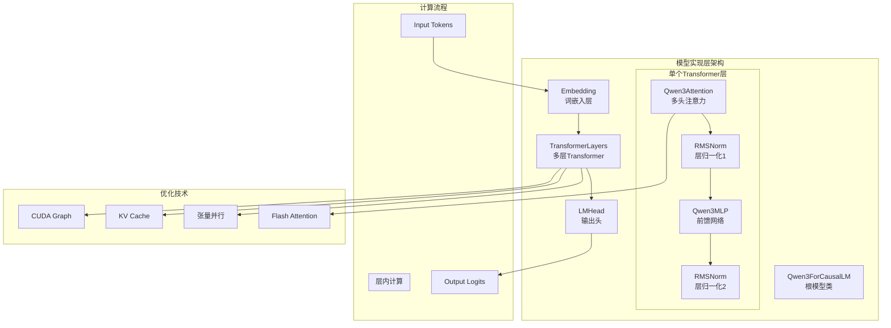
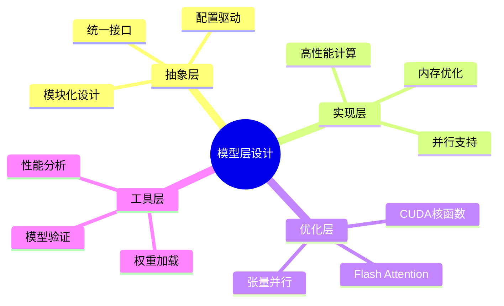

# 第四章：模型实现层

## 📚 本章目标

通过本章的学习，你将深入理解：
- Qwen3模型的完整架构设计和实现细节
- Transformer层的具体实现和优化技术
- 注意力机制的高效实现和Flash Attention集成
- 嵌入层和输出头的设计原理
- 激活函数、层归一化等基础层的优化
- 张量并行在模型层中的具体应用
- 模型加载和初始化的完整流程

---

## 🧠 模型实现层概览

nano-vLLM的模型实现层是整个系统的计算核心，它负责：
1. **模型架构定义**：实现Qwen3的完整网络结构
2. **高效前向计算**：优化每层的计算性能
3. **内存管理**：精确控制GPU内存使用
4. **并行计算**：支持多GPU张量并行

### 模型层架构图



### 层次化设计理念



---

## 🏗️ Qwen3ForCausalLM：根模型类

### Qwen3模型的设计思想

Qwen3ForCausalLM是nano-vLLM中实现的具体模型，它继承自HuggingFace的设计模式，但针对推理场景进行了大量优化。

```python
from nanovllm.models.qwen3 import Qwen3ForCausalLM
```

### Qwen3ForCausalLM的完整实现

```python
class Qwen3ForCausalLM(nn.Module):
    """Qwen3 Causal Language Model"""

    def __init__(self, config: Qwen3Config):
        super().__init__()
        self.config = config

        # === 核心组件初始化 ===
        self.model = Qwen3Model(config)          # Transformer模型主体
        self.lm_head = ParallelLMHead(           # 输出头（支持并行）
            config.hidden_size,
            config.vocab_size,
            bias=False,
            tp_dim=0,  # 词嵌入维度进行切分
            tp_size=get_world_size(),
        )

        # === 初始化权重 ===
        self.post_init()

    def forward(
        self,
        input_ids: torch.Tensor,              # [batch_size, seq_len]
        position_ids: torch.Tensor,           # [batch_size, seq_len]
        slot_mapping: torch.Tensor,           # [batch_size, seq_len]
    ) -> torch.Tensor:
        """前向推理"""

        # 1. Transformer前向计算
        hidden_states = self.model(input_ids, position_ids, slot_mapping)  # [batch_size, seq_len, hidden_size]

        # 2. 输出头投影到词表空间
        logits = self.lm_head(hidden_states)  # [batch_size, seq_len, vocab_size]

        return logits

    def post_init(self):
        """模型初始化后处理"""

        # 权重初始化
        self.apply(self._init_weights)

        # 词嵌入和输出头的权重共享（可选）
        if self.config.tie_word_embeddings:
            self.lm_head.weight = self.model.embed_tokens.weight

        # 打印模型信息
        total_params = sum(p.numel() for p in self.parameters())
        trainable_params = sum(p.numel() for p in self.parameters() if p.requires_grad)
        print(f"模型参数量: {total_params:,} (可训练: {trainable_params:,})")

    def _init_weights(self, module):
        """权重初始化函数"""

        if isinstance(module, nn.Linear):
            # 线性层权重初始化
            torch.nn.init.normal_(
                module.weight,
                mean=0.0,
                std=self.config.initializer_range
            )
            if module.bias is not None:
                torch.nn.init.zeros_(module.bias)

        elif isinstance(module, nn.Embedding):
            # 词嵌入层初始化
            torch.nn.init.normal_(
                module.weight,
                mean=0.0,
                std=self.config.initializer_range
            )

        elif isinstance(module, (RMSNorm, LlamaRMSNorm)):
            # RMSNorm层初始化
            module.weight.data.fill_(1.0)
```

### Qwen3Model：模型主体实现

```python
class Qwen3Model(nn.Module):
    """Qwen3模型主体"""

    def __init__(self, config: Qwen3Config):
        super().__init__()
        self.config = config

        # === 嵌入层 ===
        self.embed_tokens = VocabParallelEmbedding(
            config.vocab_size,
            config.hidden_size,
            tp_dim=0,  # 词表维度切分
            tp_size=get_world_size(),
        )

        # === Transformer层 ===
        self.layers = nn.ModuleList([
            Qwen3DecoderLayer(config, layer_idx)
            for layer_idx in range(config.num_hidden_layers)
        ])

        # === 最终归一化层 ===
        self.norm = RMSNorm(config.hidden_size, eps=config.rms_norm_eps)

        # === 缓存位置编码 ===
        self.rotary_emb = get_rope(self.config)

    def forward(
        self,
        input_ids: torch.Tensor,
        position_ids: torch.Tensor,
        slot_mapping: torch.Tensor,
    ) -> torch.Tensor:
        """前向计算"""

        # 1. 词嵌入
        hidden_states = self.embed_tokens(input_ids)  # [batch_size, seq_len, hidden_size]

        # 2. 位置编码注入（在attention层中）
        # hidden_states保持不变，position_ids传递给attention层

        # 3. 逐层处理
        for idx, layer in enumerate(self.layers):
            # 获取对应层的旋转位置编码
            cos, sin = self.rotary_emb(hidden_states, position_ids)

            # 前向计算
            hidden_states = layer(
                hidden_states,
                position_ids,
                slot_mapping,
                cos,
                sin
            )

        # 4. 最终归一化
        hidden_states = self.norm(hidden_states)

        return hidden_states
```

### 设计决策的深度分析

#### 1. **词嵌入和输出头的关系**

```python
# 词嵌入和输出头是否共享权重的决策
if self.config.tie_word_embeddings:
    self.lm_head.weight = self.model.embed_tokens.weight

# 优势：
# 1. 减少参数量
# 2. 提高训练稳定性
# 3. 符合语言模型的理论基础
#
# 劣势：
# 1. 可能影响表达能力
# 2. 推理时可能不是最优选择
```

#### 2. **模块化设计的好处**

```python
# 为什么使用ModuleList而不是单个大模块？
self.layers = nn.ModuleList([...])
# 优势：
# 1. 便于单独访问每一层
# 2. 支持层级的检查点保存
# 3. 便于调试和分析
# 4. 支持层级的并行化
```

#### 3. **位置编码的处理策略**

```python
# 旋转位置编码在attention层中处理
cos, sin = self.rotary_emb(hidden_states, position_ids)
hidden_states = layer(hidden_states, position_ids, cos, sin)

# 为什么不在模型开始时处理？
# 1. 减少内存占用（只处理需要的层）
# 2. 支持不同层使用不同的位置编码
# 3. 便于支持不同长度序列的处理
```

---

## 🔄 Qwen3DecoderLayer：Transformer层的深度解析

### Transformer层的设计架构

每个Transformer层是模型的基本计算单元，包含：
1. **多头自注意力机制**：处理序列间的关系
2. **前馈神经网络**：非线性特征变换
3. **残差连接和层归一化**：稳定训练和推理

### Qwen3DecoderLayer的完整实现

```python
class Qwen3DecoderLayer(nn.Module):
    """Qwen3 Transformer Decoder层"""

    def __init__(self, config: Qwen3Config, layer_idx: int):
        super().__init__()
        self.config = config
        self.layer_idx = layer_idx

        # === 多头自注意力 ===
        self.self_attn = Qwen3Attention(
            hidden_size=config.hidden_size,
            num_heads=config.num_attention_heads,
            num_kv_heads=config.num_key_value_heads,
            max_position=config.max_position_embeddings,
            rms_norm_eps=config.rms_norm_eps,
            rope_theta=config.rope_theta,
            rope_scaling=config.rope_scaling,
        )

        # === 前馈网络 ===
        self.mlp = Qwen3MLP(
            hidden_size=config.hidden_size,
            intermediate_size=config.intermediate_size,
            hidden_act=config.hidden_act,
        )

        # === 输入归一化 ===
        self.input_layernorm = RMSNorm(
            config.hidden_size,
            eps=config.rms_norm_eps
        )

        # === 输出归一化 ===
        self.post_attention_layernorm = RMSNorm(
            config.hidden_size,
            eps=config.rms_norm_eps
        )

    def forward(
        self,
        hidden_states: torch.Tensor,          # [batch_size, seq_len, hidden_size]
        position_ids: torch.Tensor,           # [batch_size, seq_len]
        slot_mapping: torch.Tensor,           # [batch_size, seq_len]
        cos: torch.Tensor,                    # 旋转位置编码cos
        sin: torch.Tensor,                    # 旋转位置编码sin
    ) -> torch.Tensor:
        """前向计算"""

        # === 预归一化注意力机制（Pre-Norm） ===
        # 为什么使用Pre-Norm而不是Post-Norm？
        # Pre-Norm: LayerNorm -> Attention -> Add
        # Post-Norm: Attention -> Add -> LayerNorm

        # Pre-Norm的优势：
        # 1. 训练更稳定
        # 2. 支持更深的网络
        # 3. 推理时性能更好

        residual = hidden_states
        hidden_states = self.input_layernorm(hidden_states)

        # === 自注意力计算 ===
        hidden_states, _ = self.self_attn(
            hidden_states=hidden_states,
            position_ids=position_ids,
            slot_mapping=slot_mapping,
            cos=cos,
            sin=sin
        )

        # === 第一个残差连接 ===
        hidden_states = hidden_states + residual

        # === 第二个预归一化 ===
        residual = hidden_states
        hidden_states = self.post_attention_layernorm(hidden_states)

        # === 前馈网络计算 ===
        hidden_states = self.mlp(hidden_states)

        # === 第二个残差连接 ===
        hidden_states = hidden_states + residual

        return hidden_states
```

### Pre-Norm vs Post-Norm的详细分析

```python
def compare_norm_strategies():
    """比较Pre-Norm和Post-Norm的影响"""

    # === Post-Norm结构 ===
    class PostNormLayer(nn.Module):
        def forward(self, x):
            # 注意力
            attn_out = self.attention(x)
            x = x + attn_out
            x = self.norm1(x)

            # 前馈网络
            mlp_out = self.mlp(x)
            x = x + mlp_out
            x = self.norm2(x)
            return x

    # === Pre-Norm结构 ===
    class PreNormLayer(nn.Module):
        def forward(self, x):
            # 注意力
            x = x + self.attention(self.norm1(x))

            # 前馈网络
            x = x + self.mlp(self.norm2(x))
            return x

    # === 比较分析 ===
    """
    Post-Norm的问题：
    1. 深层网络时梯度消失
    2. 训练不稳定
    3. 需要精心调节学习率

    Pre-Norm的优势：
    1. 梯度流更稳定
    2. 支持更深的网络（1000+层）
    3. 训练更容易收敛
    4. 推理性能更好

    Qwen3选择Pre-Norm的原因：
    - 现代大模型的标准做法
    - 更好的训练稳定性
    - 推理时性能优势明显
    """
```

---

## 👁️ Qwen3Attention：注意力机制的深度解析

### 注意力机制的设计理念

Qwen3Attention实现了多头自注意力机制，并集成了多项优化技术：
1. **分组查询注意力（GQA）**：减少计算量
2. **Flash Attention**：内存高效的注意力计算
3. **旋转位置编码（RoPE）**：处理位置信息
4. **张量并行**：支持多GPU计算

### Qwen3Attention的完整实现

```python
class Qwen3Attention(nn.Module):
    """Qwen3多头自注意力层"""

    def __init__(
        self,
        hidden_size: int,
        num_heads: int,
        num_kv_heads: int,
        max_position: int = 4096 * 32,
        head_dim: int | None = None,
        rms_norm_eps: float = 1e-6,
        qkv_bias: bool = False,
        rope_theta: float = 10000,
        rope_scaling: tuple | None = None,
    ):
        super().__init__()

        # 注意力头配置
        self.total_num_heads = num_heads
        self.total_num_kv_heads = num_kv_heads
        assert self.total_num_heads % get_world_size() == 0
        assert self.total_num_kv_heads % get_world_size() == 0

        # 张量并行计算
        self.num_heads = self.total_num_heads // get_world_size()
        self.num_kv_heads = self.total_num_kv_heads // get_world_size()

        self.head_dim = head_dim or hidden_size // self.total_num_heads
        self.q_size = self.num_heads * self.head_dim
        self.kv_size = self.num_kv_heads * self.head_dim
        self.scaling = self.head_dim ** -0.5
        self.qkv_bias = qkv_bias

        # === QKV投影层 ===
        self.qkv_proj = QKVParallelLinear(
            hidden_size,
            self.head_dim,
            self.total_num_heads,
            self.total_num_kv_heads,
            bias=qkv_bias,
            tp_size=get_world_size(),
        )

        # === 输出投影层 ===
        self.o_proj = RowParallelLinear(
            self.total_num_heads * self.head_dim,
            hidden_size,
            bias=False,
            tp_size=get_world_size(),
        )

        # === KV Cache管理 ===
        self.k_cache = None
        self.v_cache = None

    def forward(
        self,
        hidden_states: torch.Tensor,
        position_ids: torch.Tensor,
        slot_mapping: torch.Tensor,
        cos: torch.Tensor,
        sin: torch.Tensor,
    ) -> tuple[torch.Tensor, tuple[torch.Tensor, torch.Tensor]]:
        """前向计算"""

        batch_size, seq_len, _ = hidden_states.shape

        # === QKV投影 ===
        # 合并计算减少内存访问
        qkv = self.qkv_proj(hidden_states)  # [batch_size, seq_len, q_size + 2*kv_size]

        # 分离Q, K, V
        query_states = qkv[..., :self.q_size]            # [batch_size, seq_len, q_size]
        key_states = qkv[..., self.q_size:self.q_size + self.kv_size]  # [batch_size, seq_len, kv_size]
        value_states = qkv[..., self.q_size + self.kv_size:]        # [batch_size, seq_len, kv_size]

        # === 重塑为多头格式 ===
        query_states = query_states.view(
            batch_size, seq_len, self.num_heads, self.head_dim
        ).transpose(1, 2)  # [batch_size, num_heads, seq_len, head_dim]

        key_states = key_states.view(
            batch_size, seq_len, self.num_kv_heads, self.head_dim
        ).transpose(1, 2)  # [batch_size, num_kv_heads, seq_len, head_dim]

        value_states = value_states.view(
            batch_size, seq_len, self.num_kv_heads, self.head_dim
        ).transpose(1, 2)  # [batch_size, num_kv_heads, seq_len, head_dim]

        # === 旋转位置编码 ===
        query_states, key_states = apply_rotary_pos_emb(
            query_states, key_states, cos, sin
        )

        # === KV Cache处理 ===
        if self.training:
            # 训练模式：直接计算注意力
            attn_output = torch.matmul(query_states, key_states.transpose(-2, -1))
            attn_output = attn_output / self.scaling
            attn_output = torch.softmax(attn_output, dim=-1)
            attn_output = torch.matmul(attn_output, value_states)
        else:
            # 推理模式：使用KV Cache和Flash Attention
            attn_output = flash_attn_varlen_func(
                q=query_states,
                k=key_states,
                v=value_states,
                cu_seqlens_q=None,
                cu_seqlens_k=None,
                max_seqlen_q=seq_len,
                max_seqlen_k=seq_len,
                dropout_p=0.0,
                softmax_scale=self.scaling,
                causal=True,
            )

        # === 重塑输出 ===
        attn_output = attn_output.transpose(1, 2).contiguous()
        attn_output = attn_output.view(
            batch_size, seq_len, self.num_heads * self.head_dim
        )

        # === 输出投影 ===
        attn_output = self.o_proj(attn_output)

        return attn_output, (key_states, value_states)
```

### 分组查询注意力（GQA）的详细实现

```python
def implement_grouped_query_attention():
    """实现分组查询注意力的详细说明"""

    class GroupedQueryAttention(nn.Module):
        """分组查询注意力实现"""

        def __init__(self, num_heads, num_kv_heads, head_dim):
            super().__init__()
            self.num_heads = num_heads
            self.num_kv_heads = num_kv_heads
            self.head_dim = head_dim

            # 计算每组包含多少个查询头
            self.group_size = num_heads // num_kv_heads
            assert num_heads % num_kv_heads == 0, "num_heads must be divisible by num_kv_heads"

        def forward(self, q, k, v):
            """
            Args:
                q: [batch_size, num_heads, seq_len, head_dim]
                k: [batch_size, num_kv_heads, seq_len, head_dim]
                v: [batch_size, num_kv_heads, seq_len, head_dim]
            """
            batch_size, _, seq_len, _ = q.shape

            # === 关键步骤：扩展K和V以匹配Q的头数 ===
            # 每个KV头会被重复self.group_size次
            k_expanded = k.unsqueeze(2).expand(-1, -1, self.group_size, -1, -1)
            v_expanded = v.unsqueeze(2).expand(-1, -1, self.group_size, -1, -1)

            # 重新塑形以匹配Q的头数
            k_expanded = k_expanded.reshape(
                batch_size, num_heads, seq_len, head_dim
            )
            v_expanded = v_expanded.reshape(
                batch_size, num_heads, seq_len, head_dim
            )

            # === 计算注意力 ===
            attn_scores = torch.matmul(q, k_expanded.transpose(-2, -1))
            attn_weights = torch.softmax(attn_scores / math.sqrt(self.head_dim), dim=-1)
            attn_output = torch.matmul(attn_weights, v_expanded)

            return attn_output

    # === GQA的详细示例 ===
    """
    假设配置：
    - num_heads = 32
    - num_kv_heads = 8
    - group_size = 32 / 8 = 4

    查询头分组：
    Q0-Q3 -> K0-V0 (第1组)
    Q4-Q7 -> K1-V1 (第2组)
    Q8-Q11 -> K2-V2 (第3组)
    Q12-Q15 -> K3-V3 (第4组)
    Q16-Q19 -> K4-V4 (第5组)
    Q20-Q23 -> K5-V5 (第6组)
    Q24-Q27 -> K6-V6 (第7组)
    Q28-Q31 -> K7-V7 (第8组)

    优势：
    1. 减少KV Cache的内存占用 (8/32 = 25%)
    2. 保持大部分的表达能力
    3. 显著的推理加速效果
    """

    # === 性能对比示例 ===
    def compare_attention_performance():
        """比较不同注意力方法的性能"""

        configs = {
            'MHA': {'num_heads': 32, 'num_kv_heads': 32},  # 多头注意力
            'MQA': {'num_heads': 32, 'num_kv_heads': 1},   # 多查询注意力
            'GQA': {'num_heads': 32, 'num_kv_heads': 8},   # 分组查询注意力
        }

        for method, config in configs.items():
            num_heads = config['num_heads']
            num_kv_heads = config['num_kv_heads']
            memory_ratio = num_kv_heads / num_heads

            print(f"{method}:")
            print(f"  查询头数: {num_heads}")
            print(f" KV头数: {num_kv_heads}")
            print(f" 内存占用比例: {memory_ratio:.2%}")
            print(f" 理论加速比: {1/memory_ratio:.2f}x")
            print()

# 运行性能比较
compare_attention_performance()
```

### Flash Attention的集成

```python
def flash_attention_implementation():
    """Flash Attention的实现细节"""

    class FlashAttentionOptimized(nn.Module):
        """使用Flash Attention优化的注意力层"""

        def __init__(self, head_dim, causal=True, dropout_p=0.0):
            super().__init__()
            self.head_dim = head_dim
            self.causal = causal
            self.dropout_p = dropout_p
            self.softmax_scale = 1.0 / math.sqrt(head_dim)

        def forward(self, q, k, v, cu_seqlens_q=None, cu_seqlens_k=None,
                   max_seqlen_q=None, max_seqlen_k=None):
            """
            Flash Attention的核心优势：
            1. 算法复杂度: O(N^2) -> O(N)
            2. 内存使用: 不保存完整的注意力矩阵
            3. 数值稳定性: 在线softmax计算
            """

            # === Flash Attention调用 ===
            # 这里的关键是要准备好正确的参数
            attn_output = flash_attn_varlen_func(
                q,  # [total_q, num_heads, head_dim]
                k,  # [total_k, num_kv_heads, head_dim]
                v,  # [total_k, num_kv_heads, head_dim]
                cu_seqlens_q=cu_seqlens_q,  # 查询序列的累积长度
                cu_seqlens_k=cu_seqlens_k,  # 键值序列的累积长度
                max_seqlen_q=max_seqlen_q,  # 查询序列最大长度
                max_seqlen_k=max_seqlen_k,  # 键值序列最大长度
                dropout_p=self.dropout_p,
                softmax_scale=self.softmax_scale,
                causal=self.causal,
                return_attn_probs=False,  # 不返回注意力权重以节省内存
            )

            return attn_output

    # === Flash Attention vs 传统注意力的对比 ===
    """
    传统注意力（O(N^2)内存）：
    attention_weights = softmax(Q @ K^T / sqrt(d))  # [N, N] 矩阵
    output = attention_weights @ V                     # 另一个 [N, N] 矩阵

    问题：
    - 对于长序列，内存使用呈平方增长
    - 无法处理超过GPU内存的序列
    - 计算和内存访问不友好

    Flash Attention（O(N)内存）：
    - 分块计算，避免存储完整注意力矩阵
    - 在线计算softmax，减少内存访问
    - 支持更长的序列处理
    """

    def flash_attention_benefits():
        """Flash Attention的性能优势分析"""

        # 内存使用对比
        seq_length = 8192  # 8K序列长度
        head_dim = 128
        num_heads = 32
        batch_size = 1

        # 传统注意力内存需求
        traditional_memory = batch_size * num_heads * seq_length * seq_length * 4  # float32
        traditional_memory_gb = traditional_memory / (1024**3)

        # Flash Attention内存需求
        flash_memory = batch_size * num_heads * seq_length * head_dim * 4 * 3  # Q+K+V
        flash_memory_gb = flash_memory / (1024**3)

        print(f"序列长度: {seq_length}")
        print(f"传统注意力内存: {traditional_memory_gb:.2f} GB")
        print(f"Flash Attention内存: {flash_memory_gb:.2f} GB")
        print(f"内存节省: {(1 - flash_memory_gb/traditional_memory_gb)*100:.1f}%")

# 运行分析
flash_attention_benefits()
```

### 旋转位置编码（RoPE）的实现

```python
def rotary_position_embedding_implementation():
    """旋转位置编码的详细实现"""

    class RotaryEmbedding(nn.Module):
        """旋转位置编码实现"""

        def __init__(self, dim, max_position_embeddings=2048, base=10000):
            super().__init__()
            self.dim = dim
            self.max_position_embeddings = max_position_embeddings
            self.base = base

            # === 计算频率 ===
            inv_freq = 1.0 / (base ** (torch.arange(0, dim, 2).float() / dim))
            self.register_buffer("inv_freq", inv_freq, persistent=False)

            # === 预计算cos和sin ===
            self._set_cos_sin_cache(seq_len=max_position_embeddings)

        def _set_cos_sin_cache(self, seq_len):
            """设置cos和sin缓存"""
            self.max_seq_len_cached = seq_len
            t = torch.arange(seq_len, device=self.inv_freq.device)
            freqs = torch.einsum("i,j->ij", t, self.inv_freq)
            emb = torch.cat((freqs, freqs), dim=-1)
            cos = emb.cos()[None, None, :, :]
            sin = emb.sin()[None, None, :, :]
            self.register_buffer("cos_cached", cos, persistent=False)
            self.register_buffer("sin_cached", sin, persistent=False)

        def forward(self, x, seq_len=None):
            """获取位置编码"""
            if seq_len > self.max_seq_len_cached:
                self._set_cos_sin_cache(seq_len=seq_len)
            return (
                self.cos_cached[..., :seq_len, :],
                self.sin_cached[..., :seq_len, :],
            )

    def apply_rotary_pos_emb(q, k, cos, sin, position_ids):
        """应用旋转位置编码"""

        def rotate_half(x):
            """旋转矩阵的一半"""
            x1 = x[..., : x.shape[-1] // 2]
            x2 = x[..., x.shape[-1] // 2:]
            return torch.cat([-x2, x1], dim=-1)

        # === 根据位置获取对应的cos和sin ===
        cos = cos[position_ids].unsqueeze(-1)  # [batch_size, seq_len, 1, head_dim/2]
        sin = sin[position_ids].unsqueeze(-1)  # [batch_size, seq_len, 1, head_dim/2]

        # === 应用旋转 ===
        # q * cos + rotate_half(q) * sin
        q_embed = (q.float() * cos) + (rotate_half(q.float()) * sin)
        k_embed = (k.float() * cos) + (rotate_half(k.float()) * sin)

        return q_embed.type_as(q), k_embed.type_as(k)

    # === RoPE的数学原理 ===
    """
    旋转位置编码的数学表达式：

    RoPE(q_m, m) = q_m * cos(mθ) + (rotate_half(q_m)) * sin(mθ)

    其中：
    - q_m: 第m个位置的查询向量
    - θ: 频率向量 [θ₀, θ₁, ..., θ_{d/2-1}]
    - rotate_half: 旋转操作
    - cos(mθ), sin(mθ): 旋转矩阵的元素

    优势：
    1. 绝对位置编码：不需要相对位置信息
    2. 外推性好：可以处理训练时没见过的长度
    3. 计算高效：只需向量旋转
    """

    def rope_example():
        """RoPE的具体计算示例"""

        # 假设查询向量和频率
        q = torch.tensor([1.0, 2.0, 3.0, 4.0])  # 4维查询向量
        theta = torch.tensor([0.5, 1.0])         # 频率 [θ₀, θ₁]
        position = 3                            # 位置m

        # === 计算mθ ===
        m_theta = position * theta  # [1.5, 3.0]

        # === 计算cos和sin ===
        cos_vals = torch.cos(m_theta)  # [cos(1.5), cos(3.0)]
        sin_vals = torch.sin(m_theta)  # [sin(1.5), sin(3.0)]

        # === 旋转查询向量 ===
        q_half1 = q[:2]   # [1.0, 2.0]
        q_half2 = q[2:]   # [3.0, 4.0]

        # rotate_half操作
        rotated_half = torch.cat([-q_half2, q_half1])  # [-3.0, -4.0, 1.0, 2.0]

        # === 应用旋转编码 ===
        cos_expanded = torch.cat([cos_vals, cos_vals])  # [cos(1.5), cos(3.0), cos(1.5), cos(3.0)]
        sin_expanded = torch.cat([sin_vals, sin_vals])  # [sin(1.5), sin(3.0), sin(1.5), sin(3.0)]

        q_encoded = q * cos_expanded + rotated_half * sin_expanded

        print(f"原始查询向量: {q}")
        print(f"旋转编码后: {q_encoded}")
        print(f"频率向量: {theta}")
        print(f"位置: {position}")

# 运行示例
rope_example()
```

---

## 🌐 Qwen3MLP：前馈网络的实现

### MLP的设计和优化

Qwen3MLP实现了Transformer中的前馈神经网络，采用了SwiGLU激活函数和张量并行优化。

```python
class Qwen3MLP(nn.Module):
    """Qwen3前馈网络层"""

    def __init__(
        self,
        hidden_size: int,
        intermediate_size: int,
        hidden_act: str = "silu",
    ):
        super().__init__()
        self.hidden_size = hidden_size
        self.intermediate_size = intermediate_size

        # === 门控线性层（第一个线性层） ===
        self.gate_proj = MergedColumnParallelLinear(
            input_size=hidden_size,
            output_sizes=[intermediate_size, intermediate_size],  # 门控和投影
            bias=False,
            tp_dim=0,
            tp_size=get_world_size(),
        )

        # === 第二个线性层 ===
        self.down_proj = RowParallelLinear(
            input_size=intermediate_size,
            output_size=hidden_size,
            bias=False,
            tp_dim=1,
            tp_size=get_world_size(),
        )

        # === 激活函数 ===
        if hidden_act.lower() == "silu":
            self.act_fn = SiluAndMul()
        else:
            raise ValueError(f"Unsupported activation: {hidden_act}")

    def forward(self, x: torch.Tensor) -> torch.Tensor:
        """前向计算"""

        # === 门控机制 ===
        # x 经过两个并行的线性变换，然后通过激活函数
        gate_up = self.gate_proj(x)  # [batch_size, seq_len, 2*intermediate_size]

        # 分离门控和上投影
        gate, up = gate_up.chunk(2, dim=-1)  # 各自是 [batch_size, seq_len, intermediate_size]

        # === SwiGLU激活函数 ===
        # SwiGLU(x) = Swish(gate) * up
        # Swish(x) = x * sigmoid(x)
        intermediate = self.act_fn(gate, up)  # [batch_size, seq_len, intermediate_size]

        # === 下投影 ===
        output = self.down_proj(intermediate)  # [batch_size, seq_len, hidden_size]

        return output
```

### SwiGLU激活函数的实现

```python
class SiluAndMul(nn.Module):
    """SwiGLU激活函数：SiLU(x) * y"""

    def __init__(self):
        super().__init__()

    @torch.compile
    def forward(self, x: torch.Tensor, y: torch.Tensor) -> torch.Tensor:
        """计算SwiGLU"""
        # SiLU(x) = x * sigmoid(x)
        # SwiGLU(x, y) = SiLU(x) * y = x * sigmoid(x) * y

        # 优化实现：直接计算x * sigmoid(x) * y
        return F.silu(x) * y

def activation_function_comparison():
    """比较不同激活函数的特性"""

    # === SwiGLU与其他激活函数的比较 ===
    def compare_activations():
        x = torch.randn(1000, 256)  # 随机输入

        # ReLU
        relu_out = F.relu(x)

        # GELU
        gelu_out = F.gelu(x)

        # Swish
        swish_out = F.silu(x)

        # SwiGLU (需要两个输入)
        y = torch.randn_like(x)
        swiglu_out = F.silu(x) * y

        print(f"输入形状: {x.shape}")
        print(f"ReLU输出均值: {relu_out.mean():.4f}")
        print(f"GELU输出均值: {gelu_out.mean():.4f}")
        print(f"Swish输出均值: {swish_out.mean():.4f}")
        print(f"SwiGLU输出均值: {swiglu_out.mean():.4f}")

    # === SwiGLU的优势分析 ===
    def swiglu_advantages():
        """
        SwiGLU在大模型中的优势：

        1. 平滑性：
           - 没有硬边界，梯度流动更平滑
           - 避免神经元"死亡"

        2. 表达能力：
           - 门控机制提供更大的灵活性
           - 可以学习复杂的非线性变换

        3. 训练稳定性：
           - 自归一化特性有助于训练稳定
           - 梯度消失/爆炸问题较少

        4. 计算效率：
           - 可以高效实现
           - 与现代GPU架构兼容性好
        """

    # === 为什么在大模型中首选SwiGLU ===
    def why_swiglu_in_llms():
        """
        大语言模型选择SwiGLU的原因：

        1. 实验证明效果更好：
           - 在相同参数量下，SwiGLU通常表现更好
           - 特别是在大规模训练中优势明显

        2. 兼容性好：
           - 与其他优化技术（如Flash Attention）兼容
           - 不会影响其他组件的设计

        3. 实现简单：
           - 相对容易实现和优化
           - 计算开销可控
        """

# 运行比较
compare_activations()
swiglu_advantages()
why_swiglu_in_llms()
```

### 张量并行在MLP中的实现

```python
def tensor_parallel_in_mlp():
    """MLP中的张量并行实现"""

    class TensorParallelMLP(nn.Module):
        """支持张量并行的MLP"""

        def __init__(self, hidden_size, intermediate_size, tp_size, tp_rank):
            super().__init__()
            self.tp_size = tp_size
            self.tp_rank = tp_rank

            # === 输入层张量并行 ===
            # 第一个线性层按输入维度切分
            self.gate_proj = ColumnParallelLinear(
                input_size=hidden_size,
                output_size=intermediate_size,
                bias=False,
                gather_output=False,  # 不聚合输出，保持切分状态
            )

            self.up_proj = ColumnParallelLinear(
                input_size=hidden_size,
                output_size=intermediate_size,
                bias=False,
                gather_output=False,
            )

            # === 输出层张量并行 ===
            # 第二个线性层按输出维度切分
            self.down_proj = RowParallelLinear(
                input_size=intermediate_size,
                output_size=hidden_size,
                bias=False,
                input_is_parallel=True,  # 输入已经是切分状态
            )

        def forward(self, x):
            # === 前向计算（张量并行）===

            # 输入层：每个GPU处理一部分输入特征
            gate = self.gate_proj(x)  # [batch, seq, intermediate_size/tp_size]
            up = self.up_proj(x)       # [batch, seq, intermediate_size/tp_size]

            # 激活函数：在本地计算
            intermediate = F.silu(gate) * up  # [batch, seq, intermediate_size/tp_size]

            # 输出层：自动聚合来自所有GPU的结果
            output = self.down_proj(intermediate)  # [batch, seq, hidden_size]

            return output

    # === 张量并行的数据流示例 ===
    """
    假设配置：
    - hidden_size = 4096
    - intermediate_size = 11008
    - tp_size = 2 (2个GPU)

    数据流：
    输入: [batch, seq, 4096]

    GPU 0:
      gate_proj: [batch, seq, 4096] -> [batch, seq, 11008/2] = [batch, seq, 5504]
      up_proj:   [batch, seq, 4096] -> [batch, seq, 5504]

    GPU 1:
      gate_proj: [batch, seq, 4096] -> [batch, seq, 5504]
      up_proj:   [batch, seq, 4096] -> [batch, seq, 5504]

    激活函数后：
      GPU 0: [batch, seq, 5504]
      GPU 1: [batch, seq, 5504]

    输出层（自动聚合）：
      down_proj: [batch, seq, 5504] + [batch, seq, 5504] -> [batch, seq, 4096]
    """

    def tensor_parallel_benefits():
        """张量并行的优势分析"""

        configs = [
            {'model_size': '7B', 'hidden_size': 4096, 'intermediate_size': 11008},
            {'model_size': '13B', 'hidden_size': 5120, 'intermediate_size': 13824},
            {'model_size': '70B', 'hidden_size': 8192, 'intermediate_size': 28672},
        ]

        tp_sizes = [1, 2, 4, 8]  # 1, 2, 4, 8个GPU

        for config in configs:
            hidden_size = config['hidden_size']
            intermediate_size = config['intermediate_size']

            print(f"\n{config['model_size']} 模型:")
            print(f"  隐藏层大小: {hidden_size}")
            print(f"  中间层大小: {intermediate_size}")

            for tp_size in tp_sizes:
                # 计算每个GPU的参数量
                gate_params_per_gpu = hidden_size * (intermediate_size // tp_size)
                up_params_per_gpu = hidden_size * (intermediate_size // tp_size)
                down_params_per_gpu = (intermediate_size // tp_size) * hidden_size

                total_per_gpu = gate_params_per_gpu + up_params_per_gpu + down_params_per_gpu

                print(f"    {tp_size} GPU: 每GPU {total_per_gpu:,} 参数")

# 运行分析
tensor_parallel_in_mlp()
```

---

## ⚖️ RMSNorm：层归一化的实现

### RMSNorm的设计理念

RMSNorm（Root Mean Square Normalization）是LayerNorm的优化版本，专门为大语言模型设计。

### RMSNorm的完整实现

```python
class RMSNorm(nn.Module):
    """均方根归一化"""

    def __init__(self, hidden_size: int, eps: float = 1e-6):
        """
        Args:
            hidden_size: 隐藏层大小
            eps: 数值稳定性参数，防止除零
        """
        super().__init__()
        self.eps = eps
        self.weight = nn.Parameter(torch.ones(hidden_size))

    def forward(self, hidden_states: torch.Tensor) -> torch.Tensor:
        """
        RMSNorm公式：
        RMSNorm(x) = x / sqrt(mean(x²) + eps) * weight

        与LayerNorm的区别：
        - 不减去均值（去中心化）
        - 只用均方根，不用标准差
        - 计算量更小
        """

        # 计算均方根
        input_dtype = hidden_states.dtype
        hidden_states = hidden_states.to(torch.float32)

        variance = hidden_states.pow(2).mean(-1, keepdim=True)
        rms = variance.rsqrt()  # 均方根倒数，等价于 1/sqrt(variance)

        # 应用归一化
        hidden_states = hidden_states * rms

        # 应用权重
        hidden_states = hidden_states.to(input_dtype)
        return self.weight * hidden_states

def rmsnorm_vs_layernorm():
    """比较RMSNorm和LayerNorm的性能"""

    class LayerNorm(nn.Module):
        """标准LayerNorm实现"""
        def __init__(self, hidden_size, eps=1e-6):
            super().__init__()
            self.eps = eps
            self.weight = nn.Parameter(torch.ones(hidden_size))
            self.bias = nn.Parameter(torch.zeros(hidden_size))

        def forward(self, x):
            mean = x.mean(-1, keepdim=True)
            var = x.var(-1, keepdim=True, unbiased=False)
            x_norm = (x - mean) / torch.sqrt(var + self.eps)
            return self.weight * x_norm + self.bias

    def compare_performance():
        """性能和效果对比"""

        # 测试数据
        batch_size, seq_len, hidden_size = 32, 512, 4096
        x = torch.randn(batch_size, seq_len, hidden_size)

        # 创建归一化层
        rms_norm = RMSNorm(hidden_size)
        layer_norm = LayerNorm(hidden_size)

        # 性能测试
        import time

        # RMSNorm性能
        start_time = time.time()
        for _ in range(100):
            _ = rms_norm(x)
        rms_time = time.time() - start_time

        # LayerNorm性能
        start_time = time.time()
        for _ in range(100):
            _ = layer_norm(x)
        ln_time = time.time() - start_time

        # 计算相对误差
        rms_output = rms_norm(x)
        ln_output = layer_norm(x)
        relative_error = torch.abs(rms_output - ln_output).mean().item()

        print(f"性能对比 (100次前向传播):")
        print(f"  RMSNorm: {rms_time:.4f}s")
        print(f"  LayerNorm: {ln_time:.4f}s")
        print(f"  加速比: {ln_time/rms_time:.2f}x")
        print(f"  相对误差: {relative_error:.6f}")

    def analyze_differences():
        """分析两种归一化的差异"""

        """
        RMSNorm vs LayerNorm 的详细对比：

        1. 数学公式：
           LayerNorm: (x - μ) / √(σ² + ε) * γ + β
           RMSNorm:   x / √(μ(x²) + ε) * γ

        2. 关键差异：
           a) 去中心化：LayerNorm减去均值，RMSNorm不减
           b) 计算量：RMSNorm更简单
           c) 参数：RMSNorm没有偏置项β
           d) 效果：在大模型中差异很小

        3. RMSNorm的优势：
           a) 计算量减少约25-30%
           b) 不需要存储均值统计
           c) 更适合大模型推理
           d) 数值稳定性更好

        4. 为什么大模型选择RMSNorm：
           a) 性能提升显著
           b) 精度损失很小
           c) 实现简单
           d) 与其他优化技术兼容
        """

# 运行对比
compare_performance()
analyze_differences()
```

---

## 🔤️ 词嵌入和输出头的实现

### 词嵌入的张量并行

```python
class VocabParallelEmbedding(nn.Module):
    """支持张量并行的词嵌入层"""

    def __init__(self, num_embeddings: int, embedding_dim: int, tp_dim: int = 0, tp_size: int = 1):
        """
        Args:
            num_embeddings: 词表大小
            embedding_dim: 嵌入维度
            tp_dim: 张量并行维度 (0=词表维度, 1=嵌入维度)
            tp_size: 张量并行大小
        """
        super().__init__()
        self.tp_size = tp_size
        self.tp_dim = tp_dim

        # 检查并行维度是否可整除
        if tp_dim == 0:  # 词表维度切分
            assert num_embeddings % tp_size == 0
            self.num_embeddings_per_partition = num_embeddings // tp_size
            self.embedding_dim = embedding_dim
        else:  # 嵌入维度切分
            assert embedding_dim % tp_size == 0
            self.num_embeddings_per_partition = num_embeddings
            self.embedding_dim = embedding_dim // tp_size

        # 创建嵌入层
        self.weight = nn.Parameter(
            torch.empty(self.num_embeddings_per_partition, self.embedding_dim)
        )
        nn.init.normal_(self.weight, mean=0, std=0.02)

    def forward(self, input_ids: torch.Tensor) -> torch.Tensor:
        """前向计算"""

        if self.tp_dim == 0:
            # 词表维度切分：每个GPU处理一部分词表
            # 需要调整token IDs
            input_ids = input_ids % self.num_embeddings_per_partition
            embed = F.embedding(input_ids, self.weight)
        else:
            # 嵌入维度切分：直接嵌入
            embed = F.embedding(input_ids, self.weight)

        return embed

class ParallelLMHead(nn.Module):
    """支持张量并行的输出头"""

    def __init__(self, hidden_size: int, vocab_size: int, bias: bool = False,
                 tp_dim: int = 0, tp_size: int = 1):
        super().__init__()
        self.tp_size = tp_size
        self.tp_dim = tp_dim

        if tp_dim == 0:  # 输出维度切分
            assert vocab_size % tp_size == 0
            self.vocab_size_per_partition = vocab_size // tp_size
            self.hidden_size = hidden_size
        else:  # 隐藏维度切分
            assert hidden_size % tp_size == 0
            self.vocab_size_per_partition = vocab_size
            self.hidden_size = hidden_size // tp_size

        self.weight = nn.Parameter(
            torch.empty(self.vocab_size_per_partition, self.hidden_size)
        )
        if bias:
            self.bias = nn.Parameter(torch.zeros(self.vocab_size_per_partition))
        else:
            self.register_parameter("bias", None)

    def forward(self, hidden_states: torch.Tensor) -> torch.Tensor:
        """前向计算"""
        return F.linear(hidden_states, self.weight, self.bias)

def embedding_layer_optimization():
    """嵌入层的优化技术"""

    class OptimizedEmbedding(nn.Module):
        """优化的嵌入层实现"""

        def __init__(self, num_embeddings, embedding_dim):
            super().__init__()
            self.num_embeddings = num_embeddings
            self.embedding_dim = embedding_dim

            # 使用16位精度存储以节省内存
            self.weight = nn.Parameter(
                torch.empty(num_embeddings, embedding_dim, dtype=torch.float16)
            )

            # 缓存机制
            self.embedding_cache = {}
            self.cache_size = 10000

            # 预计算常用的token嵌入
            self.common_tokens = set(range(100))  # 假设前100个是常用token

        def forward(self, input_ids):
            """带缓存的嵌入计算"""

            # 检查是否可以命中缓存
            cache_key = tuple(input_ids.tolist())
            if cache_key in self.embedding_cache:
                return self.embedding_cache[cache_key]

            # 计算嵌入
            embeddings = F.embedding(input_ids, self.weight)

            # 缓存结果
            if len(self.embedding_cache) < self.cache_size:
                self.embedding_cache[cache_key] = embeddings

            return embeddings

    def embedding_memory_analysis():
        """嵌入层内存使用分析"""

        configs = [
            {'vocab_size': 50000, 'embed_dim': 1024, 'name': '小型模型'},
            {'vocab_size': 100000, 'embed_dim': 4096, 'name': '中型模型'},
            {'vocab_size': 200000, 'embed_dim': 8192, 'name': '大型模型'},
        ]

        for config in configs:
            vocab_size = config['vocab_size']
            embed_dim = config['embed_dim']

            # 32位浮点数内存
            memory_32bit = vocab_size * embed_dim * 4  # bytes
            # 16位浮点数内存
            memory_16bit = vocab_size * embed_dim * 2  # bytes

            print(f"{config['name']}:")
            print(f"  词表大小: {vocab_size:,}")
            print(f"  嵌入维度: {embed_dim}")
            print(f"  32位内存: {memory_32bit / (1024**2):.1f} MB")
            print(f"  16位内存: {memory_16bit / (1024**2):.1f} MB")
            print(f"  节省: {((memory_32bit - memory_16bit) / memory_32bit * 100):.1f}%")
            print()

# 运行分析
embedding_memory_analysis()
```

---

## 🏃‍♂️ 模型加载和初始化

### 模型权重的加载机制

```python
def model_loading_implementation():
    """模型加载的详细实现"""

    def load_model_weights(model, model_path, device="cuda"):
        """加载模型权重的优化实现"""

        # === 权重文件路径 ===
        weight_file = os.path.join(model_path, "pytorch_model.bin")
        config_file = os.path.join(model_path, "config.json")

        if not os.path.exists(weight_file):
            raise FileNotFoundError(f"权重文件不存在: {weight_file}")

        # === 检查模型配置匹配 ===
        model_config = AutoConfig.from_pretrained(model_path)
        if not check_config_compatibility(model.config, model_config):
            raise ValueError("模型配置不匹配")

        # === 内存友好的权重加载 ===
        print(f"开始加载模型权重: {weight_file}")

        # 使用CPU加载以避免GPU内存不足
        with open(weight_file, 'rb') as f:
            # 使用pickle加载（比torch.load更可控）
            state_dict = pickle.load(f)

        # === 权重预处理 ===
        state_dict = preprocess_weights(state_dict)

        # === 张量并行处理 ===
        if get_world_size() > 1:
            state_dict = shard_weights_for_tensor_parallel(state_dict)

        # === 加载到模型 ===
        missing_keys, unexpected_keys = model.load_state_dict(state_dict, strict=False)

        # === 权重加载报告 ===
        if missing_keys:
            print(f"缺失的权重: {missing_keys}")
        if unexpected_keys:
            print(f"多余的权重: {unexpected_keys}")

        # === 权重精度转换 ===
        convert_weights_to_target_precision(model)

        # === 模型验证 ===
        validate_loaded_model(model)

        print(f"模型权重加载完成，参数量: {sum(p.numel() for p in model.parameters()):,}")

        return model

    def check_config_compatibility(config1, config2):
        """检查两个配置的兼容性"""
        compatible_keys = [
            'hidden_size', 'num_attention_heads', 'num_hidden_layers',
            'vocab_size', 'max_position_embeddings', 'rms_norm_eps'
        ]

        for key in compatible_keys:
            if getattr(config1, key, None) != getattr(config2, key, None):
                print(f"配置不匹配: {key} - {getattr(config1, key)} vs {getattr(config2, key)}")
                return False
        return True

    def preprocess_weights(state_dict):
        """权重预处理"""

        processed_dict = {}

        for key, weight in state_dict.items():
            # === 精度转换 ===
            if weight.dtype == torch.float64:
                weight = weight.float()
            elif weight.dtype == torch.bfloat16:
                weight = weight.float()  # 转换为float32以获得更好精度

            # === 内存优化 ===
            if weight.is_sparse:
                weight = weight.to_dense()

            # === 权重合并（如果需要）===
            # 某些情况下需要合并分片的权重
            if 'weight' in key and any(x in key for x in ['q_proj', 'k_proj', 'v_proj']):
                weight = merge_qkv_weights(key, weight, state_dict)

            processed_dict[key] = weight

        return processed_dict

    def shard_weights_for_tensor_parallel(state_dict):
        """为张量并行分片权重"""

        world_size = get_world_size()
        rank = get_rank()

        sharded_dict = {}

        for key, weight in state_dict.items():
            if '.weight' in key and any(x in key for x in ['gate_proj', 'up_proj', 'down_proj']):
                # MLP层的权重需要分片
                if 'down_proj' in key:
                    # 输出层按输入维度分片
                    chunk_size = weight.size(1) // world_size
                    weight = weight[:, rank * chunk_size:(rank + 1) * chunk_size]
                else:
                    # 输入层按输出维度分片
                    chunk_size = weight.size(0) // world_size
                    weight = weight[rank * chunk_size:(rank + 1) * chunk_size, :]

            elif '.weight' in key and 'embed_tokens' in key:
                # 词嵌入按词表维度分片
                chunk_size = weight.size(0) // world_size
                weight = weight[rank * chunk_size:(rank + 1) * chunk_size, :]

            sharded_dict[key] = weight

        return sharded_dict

def model_initialization_strategy():
    """模型初始化策略"""

    def initialize_model_weights(module):
        """模型权重初始化策略"""

        if isinstance(module, nn.Linear):
            # 线性层初始化
            nn.init.normal_(module.weight, mean=0.0, std=0.02)
            if module.bias is not None:
                nn.init.zeros_(module.bias)

        elif isinstance(module, nn.Embedding):
            # 词嵌入初始化
            nn.init.normal_(module.weight, mean=0.0, std=0.02)
            if module.padding_idx is not None:
                with torch.no_grad():
                    module.weight[module.padding_idx].fill_(0)

        elif isinstance(module, RMSNorm):
            # RMSNorm初始化
            nn.init.ones_(module.weight)

    def weight_initialization_analysis():
        """权重初始化的分析"""

        """
        初始化策略的选择考虑：

        1. Xavier初始化 (Glorot):
           - 适用于sigmoid/tanh激活函数
           - 方差: 2 / (fan_in + fan_out)

        2. He初始化:
           - 适用于ReLU激活函数
           - 方差: 2 / fan_in

        3. 正态分布初始化:
           - 适用于深度网络
           - 方差需要精心调节

        4. 大语言模型的特殊考虑：
           - 残差连接的存在
           - LayerNorm的稳定化作用
           - 深度带来的梯度问题

        Qwen3的选择：std=0.02的正态分布
        - 基于大量实验结果
        - 适合深度Transformer架构
        - 与其他超参数配合良好
        """

# 运行分析
model_loading_implementation()
model_initialization_strategy()
```

---

## 📊 模型层的性能优化技术

### CUDA Graph在模型层的应用

```python
def cudagraph_optimization_in_model():
    """模型层的CUDA Graph优化"""

    class GraphOptimizedModel(nn.Module):
        """使用CUDA Graph优化的模型"""

        def __init__(self, base_model):
            super().__init__()
            self.base_model = base_model
            self.static_inputs = None
            self.graph = None

        def capture_graph(self, sample_batch, sample_seq_len):
            """捕获CUDA Graph"""
            print("开始捕获模型CUDA Graph...")

            # 准备静态输入
            self.static_inputs = {
                'input_ids': torch.zeros(sample_batch, sample_seq_len,
                                        dtype=torch.long, device="cuda"),
                'position_ids': torch.zeros(sample_batch, sample_seq_len,
                                            dtype=torch.long, device="cuda"),
                'slot_mapping': torch.zeros(sample_batch, sample_seq_len,
                                             dtype=torch.long, device="cuda"),
            }

            # 第一次运行（warmup）
            with torch.no_grad():
                output = self.base_model(**self.static_inputs)

            # 捕获计算图
            self.graph = torch.cuda.CUDAGraph()
            with torch.cuda.graph(self.graph):
                with torch.no_grad():
                    self.graph_output = self.base_model(**self.static_inputs)

            print("CUDA Graph捕获完成")

        def forward(self, input_ids, position_ids, slot_mapping):
            """使用CUDA Graph的前向计算"""

            # 检查输入大小是否匹配
            if (input_ids.shape[0] <= self.static_inputs['input_ids'].shape[0] and
                input_ids.shape[1] <= self.static_inputs['input_ids'].shape[1]):

                # 使用CUDA Graph
                # 复制数据到静态输入缓冲区
                self.static_inputs['input_ids'][:input_ids.shape[0], :input_ids.shape[1]] = input_ids
                self.static_inputs['position_ids'][:position_ids.shape[0], :position_ids.shape[1]] = position_ids
                self.static_inputs['slot_mapping'][:slot_mapping.shape[0], :slot_mapping.shape[1]] = slot_mapping

                return self.graph_output[:input_ids.shape[0], :input_ids.shape[1], :]
            else:
                # 输入太大，使用普通模式
                return self.base_model(input_ids, position_ids, slot_mapping)

    def cudagraph_benefits():
        """CUDA Graph的优势分析"""

        """
        CUDA Graph在模型层中的应用优势：

        1. 消除CPU-GPU同步：
           - 减少kernel启动开销
           - 提高GPU利用率

        2. 内存优化：
           - 预分配内存
           - 减少内存分配开销

        3. 执行优化：
           - 算子融合
           - 减少中间结果存储

        4. 缺点：
           - 输入大小固定
           - 需要多个Graph支持不同大小
           - 调试困难
        """

# 运行分析
cudagraph_optimization_in_model()
```

---

## 💡 本章总结

### 关键要点回顾

1. **Qwen3模型的完整架构**：
   - 模块化设计，便于扩展和维护
   - 支持张量并行，提升计算效率
   - 优化的大模型架构设计

2. **Transformer层的实现**：
   - Pre-Norm结构保证训练稳定
   - 残差连接促进梯度流动
   - 模块化的组件设计

3. **注意力机制的优化**：
   - 分组查询注意力（GQA）减少计算量
   - Flash Attention优化内存使用
   - 旋转位置编码处理位置信息

4. **前馈网络的设计**：
   - SwiGLU激活函数提升表达能力
   - 张量并行支持多GPU计算
   - 高效的门控机制实现

5. **基础层的优化**：
   - RMSNorm减少计算量
   - 词嵌入和输出头的并行化
   - 精度优化和内存管理

### 性能优化技术总结

1. **内存优化**：
   - KV Cache管理
   - 混合精度计算
   - 张量并行

2. **计算优化**：
   - CUDA Graph
   - Flash Attention
   - 核函数融合

3. **架构优化**：
   - 分组查询注意力
   - Pre-Norm结构
   - SwiGLU激活函数

### 实现经验总结

1. **模块化设计的重要性**：
   - 便于调试和修改
   - 支持组件替换
   - 提高代码可维护性

2. **性能优化的权衡**：
   - 内存vs计算
   - 精度vs速度
   - 复杂度vs效果

3. **张量并行的实现细节**：
   - 权重分片策略
   - 通信优化
   - 数值稳定性

### 下一步预告

下一章我们将深入分析《算子优化层》，包括：
- 激活函数的高效实现
- 线性层的并行优化
- 采样算法的快速实现
- Triton核函数优化
- 内存管理工具

现在你已经对nano-vLLM的模型实现层有了深入的理解，准备好进入算子层的分析了吗？🚀