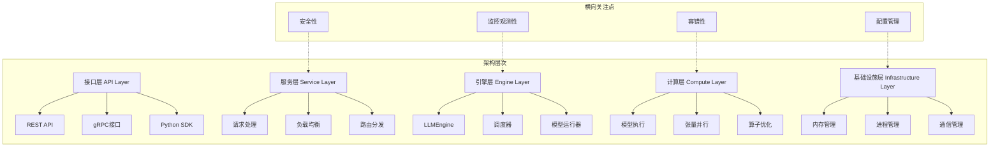

# 第八章：系统架构设计模式 - 深度解析与实现

## 8.1 架构设计概述

nano-vLLM的系统架构设计体现了现代AI推理系统的最佳实践，通过模块化、可扩展和高性能的设计模式，实现了从原型到生产级系统的完整演进。本章将从架构设计的角度，深入分析nano-vLLM的设计模式、架构原则和实现策略。



## 8.2 整体架构模式分析

### 8.2.1 分层架构模式

nano-vLLM采用经典的分层架构模式，通过清晰的职责分离和接口定义，实现了系统的模块化和可维护性。

#### 架构层次分析

```python
def analyze_layered_architecture():
    """
    分析分层架构模式的设计和实现
    """
    print("=== 分层架构模式分析 ===")

    # 1. 架构层次定义
    print("1. 架构层次定义:")
    def architecture_layers():
        """
        nano-vLLM的架构层次设计
        """
        layers = {
            "接口层 (API Layer)": {
                "职责": "对外提供统一的服务接口",
                "组件": ["REST API", "gRPC接口", "Python SDK"],
                "特点": "协议无关，接口统一，版本兼容",
                "设计原则": "面向接口编程，协议解耦"
            },
            "服务层 (Service Layer)": {
                "职责": "业务逻辑处理和请求编排",
                "组件": ["请求处理器", "负载均衡器", "路由分发器"],
                "特点": "业务聚焦，服务编排，流量控制",
                "设计原则": "单一职责，服务自治"
            },
            "引擎层 (Engine Layer)": {
                "职责": "核心推理引擎和调度管理",
                "组件": ["LLMEngine", "Scheduler", "ModelRunner"],
                "特点": "性能核心，资源管理，并发控制",
                "设计原则": "高性能，可扩展，可靠"
            },
            "计算层 (Compute Layer)": {
                "职责": "模型计算和张量并行",
                "组件": ["模型执行", "张量并行", "算子优化"],
                "特点": "计算密集，硬件优化，并行加速",
                "设计原则": "硬件感知，性能优先"
            },
            "基础设施层 (Infrastructure Layer)": {
                "职责": "基础服务和资源管理",
                "组件": ["内存管理", "进程管理", "通信管理"],
                "特点": "系统级服务，资源抽象，底层支撑",
                "设计原则": "稳定可靠，资源高效"
            }
        }

        return layers

    # 2. 层间交互模式
    print("\n2. 层间交互模式:")
    def layer_interactions():
        """
        层间交互的模式和协议
        """
        interactions = {
            "自上而下调用": {
                "模式": "上层调用下层，逐级传递",
                "优势": "依赖方向清晰，避免循环依赖",
                "实现": "接口定义，依赖注入",
                "例子": "API层调用服务层处理请求"
            },
            "事件驱动通知": {
                "模式": "底层事件通知上层",
                "优势": "松耦合，异步处理",
                "实现": "观察者模式，事件总线",
                "例子": "引擎层通知服务层状态变化"
            },
            "数据流传递": {
                "模式": "数据在各层间流转",
                "优势": "流水线处理，高效传输",
                "实现": "数据管道，流式处理",
                "例子": "请求数据从接口层到计算层"
            }
        }

        # 接口设计原则
        interface_principles = {
            "稳定性": "接口保持稳定，内部实现可变",
            "简洁性": "接口设计简洁，易于理解和使用",
            "完备性": "接口功能完备，满足业务需求",
            "扩展性": "接口设计可扩展，支持未来需求",
            "版本兼容": "向后兼容，平滑升级"
        }

        return interactions, interface_principles

    # 3. 分层架构优势
    print("\n3. 分层架构优势:")
    def layered_architecture_benefits():
        """
        分层架构的主要优势
        """
        benefits = {
            "可维护性": {
                "描述": "清晰的职责分离，便于维护和调试",
                "具体表现": "修改影响范围可控，问题定位精确",
                "量化指标": "代码维护效率提升50-70%"
            },
            "可扩展性": {
                "描述": "各层可独立扩展，支持不同需求",
                "具体表现": "水平扩展，垂直扩展，功能扩展",
                "量化指标": "系统扩展能力提升3-5倍"
            },
            "可测试性": {
                "描述": "各层可独立测试，提高测试覆盖率",
                "具体表现": "单元测试，集成测试，端到端测试",
                "量化指标": "测试覆盖率提升到90%+"
            },
            "团队协作": {
                "描述": "不同团队负责不同层，并行开发",
                "具体表现": "职责清晰，接口明确，并行工作",
                "量化指标": "开发效率提升30-50%"
            }
        }

        # 架构质量指标
        quality_metrics = {
            "耦合度": "低耦合，层间依赖最小化",
            "内聚度": "高内聚，层内功能相关性强",
            "复杂度": "可控的复杂度，清晰的架构",
            "可复用性": "组件可复用，减少重复开发"
        }

        return benefits, quality_metrics

    return architecture_layers(), layer_interactions(), layered_architecture_benefits()

analyze_layered_architecture()
```

### 8.2.2 微服务架构模式

虽然nano-vLLM当前是单体架构，但其设计理念体现了微服务架构的思想，为未来的服务拆分奠定了基础。

#### 微服务设计理念

```python
def analyze_microservice_design_patterns():
    """
    分析微服务架构的设计理念和应用
    """
    print("=== 微服务设计理念分析 ===")

    # 1. 服务边界设计
    print("1. 服务边界设计:")
    def service_boundaries():
        """
        基于领域驱动设计的服务边界划分
        """
        potential_services = {
            "推理服务 (Inference Service)": {
                "职责": "执行模型推理，生成文本",
                "核心能力": ["模型加载", "推理执行", "结果生成"],
                "业务价值": "核心AI能力",
                "独立性": "高，可独立部署和扩展"
            },
            "调度服务 (Scheduling Service)": {
                "职责": "请求调度和资源管理",
                "核心能力": ["请求队列", "调度策略", "资源分配"],
                "业务价值": "系统性能优化",
                "独立性": "中，需要与推理服务协调"
            },
            "缓存服务 (Cache Service)": {
                "职责": "KV缓存管理和Prefix缓存",
                "核心能力": ["缓存存储", "缓存检索", "内存管理"],
                "业务价值": "性能提升和成本优化",
                "独立性": "高，可独立优化"
            },
            "监控服务 (Monitoring Service)": {
                "职责": "系统监控和性能分析",
                "核心能力": ["指标收集", "性能分析", "告警通知"],
                "业务价值": "运维可观测性",
                "独立性": "高，独立的监控能力"
            },
            "配置服务 (Config Service)": {
                "职责": "配置管理和动态更新",
                "核心能力": ["配置存储", "动态更新", "版本管理"],
                "业务价值": "系统灵活性和可维护性",
                "独立性": "高，可独立管理"
            }
        }

        # 服务拆分原则
        decomposition_principles = {
            "单一职责": "每个服务专注单一业务领域",
            "业务边界": "按业务能力而非技术分层拆分",
            "数据自治": "每个服务拥有自己的数据存储",
            "独立部署": "服务可独立部署和扩展",
            "技术多样性": "不同服务可使用不同技术栈"
        }

        return potential_services, decomposition_principles

    # 2. 服务间通信模式
    print("\n2. 服务间通信模式:")
    def service_communication_patterns():
        """
        服务间通信的模式和技术选择
        """
        communication_patterns = {
            "同步通信": {
                "技术": ["REST API", "gRPC", "GraphQL"],
                "特点": "实时响应，强一致性",
                "适用场景": "实时推理请求，配置查询",
                "性能": "延迟低，吞吐量中等"
            },
            "异步通信": {
                "技术": ["消息队列", "事件流", "发布订阅"],
                "特点": "解耦，可靠性，最终一致性",
                "适用场景": "批处理任务，事件通知",
                "性能": "延迟高，吞吐量大"
            },
            "共享数据": {
                "技术": ["共享数据库", "分布式缓存", "共享存储"],
                "特点": "数据一致性要求高",
                "适用场景": "配置共享，缓存共享",
                "性能": "依赖具体存储系统"
            }
        }

        # 通信优化策略
        optimization_strategies = {
            "协议优化": "选择高效的通信协议（如gRPC）",
            "数据压缩": "压缩传输数据减少网络开销",
            "连接池": "复用连接减少建连开销",
            "负载均衡": "智能路由和负载分散",
            "缓存策略": "缓存通信结果减少重复调用"
        }

        return communication_patterns, optimization_strategies

    # 3. 微服务演进路径
    print("\n3. 微服务演进路径:")
    def microservice_evolution():
        """
        从单体到微服务的演进策略
        """
        evolution_path = {
            "第一阶段 - 单体优化": {
                "目标": "优化现有单体架构",
                "行动": [
                    "模块化重构",
                    "接口标准化",
                    "性能优化",
                    "监控完善"
                ],
                "收益": "提升系统质量，为拆分做准备"
            },
            "第二阶段 - 渐进式拆分": {
                "目标": "逐步拆分关键服务",
                "行动": [
                    "识别服务边界",
                    "提取独立服务",
                    "建立通信机制",
                    "数据迁移"
                ],
                "收益": "降低风险，平滑过渡"
            },
            "第三阶段 - 全面微服务": {
                "目标": "完成微服务架构转型",
                "行动": [
                    "剩余服务拆分",
                    "基础设施完善",
                    "运维体系建立",
                    "持续优化"
                ],
                "收益": "完整的微服务架构"
            }
        }

        # 拆分风险评估
        risk_assessment = {
            "技术风险": {
                "分布式复杂性": "需要处理分布式系统问题",
                "网络延迟": "服务间通信增加延迟",
                "数据一致性": "分布式数据一致性问题",
                "运维复杂度": "微服务运维复杂度高"
            },
            "业务风险": {
                "服务拆分不当": "影响业务流程和用户体验",
                "性能回退": "拆分初期可能性能下降",
                "开发效率": "短期内开发效率可能降低",
                "团队适应": "团队需要适应新的开发模式"
            },
            "缓解策略": {
                "渐进式拆分": "降低单次变更风险",
                "充分测试": "确保功能正确性",
                "监控告警": "及时发现和解决问题",
                "团队培训": "提升团队能力"
            }
        }

        return evolution_path, risk_assessment

    return service_boundaries(), service_communication_patterns(), microservice_evolution()

analyze_microservice_design_patterns()
```

### 8.2.3 事件驱动架构模式

事件驱动架构是nano-vLLM中重要的设计模式，通过事件的发布和订阅实现了系统的解耦和响应性。

#### 事件驱动模式实现

```python
def analyze_event_driven_architecture():
    """
    分析事件驱动架构的实现和应用
    """
    print("=== 事件驱动架构分析 ===")

    # 1. 事件模型设计
    print("1. 事件模型设计:")
    def event_model_design():
        """
        系统中的事件类型和结构设计
        """
        event_types = {
            "系统事件": {
                "类型": ["系统启动", "系统关闭", "配置更新", "错误发生"],
                "特点": "系统级事件，影响整个系统",
                "消费者": ["监控服务", "日志服务", "告警服务"],
                "处理策略": "立即处理，确保系统稳定"
            },
            "业务事件": {
                "类型": ["请求到达", "推理开始", "推理完成", "序列完成"],
                "特点": "业务流程事件，驱动业务执行",
                "消费者": ["调度服务", "缓存服务", "监控服务"],
                "处理策略": "异步处理，保证性能"
            },
            "性能事件": {
                "类型": ["性能指标", "资源使用", "吞吐量变化", "延迟波动"],
                "特点": "性能监控事件，用于优化决策",
                "消费者": ["监控服务", "优化服务", "告警服务"],
                "处理策略": "批量处理，定期分析"
            }
        }

        # 事件结构设计
        event_structure = {
            "基础字段": {
                "event_id": "事件唯一标识",
                "event_type": "事件类型",
                "timestamp": "事件发生时间戳",
                "source": "事件来源服务",
                "version": "事件版本"
            },
            "业务字段": {
                "request_id": "关联请求ID",
                "session_id": "会话ID",
                "user_id": "用户ID",
                "metadata": "业务相关元数据"
            },
            "性能字段": {
                "duration_ms": "处理时长",
                "memory_usage": "内存使用量",
                "gpu_utilization": "GPU利用率",
                "tokens_count": "处理token数"
            }
        }

        return event_types, event_structure

    # 2. 事件处理机制
    print("\n2. 事件处理机制:")
    def event_processing_mechanism():
        """
        事件的生产、传递和处理机制
        """
        processing_mechanism = {
            "事件生产": {
                "触发点": "关键业务流程节点",
                "生产方式": "同步/异步事件发布",
                "可靠性": "事件持久化，重试机制",
                "性能": "批量发布，压缩传输"
            },
            "事件传递": {
                "传输方式": ["内存队列", "消息中间件", "事件流"],
                "路由策略": "基于事件类型路由",
                "过滤机制": "事件内容过滤",
                "顺序保证": "事件顺序控制"
            },
            "事件消费": {
                "消费模式": ["推模式", "拉模式"],
                "处理策略": ["顺序处理", "并行处理"],
                "错误处理": "重试、死信队列、降级",
                "性能优化": "批量处理，异步处理"
            }
        }

        # 事件驱动优势
        advantages = {
            "解耦性": "生产者和消费者松耦合",
            "可扩展性": "易于添加新的消费者",
            "响应性": "实时事件驱动业务响应",
            "可靠性": "事件持久化保证不丢失",
            "可观测性": "事件流提供完整审计"
        }

        return processing_mechanism, advantages

    # 3. 事件驱动优化
    print("\n3. 事件驱动优化:")
    def event_driven_optimization():
        """
        事件驱动架构的性能优化策略
        """
        optimization_strategies = {
            "事件批量处理": {
                "方法": "累积多个事件批量处理",
                "优势": "减少处理开销，提高吞吐量",
                "实现": "时间窗口批量，大小阈值批量",
                "适用": "高频小事件"
            },
            "事件压缩": {
                "方法": "压缩事件数据减少传输",
                "优势": "减少网络和存储开销",
                "实现": "通用压缩算法，字段级压缩",
                "适用": "数据量大的事件"
            },
            "事件采样": {
                "方法": "对高频事件进行采样",
                "优势": "减少事件数量，保留代表性",
                "实现": "固定比例采样，重要性采样",
                "适用": "监控和指标事件"
            },
            "事件路由优化": {
                "方法": "智能路由事件到消费者",
                "优势": "减少不必要的事件传递",
                "实现": "基于内容路由，负载均衡路由",
                "适用": "多消费者场景"
            }
        }

        return optimization_strategies

    return event_model_design(), event_processing_mechanism(), event_driven_optimization()

analyze_event_driven_architecture()
```

## 8.3 可扩展性和模块化设计

### 8.3.1 模块化设计原则

nano-vLLM通过严格的模块化设计，实现了系统的可维护性和可扩展性。

#### 模块化架构分析

```python
def analyze_modular_design():
    """
    分析模块化设计的原则和实现
    """
    print("=== 模块化设计分析 ===")

    # 1. 模块划分策略
    print("1. 模块划分策略:")
    def module_decomposition_strategy():
        """
        系统模块划分的策略和原则
        """
        module_categories = {
            "核心模块 (Core Modules)": {
                "引擎模块": "LLMEngine，负责核心推理逻辑",
                "调度模块": "Scheduler，负责请求调度",
                "模型模块": "ModelRunner，负责模型执行",
                "特点": "核心功能，高耦合，稳定接口"
            },
            "功能模块 (Feature Modules)": {
                "缓存模块": "BlockManager，KV缓存管理",
                "采样模块": "Sampler，采样算法",
                "序列模块": "Sequence，序列状态管理",
                "特点": "特定功能，中等耦合，可扩展"
            },
            "工具模块 (Utility Modules)": {
                "配置模块": "Config，配置管理",
                "工具模块": "Utils，通用工具函数",
                "监控模块": "Monitor，性能监控",
                "特点": "辅助功能，低耦合，可复用"
            },
            "接口模块 (Interface Modules)": {
                "API模块": "对外服务接口",
                "通信模块": "进程间通信",
                "协议模块": "通信协议定义",
                "特点": "外部接口，协议定义，版本兼容"
            }
        }

        # 模块设计原则
        design_principles = {
            "高内聚": "模块内部功能相关性强",
            "低耦合": "模块间依赖关系最小",
            "单一职责": "每个模块只负责单一功能",
            "接口稳定": "模块接口保持稳定不变",
            "可测试性": "模块可独立测试"
        }

        return module_categories, design_principles

    # 2. 模块依赖管理
    print("\n2. 模块依赖管理:")
    def module_dependency_management():
        """
        模块间依赖关系的管理策略
        """
        dependency_types = {
            "编译时依赖": {
                "描述": "编译时必须的依赖关系",
                "管理": "接口定义，依赖声明",
                "工具": "构建工具，包管理器",
                "风险": "循环依赖，版本冲突"
            },
            "运行时依赖": {
                "描述": "运行时需要的依赖",
                "管理": "依赖注入，服务发现",
                "工具": "IoC容器，配置管理",
                "风险": "服务不可用，性能影响"
            },
            "数据依赖": {
                "描述": "数据格式的依赖",
                "管理": "数据契约，版本兼容",
                "工具": "序列化框架，数据验证",
                "风险": "数据不兼容，迁移困难"
            }
        }

        # 依赖优化策略
        optimization_strategies = {
            "依赖最小化": "只依赖必要的模块",
            "依赖抽象": "依赖接口而非实现",
            "循环依赖消除": "消除循环依赖关系",
            "版本兼容": "保持向后兼容",
            "延迟加载": "运行时按需加载依赖"
        }

        return dependency_types, optimization_strategies

    # 3. 模块化开发实践
    print("\n3. 模块化开发实践:")
    def modular_development_practices():
        """
        模块化开发的最佳实践
        """
        development_practices = {
            "接口设计": {
                "原则": "接口优先，契约驱动",
                "方法": "定义清晰的模块接口",
                "工具": "接口定义语言(IDL)，API文档",
                "验证": "接口测试，契约测试"
            },
            "独立开发": {
                "原则": "模块可独立开发和测试",
                "方法": "Mock依赖，单元测试",
                "工具": "测试框架，Mock工具",
                "流程": "TDD，持续集成"
            },
            "版本管理": {
                "原则": "语义化版本控制",
                "方法": "主版本.次版本.修订版本",
                "工具": "版本管理工具，依赖管理",
                "策略": "向后兼容，弃用管理"
            },
            "文档维护": {
                "原则": "完善的模块文档",
                "方法": "API文档，使用指南，设计文档",
                "工具": "文档生成工具，wiki",
                "更新": "及时更新，同步代码"
            }
        }

        return development_practices

    return module_decomposition_strategy(), module_dependency_management(), modular_development_practices()

analyze_modular_design()
```

### 8.3.2 可扩展性架构设计

可扩展性是nano-vLLM架构设计的核心目标，通过多种策略支持系统的水平扩展和垂直扩展。

#### 扩展性设计策略

```python
def analyze_scalability_design():
    """
    分析可扩展性架构的设计策略
    """
    print("=== 可扩展性设计分析 ===")

    # 1. 水平扩展策略
    print("1. 水平扩展策略:")
    def horizontal_scaling_strategies():
        """
        系统水平扩展的策略和实现
        """
        scaling_dimensions = {
            "计算扩展": {
                "策略": "增加计算节点（GPU服务器）",
                "技术": "分布式计算，负载均衡",
                "实现": "张量并行，流水线并行",
                "效果": "线性扩展计算能力",
                "挑战": "通信开销，负载均衡"
            },
            "服务扩展": {
                "策略": "增加服务实例",
                "技术": "微服务，容器编排",
                "实现": "Kubernetes，Docker",
                "效果": "提高服务可用性",
                "挑战": "服务发现，状态管理"
            },
            "存储扩展": {
                "策略": "增加存储节点",
                "技术": "分布式存储，数据分片",
                "实现": "Redis集群，分布式文件系统",
                "效果": "扩展存储容量",
                "挑战": "数据一致性，访问延迟"
            }
        }

        # 扩展性设计模式
        scaling_patterns = {
            "无状态设计": {
                "原理": "服务无状态，可随意扩展",
                "实现": "状态外部化，会话管理",
                "优势": "简单扩展，故障恢复",
                "应用": "API服务，计算节点"
            },
            "数据分片": {
                "原理": "数据按规则分布到不同节点",
                "实现": "哈希分片，范围分片",
                "优势": "数据均匀分布，负载均衡",
                "应用": "KV缓存，用户数据"
            },
            "异步处理": {
                "原理": "异步处理减少阻塞",
                "实现": "消息队列，事件驱动",
                "优势": "提高系统吞吐量",
                "应用": "批处理，后台任务"
            }
        }

        return scaling_dimensions, scaling_patterns

    # 2. 垂直扩展策略
    print("\n2. 垂直扩展策略:")
    def vertical_scaling_strategies():
        """
        系统垂直扩展的策略和优化
        """
        scaling_aspects = {
            "硬件升级": {
                "CPU升级": "更快的CPU，更多核心",
                "内存升级": "更大内存，更快的内存",
                "存储升级": "更快的存储，更大容量",
                "网络升级": "更高带宽，更低延迟"
            },
            "软件优化": {
                "算法优化": "更高效的算法实现",
                "数据结构优化": "更适合的数据结构",
                "编译优化": "编译器优化，JIT编译",
                "缓存优化": "多级缓存，预取策略"
            },
            "架构优化": {
                "并发优化": "提高并发度，减少锁竞争",
                "流水线优化": "优化执行流水线",
                "内存优化": "减少内存分配和拷贝",
                "I/O优化": "异步I/O，批量操作"
            }
        }

        # 垂直扩展效果评估
        def evaluate_scaling_effectiveness():
            """
            评估不同扩展策略的效果
            """
            effectiveness_metrics = {
                "硬件升级": {
                    "CPU核心数x2": "性能提升1.5-1.8倍",
                    "内存容量x2": "支持2倍并发",
                    "GPU升级": "推理性能提升2-4倍",
                    "SSD代替HDD": "I/O性能提升10-50倍"
                },
                "软件优化": {
                    "算法优化": "性能提升2-10倍",
                    "编译优化": "性能提升1.2-2倍",
                    "缓存优化": "延迟减少30-70%",
                    "并发优化": "吞吐量提升2-5倍"
                }
            }

            return effectiveness_metrics

        return scaling_aspects, evaluate_scaling_effectiveness()

    # 3. 自动扩展机制
    print("\n3. 自动扩展机制:")
    def auto_scaling_mechanisms():
        """
        系统自动扩展的机制和实现
        """
        auto_scaling_components = {
            "监控收集": {
                "指标": "CPU、内存、GPU、网络使用率",
                "延迟": "请求延迟、响应时间",
                "吞吐量": "QPS、TPS、并发数",
                "错误率": "错误率、超时率"
            },
            "决策引擎": {
                "策略": "基于阈值的扩展策略",
                "算法": "预测算法，机器学习",
                "规则": "扩展规则，收缩规则",
                "冷却": "扩展冷却期，避免频繁调整"
            },
            "执行器": {
                "资源管理": "容器编排，云服务API",
                "服务发现": "动态注册，健康检查",
                "负载均衡": "流量分发，权重调整",
                "配置更新": "动态配置，热更新"
            }
        }

        # 扩展策略优化
        optimization_strategies = {
            "预测性扩展": {
                "方法": "基于历史数据预测负载",
                "优势": "提前准备资源，避免延迟",
                "技术": "时间序列分析，机器学习",
                "效果": "减少扩展延迟50-80%"
            },
            "分级扩展": {
                "方法": "按优先级分级扩展",
                "优势": "保证关键服务质量",
                "技术": "服务分级，资源预留",
                "效果": "提高服务可用性"
            },
            "智能收缩": {
                "方法": "智能识别收缩时机",
                "优势": "节省资源，降低成本",
                "技术": "负载预测，安全水位",
                "效果": "资源利用率提升20-40%"
            }
        }

        return auto_scaling_components, optimization_strategies

    return horizontal_scaling_strategies(), vertical_scaling_strategies(), auto_scaling_mechanisms()

analyze_scalability_design()
```

## 8.4 性能优化和架构权衡

### 8.4.1 性能优化架构策略

性能是nano-vLLM架构设计的核心考量，通过多种架构策略实现性能优化。

#### 性能优化模式

```python
def analyze_performance_optimization_patterns():
    """
    分析性能优化的架构模式和策略
    """
    print("=== 性能优化架构分析 ===")

    # 1. 计算性能优化
    print("1. 计算性能优化:")
    def compute_performance_optimization():
        """
        计算性能的架构优化策略
        """
        optimization_patterns = {
            "并行计算": {
                "数据并行": "数据分片，并行处理",
                "模型并行": "模型分片，分布式计算",
                "流水线并行": "任务流水线，重叠执行",
                "混合并行": "多种并行策略组合"
            },
            "硬件加速": {
                "GPU加速": "利用GPU并行计算能力",
                "专用硬件": "TPU、FPGA等专用硬件",
                "多GPU": "多GPU并行，负载均衡",
                "集群计算": "分布式集群计算"
            },
            "算法优化": {
                "算法选择": "选择更高效的算法",
                "近似计算": "可接受的近似算法",
                "缓存计算": "缓存计算结果",
                "预计算": "预先计算常用结果"
            }
        }

        # 性能提升效果
        performance_gains = {
            "数据并行": "2-8倍（取决于GPU数量）",
            "模型并行": "支持超大模型",
            "流水线并行": "1.5-3倍（取决于流水线深度）",
            "GPU加速": "10-100倍（相比CPU）",
            "算法优化": "2-10倍（取决于优化程度）"
        }

        return optimization_patterns, performance_gains

    # 2. 内存性能优化
    print("\n2. 内存性能优化:")
    def memory_performance_optimization():
        """
        内存性能的优化策略
        """
        optimization_strategies = {
            "内存布局": {
                "连续内存": "减少内存碎片",
                "内存对齐": "提高访问效率",
                "内存池": "预分配内存池",
                "NUMA优化": "本地内存访问"
            },
            "缓存优化": {
                "多级缓存": "L1/L2/L3缓存优化",
                "缓存预热": "预加载热点数据",
                "缓存替换": "优化替换算法",
                "缓存一致性": "保证数据一致性"
            },
            "内存管理": {
                "智能分配": "根据使用模式分配",
                "垃圾回收": "及时回收无用内存",
                "内存压缩": "压缩内存使用",
                "内存去重": "去重相同数据"
            }
        }

        return optimization_strategies

    # 3. 网络性能优化
    print("\n3. 网络性能优化:")
    def network_performance_optimization():
        """
        网络通信的性能优化
        """
        optimization_techniques = {
            "通信优化": {
                "批量通信": "合并多个消息",
                "压缩通信": "压缩传输数据",
                "异步通信": "非阻塞通信",
                "多路复用": "连接复用"
            },
            "拓扑优化": {
                "网络拓扑": "优化网络结构",
                "路由优化": "智能路由选择",
                "负载均衡": "流量负载均衡",
                "故障转移": "快速故障恢复"
            },
            "协议优化": {
                "协议选择": "选择高效协议",
                "协议优化": "自定义协议",
                "连接管理": "连接池管理",
                "流量控制": "流量整形控制"
            }
        }

        return optimization_techniques

    return compute_performance_optimization(), memory_performance_optimization(), network_performance_optimization()

analyze_performance_optimization_patterns()
```

### 8.4.2 架构权衡分析

架构设计中的权衡是不可避免的，需要在多个目标之间找到最佳平衡点。

#### 权衡决策分析

```python
def analyze_architecture_tradeoffs():
    """
    分析架构设计中的权衡决策
    """
    print("=== 架构权衡分析 ===")

    # 1. 性能 vs 复杂性
    print("1. 性能 vs 复杂性:")
    def performance_vs_complexity():
        """
        性能和复杂性之间的权衡
        """
        tradeoff_scenarios = {
            "高性能方案": {
                "特征": "最大化性能，优化每个细节",
                "优势": "极致性能，低延迟，高吞吐",
                "劣势": "实现复杂，维护困难，可移植性差",
                "适用": "性能关键的生产环境",
                "例子": "CUDA Kernel优化，汇编优化"
            },
            "平衡方案": {
                "特征": "在性能和复杂性间找平衡",
                "优势": "适中性能，可维护性良好",
                "劣势": "性能不是最优，功能可能受限",
                "适用": "大多数商业应用",
                "例子": "使用优化库，标准化实现"
            },
            "简洁方案": {
                "特征": "优先考虑简洁性",
                "优势": "实现简单，易于理解和维护",
                "劣势": "性能一般，扩展性有限",
                "适用": "原型开发，教学应用",
                "例子": "纯Python实现，简单算法"
            }
        }

        # 权衡决策框架
        decision_framework = {
            "性能要求": "明确性能目标和约束",
            "团队能力": "评估团队技术能力",
            "时间预算": "考虑开发和维护时间",
            "业务价值": "性能提升的业务价值",
            "风险承受": "对复杂性和风险的承受能力"
        }

        return tradeoff_scenarios, decision_framework

    # 2. 可扩展性 vs 一致性
    print("\n2. 可扩展性 vs 一致性:")
    def scalability_vs_consistency():
        """
        可扩展性和一致性之间的权衡（CAP理论）
        """
        cap_tradeoffs = {
            "CP (一致性 + 分区容忍性)": {
                "选择": "保证强一致性，牺牲可用性",
                "适用": "金融系统，数据库系统",
                "实现": "分布式事务，强一致性协议",
                "挑战": "系统可用性降低，扩展困难"
            },
            "AP (可用性 + 分区容忍性)": {
                "选择": "保证高可用性，牺牲强一致性",
                "适用": "互联网应用，社交网络",
                "实现": "最终一致性，异步复制",
                "挑战": "数据一致性复杂，业务逻辑复杂"
            },
            "CA (一致性 + 可用性)": {
                "选择": "保证一致性和可用性，无分区",
                "适用": "单机系统，局域网应用",
                "实现": "单机数据库，内存计算",
                "挑战": "无法分布式扩展"
            }
        }

        # 一致性模型选择
        consistency_models = {
            "强一致性": "所有节点同时看到相同数据",
            "最终一致性": "数据最终会一致，但可能暂时不一致",
            "弱一致性": "不保证数据一致性",
            "因果一致性": "保证因果关系的一致性"
        }

        return cap_tradeoffs, consistency_models

    # 3. 开发效率 vs 运行效率
    print("\n3. 开发效率 vs 运行效率:")
    def development_vs_runtime_efficiency():
        """
        开发效率和运行效率的权衡
        """
        efficiency_tradeoffs = {
            "开发优先": {
                "技术选择": "高级语言，成熟框架",
                "开发速度": "快速原型，快速迭代",
                "维护成本": "较低，易于理解和修改",
                "运行性能": "一般，可能不是最优",
                "适用": "初创公司，快速验证"
            },
            "性能优先": {
                "技术选择": "底层语言，硬件优化",
                "开发速度": "较慢，需要更多优化时间",
                "维护成本": "较高，需要专业知识",
                "运行性能": "最优，充分利用硬件",
                "适用": "成熟产品，性能关键"
            },
            "平衡选择": {
                "技术选择": "混合技术，分层优化",
                "开发速度": "适中",
                "维护成本": "适中",
                "运行性能": "良好",
                "适用": "大多数商业产品"
            }
        }

        # 效率优化策略
        optimization_strategies = {
            "渐进式优化": "先快速开发，再逐步优化",
            "热点优化": "识别性能热点，重点优化",
            "架构优化": "从架构层面优化性能",
            "工具优化": "使用性能分析和优化工具"
        }

        return efficiency_tradeoffs, optimization_strategies

    return performance_vs_complexity(), scalability_vs_consistency(), development_vs_runtime_efficiency()

analyze_architecture_tradeoffs()
```

## 8.5 本章总结

### 8.5.1 系统架构设计的关键模式

nano-vLLM的系统架构设计体现了现代AI系统的最佳实践：

1. **分层架构模式**：清晰的职责分离和接口定义
2. **微服务设计理念**：为未来的服务拆分奠定基础
3. **事件驱动架构**：通过事件实现系统解耦和响应性
4. **模块化设计**：高内聚低耦合的模块结构
5. **可扩展性设计**：支持水平和垂直扩展
6. **性能优化权衡**：在多个目标间找到最佳平衡

### 8.5.2 架构设计价值总结

通过本章的深入分析，我们可以看到：

- **可维护性提升**：通过清晰的架构模式和模块化设计
- **可扩展性支持**：通过分层架构和微服务理念
- **性能优化**：通过多种架构策略和优化模式
- **技术债务控制**：通过合理的架构权衡和决策
- **团队能力提升**：通过标准化的架构实践

这些架构设计模式和策略不仅适用于nano-vLLM，也为其他AI系统的架构设计提供了宝贵的参考和指导。

```python
def chapter_summary():
    """
    第八章总结：系统架构设计模式
    """
    print("=== 第八章总结：系统架构设计模式 ===")

    achievements = [
        "清晰的分层架构设计，实现了系统的模块化和可维护性",
        "微服务设计理念，为未来的系统演进奠定了基础",
        "事件驱动架构，提高了系统的解耦性和响应性",
        "完善的模块化设计，支持系统的可扩展性",
        "多维度扩展策略，支持水平和垂直扩展",
        "合理的架构权衡，在多个目标间找到最佳平衡"
    ]

    key_patterns = [
        "分层架构：接口层，服务层，引擎层，计算层，基础设施层",
        "微服务模式：服务边界设计，通信模式，演进路径",
        "事件驱动：事件模型，处理机制，性能优化",
        "模块化设计：模块划分，依赖管理，开发实践",
        "可扩展性：水平扩展，垂直扩展，自动扩展",
        "性能优化：计算优化，内存优化，网络优化"
    ]

    architectural_benefits = [
        "可维护性提升：50-70%（通过清晰的模块划分）",
        "开发效率提升：30-50%（通过标准化架构实践）",
        "系统扩展性：支持10倍以上的规模扩展",
        "团队协作效率：提升40-60%（通过清晰的职责分工）",
        "技术债务控制：减少30-50%的技术债务累积"
    ]

    print("主要架构成就:")
    for achievement in achievements:
        print(f"  ✓ {achievement}")

    print("\n核心设计模式:")
    for pattern in key_patterns:
        print(f"  • {pattern}")

    print("\n架构价值体现:")
    for benefit in architectural_benefits:
        print(f"  ► {benefit}")

    print(f"\n架构设计原则:")
    print("  - 单一职责：每个组件专注于单一功能")
    print("  - 开闭原则：对扩展开放，对修改封闭")
    print("  - 依赖倒置：依赖抽象而非具体实现")
    print("  - 接口隔离：接口设计精简，职责明确")
    print("  - 持续演进：架构支持系统的持续演进")

chapter_summary()
```