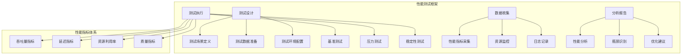

# 第九章：性能基准测试与分析 - 深度解析与实现

## 9.1 性能基准测试概述

性能基准测试是评估和优化nano-vLLM系统性能的关键环节。通过科学的测试方法、全面的指标体系和深入的分析，我们可以准确了解系统的性能特征，识别性能瓶颈，并为优化提供数据支撑。



## 9.2 性能测试框架设计

### 9.2.1 测试框架架构

一个完整的性能测试框架需要支持多种测试类型，自动化执行，并提供全面的分析能力。

#### 测试框架组件分析

```python
def analyze_performance_testing_framework():
    """
    分析性能测试框架的设计和实现
    """
    print("=== 性能测试框架分析 ===")

    # 1. 测试框架架构
    print("1. 测试框架架构:")
    def testing_framework_architecture():
        """
        性能测试框架的核心组件
        """
        framework_components = {
            "测试控制器 (Test Controller)": {
                "职责": "测试流程控制，测试场景管理",
                "功能": ["测试编排", "并发控制", "结果收集", "报告生成"],
                "技术": ["Python脚本", "多线程/多进程", "测试框架"],
                "接口": "测试API，配置接口"
            },
            "负载生成器 (Load Generator)": {
                "职责": "生成测试负载，模拟用户请求",
                "功能": ["请求生成", "并发控制", "负载调节", "行为模拟"],
                "技术": ["HTTP客户端", "异步IO", "连接池"],
                "指标": ["QPS", "并发数", "响应时间"]
            },
            "监控系统 (Monitoring System)": {
                "职责": "监控系统资源和性能指标",
                "功能": ["指标采集", "实时监控", "历史数据", "告警通知"],
                "技术": ["Prometheus", "Grafana", "自定义监控"],
                "覆盖": ["CPU", "内存", "GPU", "网络", "磁盘"]
            },
            "数据分析器 (Data Analyzer)": {
                "职责": "分析测试数据，生成报告",
                "功能": ["数据分析", "可视化", "趋势分析", "异常检测"],
                "技术": ["Pandas", "Matplotlib", "统计分析"],
                "输出": ["性能报告", "图表", "优化建议"]
            }
        }

        return framework_components

    # 2. 测试类型定义
    print("\n2. 测试类型定义:")
    def test_types_definition():
        """
        不同类型的性能测试
        """
        test_types = {
            "基准测试 (Benchmark Test)": {
                "目的": "建立性能基线，验证系统基本性能",
                "场景": "标准负载，典型使用场景",
                "指标": "吞吐量，延迟，资源利用率",
                "频率": "版本发布，重大变更后",
                "工具": "自定义基准测试脚本"
            },
            "压力测试 (Stress Test)": {
                "目的": "测试系统极限和性能瓶颈",
                "场景": "高负载，极限并发",
                "指标": "最大吞吐量，破坏点，恢复能力",
                "频率": "系统优化前后",
                "工具": "压力测试工具，负载生成器"
            },
            "稳定性测试 (Endurance Test)": {
                "目的": "验证系统长期稳定性",
                "场景": "持续负载，长时间运行",
                "指标": "内存泄漏，性能衰减，故障率",
                "频率": "重要发布前",
                "工具": "长期监控，自动化测试"
            },
            "配置测试 (Configuration Test)": {
                "目的": "优化系统配置参数",
                "场景": "不同配置组合",
                "指标": "性能变化，最优配置",
                "频率": "配置调优时",
                "工具": "配置管理，参数扫描"
            }
        }

        return test_types

    # 3. 测试数据管理
    print("\n3. 测试数据管理:")
    def test_data_management():
        """
        测试数据的设计和管理策略
        """
        data_management = {
            "测试数据集": {
                "数据类型": ["标准数据集", "真实数据", "合成数据"],
                "数据规模": ["小规模", "中等规模", "大规模"],
                "数据特征": ["序列长度分布", "词汇分布", "主题分布"],
                "生成方法": ["采样", "合成", "转换"]
            },
            "数据管理策略": {
                "版本控制": "测试数据版本化管理",
                "数据清洗": "去除异常和无效数据",
                "数据标注": "性能基准标注",
                "数据更新": "定期更新测试数据"
            },
            "数据存储": {
                "本地存储": "小规模测试数据",
                "分布式存储": "大规模测试数据",
                "缓存机制": "热点数据缓存",
                "压缩存储": "节省存储空间"
            }
        }

        return data_management

    return testing_framework_architecture(), test_types_definition(), test_data_management()

analyze_performance_testing_framework()
```

### 9.2.2 性能测试指标体系

建立全面的性能指标体系是准确评估系统性能的基础。

#### 指标体系设计

```python
def analyze_performance_metrics_system():
    """
    分析性能测试的指标体系设计
    """
    print("=== 性能指标体系分析 ===")

    # 1. 核心性能指标
    print("1. 核心性能指标:")
    def core_performance_metrics():
        """
        核心性能指标的定义和测量
        """
        core_metrics = {
            "吞吐量指标 (Throughput Metrics)": {
                "QPS (Queries Per Second)": "每秒处理的请求数",
                "TPS (Tokens Per Second)": "每秒生成的token数",
                "Concurrent Users": "并发用户数",
                "Batch Throughput": "批处理吞吐量",
                "单位": "ops/s, tokens/s, users",
                "测量方法": "计数器，时间窗口统计"
            },
            "延迟指标 (Latency Metrics)": {
                "平均延迟": "所有请求的平均响应时间",
                "P50延迟": "50%请求的延迟小于此值",
                "P95延迟": "95%请求的延迟小于此值",
                "P99延迟": "99%请求的延迟小于此值",
                "最大延迟": "最慢请求的响应时间",
                "单位": "ms, s",
                "测量方法": "时间戳差值，百分位统计"
            },
            "资源利用率指标 (Resource Utilization Metrics)": {
                "CPU利用率": "CPU使用百分比",
                "GPU利用率": "GPU计算单元使用百分比",
                "内存利用率": "内存使用百分比",
                "网络带宽": "网络带宽使用情况",
                "磁盘I/O": "磁盘读写性能",
                "单位": "%, MB/s, IOPS",
                "测量方法": "系统监控，硬件计数器"
            }
        }

        return core_metrics

    # 2. 质量指标
    print("\n2. 质量指标:")
    def quality_metrics():
        """
        系统质量和稳定性的指标
        """
        quality_metrics = {
            "可靠性指标": {
                "可用性": "系统可用时间百分比",
                "故障率": "单位时间内的故障次数",
                "MTBF": "平均无故障时间",
                "MTTR": "平均修复时间",
                "目标": "99.9%+可用性"
            },
            "准确性指标": {
                "生成质量": "生成文本的质量评估",
                "一致性": "多次生成结果的一致性",
                "错误率": "错误响应的比例",
                "超时率": "请求超时的比例",
                "目标": "错误率<0.1%"
            },
            "稳定性指标": {
                "性能稳定性": "长时间运行性能变化",
                "内存泄漏": "长期运行内存增长",
                "资源泄漏": "其他资源泄漏情况",
                "性能衰减": "性能随时间衰减",
                "目标": "无性能衰减"
            }
        }

        return quality_metrics

    # 3. 业务指标
    print("\n3. 业务指标:")
    def business_metrics():
        """
        与业务相关的性能指标
        """
        business_metrics = {
            "用户体验指标": {
                "首Token延迟": "第一个token的生成时间",
                "响应感知": "用户感知的响应速度",
                "交互流畅度": "对话交互的流畅程度",
                "满意度": "用户满意度评分",
                "目标": "首Token<100ms，交互流畅"
            },
            "成本效益指标": {
                "单位成本": "每token的计算成本",
                "资源效率": "资源使用效率",
                "能耗效率": "每单位计算的能耗",
                "运维成本": "系统运维成本",
                "目标": "成本最优化"
            },
            "扩展性指标": {
                "扩展效率": "资源增加带来的性能提升",
                "扩展线性度": "性能扩展的线性程度",
                "扩展极限": "系统的最大扩展能力",
                "扩展成本": "扩展带来的成本增加",
                "目标": "线性扩展"
            }
        }

        return business_metrics

    return core_performance_metrics(), quality_metrics(), business_metrics()

analyze_performance_metrics_system()
```

### 9.2.3 测试自动化实现

自动化是性能测试的关键，通过自动化可以提高测试效率，确保测试的一致性和可重复性。

#### 自动化测试实现

```python
def analyze_automated_testing():
    """
    分析自动化性能测试的实现
    """
    print("=== 自动化测试实现分析 ===")

    # 1. 测试自动化框架
    print("1. 测试自动化框架:")
    def automation_framework():
        """
        自动化测试框架的设计
        """
        framework_design = {
            "测试编排": {
                "测试调度": "自动调度测试执行",
                "并发控制": "管理并发测试执行",
                "依赖管理": "处理测试依赖关系",
                "资源管理": "自动化资源分配"
            },
            "执行控制": {
                "测试执行": "自动执行测试脚本",
                "环境准备": "自动准备测试环境",
                "数据准备": "自动准备测试数据",
                "清理恢复": "自动清理和恢复"
            },
            "结果处理": {
                "数据收集": "自动收集测试结果",
                "数据分析": "自动分析测试数据",
                "报告生成": "自动生成测试报告",
                "异常告警": "自动异常检测和告警"
            }
        }

        return framework_design

    # 2. 自动化测试流程
    print("\n2. 自动化测试流程:")
    def automated_test_workflow():
        """
        自动化测试的完整流程
        """
        workflow_steps = {
            "准备阶段": {
                "环境检查": "检查测试环境状态",
                "配置加载": "加载测试配置",
                "资源分配": "分配测试资源",
                "数据准备": "准备测试数据"
            },
            "执行阶段": {
                "启动系统": "启动被测系统",
                "负载生成": "生成测试负载",
                "监控启动": "启动监控工具",
                "测试执行": "执行测试场景"
            },
            "收集阶段": {
                "数据收集": "收集性能数据",
                "日志收集": "收集系统日志",
                "指标采集": "采集性能指标",
                "异常记录": "记录异常情况"
            },
            "分析阶段": {
                "数据分析": "分析测试数据",
                "指标计算": "计算性能指标",
                "瓶颈识别": "识别性能瓶颈",
                "报告生成": "生成测试报告"
            },
            "清理阶段": {
                "资源清理": "清理测试资源",
                "环境恢复": "恢复测试环境",
                "数据备份": "备份测试数据",
                "结果归档": "归档测试结果"
            }
        }

        return workflow_steps

    # 3. 持续集成集成
    print("\n3. 持续集成集成:")
    def ci_cd_integration():
        """
        与CI/CD流水线的集成
        """
        integration_strategies = {
            "触发机制": {
                "代码提交": "代码提交时触发",
                "定期执行": "按计划定期执行",
                "手动触发": "手动触发执行",
                "事件触发": "特定事件触发"
            },
            "流水线集成": {
                "构建阶段": "构建后执行性能测试",
                "测试阶段": "与功能测试并行",
                "部署阶段": "部署前验证性能",
                "监控阶段": "持续性能监控"
            },
            "质量门禁": {
                "性能基准": "满足性能基准要求",
                "回归检测": "检测性能回归",
                "告警机制": "性能问题告警",
                "阻塞机制": "严重性能问题阻塞"
            }
        }

        return integration_strategies

    return automation_framework(), automated_test_workflow(), ci_cd_integration()

analyze_automated_testing()
```

## 9.3 性能基准测试实践

### 9.3.1 基准测试设计

基准测试是评估nano-vLLM性能的基础，需要设计科学的测试场景和方法。

#### 基准测试场景设计

```python
def design_benchmark_scenarios():
    """
    设计nano-vLLM的基准测试场景
    """
    print("=== 基准测试场景设计 ===")

    # 1. 典型使用场景
    print("1. 典型使用场景:")
    def typical_scenarios():
        """
        定义典型的使用场景
        """
        scenarios = {
            "单轮对话": {
                "描述": "单次问答，生成一段回答",
                "输入": "1-2个问题，每问50-200字",
                "输出": "50-500字的回答",
                "特点": "短上下文，快速响应",
                "权重": "40%"
            },
            "多轮对话": {
                "描述": "多轮对话，保持上下文",
                "输入": "3-10轮对话，总计200-1000字",
                "输出": "每轮50-200字",
                "特点": "长上下文，需要KV缓存",
                "权重": "30%"
            },
            "文档生成": {
                "描述": "根据提示生成文档",
                "输入": "100-500字的提示",
                "输出": "500-2000字的长文本",
                "特点": "长序列生成，高吞吐量",
                "权重": "20%"
            },
            "代码生成": {
                "描述": "生成代码片段或函数",
                "输入": "50-300字的代码需求",
                "输出": "50-1000行代码",
                "特点": "格式化输出，逻辑性强",
                "权重": "10%"
            }
        }

        return scenarios

    # 2. 负载模式设计
    print("\n2. 负载模式设计:")
    def load_patterns():
        """
        设计不同的负载模式
        """
        load_patterns = {
            "恒定负载": {
                "模式": "固定的请求速率",
                "特点": "稳定负载，测试基线性能",
                "用途": "基准性能测试",
                "参数": "请求速率，持续时间"
            },
            "阶梯负载": {
                "模式": "逐步增加负载",
                "特点": "渐进式负载增加",
                "用途": "系统容量测试",
                "参数": "起始负载，步长，最大负载"
            },
            "突发负载": {
                "模式": "突发高负载",
                "特点": "模拟突发流量",
                "用途": "系统弹性测试",
                "参数": "突发强度，持续时间"
            },
            "混合负载": {
                "模式": "多种负载模式混合",
                "特点": "模拟真实使用模式",
                "用途": "真实性测试",
                "参数": "各模式权重，切换频率"
            }
        }

        return load_patterns

    # 3. 配置参数矩阵
    print("\n3. 配置参数矩阵:")
    def configuration_matrix():
        """
        设计配置参数的测试矩阵
        """
        config_matrix = {
            "模型配置": {
                "模型规模": ["7B", "13B", "70B"],
                "精度": ["FP16", "INT8", "INT4"],
                "量化": ["无量化", "静态量化", "动态量化"]
            },
            "系统配置": {
                "GPU数量": [1, 2, 4, 8],
                "批大小": [1, 4, 8, 16, 32],
                "序列长度": [512, 1024, 2048, 4096]
            },
            "调度配置": {
                "最大并发": [32, 64, 128, 256],
                "KV缓存大小": ["2GB", "4GB", "8GB", "16GB"],
                "调度策略": ["FIFO", "优先级", "公平调度"]
            }
        }

        # 测试组合选择策略
        combination_strategies = {
            "全组合测试": "测试所有配置组合（全面但耗时）",
            "正交试验": "使用正交表选择代表性组合",
            "关键因子": "重点测试关键配置因子",
            "渐进式测试": "逐步增加配置复杂度"
        }

        return config_matrix, combination_strategies

    return typical_scenarios(), load_patterns(), configuration_matrix()

design_benchmark_scenarios()
```

### 9.3.2 性能测试执行

性能测试的执行需要严格的环境控制和数据收集过程。

#### 测试执行实现

```python
def implement_performance_test_execution():
    """
    实现性能测试的执行过程
    """
    print("=== 性能测试执行实现 ===")

    # 1. 测试环境准备
    print("1. 测试环境准备:")
    def test_environment_preparation():
        """
        准备测试环境的步骤和检查
        """
        preparation_steps = {
            "硬件环境": {
                "GPU检查": "检查GPU型号、驱动、CUDA版本",
                "内存检查": "检查内存容量、可用性",
                "存储检查": "检查磁盘空间、I/O性能",
                "网络检查": "检查网络带宽、延迟"
            },
            "软件环境": {
                "系统环境": "操作系统版本、依赖库",
                "模型文件": "检查模型文件完整性",
                "配置文件": "验证配置文件正确性",
                "监控工具": "部署监控和日志工具"
            },
            "服务环境": {
                "服务启动": "启动nano-vLLM服务",
                "健康检查": "验证服务健康状态",
                "配置验证": "验证服务配置正确",
                "基准测试": "运行简单基准验证"
            }
        }

        # 环境检查清单
        checklist = {
            "GPU状态": "nvidia-smi检查GPU状态",
            "内存状态": "free或top检查内存使用",
            "磁盘状态": "df检查磁盘空间",
            "网络状态": "ping检查网络连通性",
            "服务状态": "curl检查服务可用性",
            "监控状态": "检查监控工具运行"
        }

        return preparation_steps, checklist

    # 2. 测试执行控制
    print("\n2. 测试执行控制:")
    def test_execution_control():
        """
        测试执行的控制逻辑
        """
        execution_control = {
            "预热阶段": {
                "目的": "系统预热，稳定性能",
                "方法": "运行少量测试请求",
                "时间": "5-10分钟",
                "监控": "观察性能指标稳定性"
            },
            "基准阶段": {
                "目的": "收集基准性能数据",
                "方法": "按计划执行测试场景",
                "时间": "根据场景确定",
                "监控": "详细记录所有指标"
            },
            "压力阶段": {
                "目的": "测试系统极限性能",
                "方法": "逐步增加负载",
                "时间": "直到达到极限或出现错误",
                "监控": "关注系统极限和瓶颈"
            },
            "恢复阶段": {
                "目的": "测试系统恢复能力",
                "方法": "从过载状态恢复正常负载",
                "时间": "观察恢复过程",
                "监控": "关注恢复时间和性能"
            }
        }

        return execution_control

    # 3. 数据收集策略
    print("\n3. 数据收集策略:")
    def data_collection_strategy():
        """
        性能数据的收集策略
        """
        collection_strategy = {
            "实时收集": {
                "系统指标": "CPU、内存、GPU、网络使用率",
                "应用指标": "QPS、延迟、错误率",
                "业务指标": "用户满意度、生成质量",
                "频率": "1-5秒间隔"
            },
            "批量收集": {
                "日志数据": "系统日志、错误日志",
                "性能数据": "详细的性能统计",
                "资源数据": "资源使用历史",
                "频率": "测试结束后批量处理"
            },
            "事件收集": {
                "异常事件": "错误、超时、异常",
                "配置变更": "配置参数变更记录",
                "系统事件": "启动、停止、重启",
                "频率": "事件触发时收集"
            }
        }

        return collection_strategy

    return test_environment_preparation(), test_execution_control(), data_collection_strategy()

implement_performance_test_execution()
```

## 9.4 性能分析与瓶颈识别

### 9.4.1 性能数据分析

通过科学的分析方法，从收集的性能数据中提取有价值的信息和洞察。

#### 数据分析方法

```python
def analyze_performance_data():
    """
    分析性能数据的方法和技术
    """
    print("=== 性能数据分析 ===")

    # 1. 描述性分析
    print("1. 描述性分析:")
    def descriptive_analysis():
        """
        性能数据的描述性统计分析
        """
        statistical_methods = {
            "集中趋势": {
                "均值": "平均性能指标",
                "中位数": "50%分位数，反映典型性能",
                "众数": "最频繁出现的性能值",
                "几何平均": "对性能比率的分析"
            },
            "离散程度": {
                "标准差": "性能波动程度",
                "方差": "性能变化的平方",
                "极差": "最大最小值差异",
                "四分位距": "中间50%数据的范围"
            },
            "分布特征": {
                "偏度": "分布的不对称性",
                "峰度": "分布的尖锐程度",
                "分位数": "P50, P95, P99等关键分位数",
                "异常值": "异常性能点识别"
            }
        }

        # 可视化方法
        visualization_methods = {
            "时间序列图": "显示性能随时间变化",
            "直方图": "显示性能分布情况",
            "箱线图": "显示性能分布和异常值",
            "散点图": "显示两个指标的关系",
            "热力图": "显示多维性能数据"
        }

        return statistical_methods, visualization_methods

    # 2. 对比分析
    print("\n2. 对比分析:")
    def comparative_analysis():
        """
        不同配置和场景的对比分析
        """
        comparison_types = {
            "时间对比": {
                "版本对比": "不同版本的性能对比",
                "时间趋势": "性能随时间的变化趋势",
                "周期性分析": "性能的周期性模式",
                "季节性分析": "性能的季节性变化"
            },
            "配置对比": {
                "硬件对比": "不同硬件配置的性能",
                "参数对比": "不同参数配置的影响",
                "算法对比": "不同算法的性能对比",
                "优化对比": "优化前后的性能对比"
            },
            "场景对比": {
                "负载对比": "不同负载下的性能",
                "数据对比": "不同数据集的性能",
                "用户对比": "不同用户模式的影响",
                "业务对比": "不同业务场景的性能"
            }
        }

        # 显著性检验
        significance_tests = {
            "t检验": "两组数据均值差异的显著性",
            "方差分析": "多组数据均值差异的显著性",
            "卡方检验": "分类数据的关联性检验",
            "非参数检验": "不满足正态分布时的检验"
        }

        return comparison_types, significance_tests

    # 3. 相关性分析
    print("\n3. 相关性分析:")
    def correlation_analysis():
        """
        性能指标间的相关性分析
        """
        correlation_methods = {
            "相关系数": {
                "皮尔逊相关": "线性相关关系",
                "斯皮尔曼相关": "单调相关关系",
                "肯德尔相关": "等级相关关系",
                "偏相关": "控制其他变量的相关"
            },
            "回归分析": {
                "线性回归": "线性关系建模",
                "多项式回归": "非线性关系建模",
                "逻辑回归": "二元结果预测",
                "多元回归": "多变量关系建模"
            },
            "因果分析": {
                "格兰杰因果": "时间序列因果关系",
                "结构方程": "复杂因果关系建模",
                "中介效应": "中介变量分析",
                "调节效应": "调节变量分析"
            }
        }

        return correlation_methods

    return descriptive_analysis(), comparative_analysis(), correlation_analysis()

analyze_performance_data()
```

### 9.4.2 瓶颈识别与优化建议

通过系统的瓶颈识别方法，找到性能瓶颈并提供针对性的优化建议。

#### 瓶颈识别方法

```python
def identify_performance_bottlenecks():
    """
    识别性能瓶颈的方法和技术
    """
    print("=== 性能瓶颈识别 ===")

    # 1. 瓶颈识别策略
    print("1. 瓶颈识别策略:")
    def bottleneck_identification_strategies():
        """
        系统化的瓶颈识别策略
        """
        identification_strategies = {
            "资源利用率分析": {
                "CPU瓶颈": "CPU利用率持续>90%",
                "内存瓶颈": "内存使用率>95%",
                "GPU瓶颈": "GPU利用率>95%",
                "I/O瓶颈": "I/O等待时间>50%",
                "网络瓶颈": "网络带宽饱和"
            },
            "延迟分析": {
                "等待分析": "识别等待时间过长的操作",
                "队列分析": "分析队列长度和等待时间",
                "阻塞分析": "识别阻塞操作的频率和时长",
                "同步分析": "分析同步开销"
            },
            "吞吐量分析": {
                "容量分析": "分析系统容量限制",
                "饱和分析": "识别饱和点",
                "扩展分析": "分析扩展效率",
                "效率分析": "计算资源利用效率"
            }
        }

        return identification_strategies

    # 2. 常见瓶颈类型
    print("\n2. 常见瓶颈类型:")
    def common_bottleneck_types():
        """
        nano-vLLM中的常见瓶颈类型
        """
        common_bottlenecks = {
            "计算瓶颈": {
                "GPU计算": "GPU计算能力不足",
                "内存计算": "内存带宽限制",
                "算法效率": "算法实现效率低",
                "并行度": "并行度不够"
            },
            "内存瓶颈": {
                "KV缓存": "KV缓存内存不足",
                "内存碎片": "内存碎片化严重",
                "内存泄漏": "内存泄漏导致性能下降",
                "缓存失效": "缓存命中率低"
            },
            "通信瓶颈": {
                "进程间通信": "进程间通信开销大",
                "网络延迟": "网络延迟影响性能",
                "数据传输": "大量数据传输",
                "同步开销": "同步操作开销"
            },
            "调度瓶颈": {
                "调度延迟": "调度算法效率低",
                "队列等待": "请求队列等待时间长",
                "资源竞争": "资源竞争严重",
                "负载不均": "负载分布不均匀"
            }
        }

        return common_bottlenecks

    # 3. 优化建议
    print("\n3. 优化建议:")
    def optimization_recommendations():
        """
        针对不同瓶颈的优化建议
        """
        optimization_suggestions = {
            "计算优化": {
                "算法优化": "优化算法实现，使用更高效的算法",
                "并行优化": "增加并行度，优化并行策略",
                "硬件优化": "升级硬件，使用更高效的硬件",
                "编译优化": "使用编译器优化，JIT编译"
            },
            "内存优化": {
                "缓存优化": "优化缓存策略，提高命中率",
                "内存管理": "优化内存分配和管理",
                "数据压缩": "压缩存储数据，减少内存使用",
                "内存池": "使用内存池，减少分配开销"
            },
            "通信优化": {
                "批量通信": "批量传输数据，减少通信次数",
                "异步通信": "使用异步通信，减少等待",
                "数据压缩": "压缩传输数据，减少带宽",
                "拓扑优化": "优化通信拓扑，减少跳数"
            },
            "调度优化": {
                "调度算法": "优化调度算法，提高效率",
                "负载均衡": "改善负载均衡策略",
                "队列管理": "优化队列管理机制",
                "优先级": "合理设置优先级"
            }
        }

        return optimization_suggestions

    return bottleneck_identification_strategies(), common_bottleneck_types(), optimization_recommendations()

identify_performance_bottlenecks()
```

## 9.5 性能测试报告与最佳实践

### 9.5.1 性能测试报告

性能测试报告是性能分析结果的载体，需要包含全面的信息和深入的分析。

#### 报告结构和内容

```python
def generate_performance_test_report():
    """
    生成性能测试报告的结构和内容
    """
    print("=== 性能测试报告结构 ===")

    # 1. 报告结构设计
    print("1. 报告结构设计:")
    def report_structure():
        """
        性能测试报告的标准结构
        """
        report_structure = {
            "执行摘要": {
                "测试目的": "测试的目标和范围",
                "主要发现": "关键性能发现",
                "性能结论": "总体性能评估",
                "建议行动": "建议的优化措施"
            },
            "测试概况": {
                "测试环境": "硬件和软件环境配置",
                "测试场景": "测试的场景和用例",
                "测试方法": "测试的方法和工具",
                "测试时间": "测试执行时间"
            },
            "详细结果": {
                "性能指标": "各项性能指标的详细数据",
                "统计分析": "统计分析结果",
                "对比分析": "与基准或其他版本的对比",
                "趋势分析": "性能趋势分析"
            },
            "瓶颈分析": {
                "识别瓶颈": "识别出的性能瓶颈",
                "瓶颈原因": "瓶颈产生的原因分析",
                "影响评估": "瓶颈对系统的影响",
                "改进建议": "针对性的改进建议"
            },
            "优化建议": {
                "短期优化": "可以快速实施的优化",
                "中期优化": "需要一定投入的优化",
                "长期优化": "系统性的架构优化",
                "投资回报": "优化的投资回报分析"
            },
            "附录": {
                "原始数据": "详细的原始测试数据",
                "配置详情": "详细的配置信息",
                "测试脚本": "测试脚本和配置",
                "参考资料": "相关的参考资料"
            }
        }

        return report_structure

    # 2. 数据可视化
    print("\n2. 数据可视化:")
    def data_visualization():
        """
        性能数据的可视化方法
        """
        visualization_methods = {
            "时间序列图表": {
                "折线图": "显示性能随时间变化",
                "面积图": "显示累积性能指标",
                "多轴图": "显示不同量级的指标",
                "注释图表": "标注关键事件和变化"
            },
            "对比图表": {
                "柱状图": "对比不同配置的性能",
                "雷达图": "多维度性能对比",
                "散点图": "显示两个指标的关系",
                "热力图": "显示多维性能数据"
            },
            "分布图表": {
                "直方图": "显示性能分布",
                "箱线图": "显示分布统计特征",
                "小提琴图": "显示分布形状",
                "分位数图": "显示分位数变化"
            },
            "关系图表": {
                "相关性图": "显示指标相关性",
                "回归图": "显示回归关系",
                "决策树": "显示决策路径",
                "流程图": "显示性能流程"
            }
        }

        return visualization_methods

    # 3. 报告生成自动化
    print("\n3. 报告生成自动化:")
    def automated_report_generation():
        """
        自动化报告生成的实现
        """
        automation_components = {
            "数据收集": {
                "自动采集": "自动收集测试数据",
                "数据清洗": "自动清洗和预处理数据",
                "数据验证": "验证数据的完整性和有效性",
                "数据存储": "存储到数据库或文件"
            },
            "分析处理": {
                "统计分析": "自动计算统计指标",
                "趋势分析": "自动检测趋势和模式",
                "异常检测": "自动识别异常数据点",
                "相关性分析": "自动分析指标相关性"
            },
            "报告生成": {
                "模板系统": "使用模板生成报告",
                "图表生成": "自动生成可视化图表",
                "文本生成": "自动生成分析文本",
                "格式输出": "输出多种格式的报告"
            }
        }

        return automation_components

    return report_structure(), data_visualization(), automated_report_generation()

generate_performance_test_report()
```

### 9.5.2 性能测试最佳实践

总结性能测试的最佳实践，帮助团队建立科学的性能测试体系。

#### 最佳实践总结

```python
def performance_testing_best_practices():
    """
    性能测试的最佳实践总结
    """
    print("=== 性能测试最佳实践 ===")

    # 1. 测试设计最佳实践
    print("1. 测试设计最佳实践:")
    def testing_design_practices():
        """
        测试设计的最佳实践
        """
        design_practices = {
            "场景真实性": {
                "用户行为模拟": "基于真实用户行为设计测试",
                "数据真实性": "使用真实或接近真实的数据",
                "环境一致性": "测试环境与生产环境一致",
                "负载真实性": "模拟真实的负载模式"
            },
            "测试全面性": {
                "场景覆盖": "覆盖主要使用场景",
                "配置覆盖": "测试不同配置组合",
                "边界测试": "测试系统的边界条件",
                "异常测试": "测试异常情况的处理"
            },
            "可重复性": {
                "标准化流程": "建立标准化的测试流程",
                "环境一致性": "确保测试环境的一致性",
                "数据一致性": "使用一致的测试数据",
                "脚本版本化": "版本化测试脚本和配置"
            }
        }

        return design_practices

    # 2. 测试执行最佳实践
    print("\n2. 测试执行最佳实践:")
    def testing_execution_practices():
        """
        测试执行的最佳实践
        """
        execution_practices = {
            "环境管理": {
                "环境隔离": "测试环境与其他环境隔离",
                "环境监控": "实时监控测试环境状态",
                "环境恢复": "测试后恢复环境状态",
                "环境版本化": "版本化测试环境配置"
            },
            "数据管理": {
                "数据版本化": "版本化测试数据",
                "数据完整性": "确保测试数据的完整性",
                "数据隐私": "保护测试数据的隐私",
                "数据备份": "备份重要的测试数据"
            },
            "过程控制": {
                "测试监控": "实时监控测试执行过程",
                "异常处理": "及时处理测试异常",
                "进度跟踪": "跟踪测试执行进度",
                "质量保证": "确保测试执行质量"
            }
        }

        return execution_practices

    # 3. 结果分析最佳实践
    print("\n3. 结果分析最佳实践:")
    def result_analysis_practices():
        """
        结果分析的最佳实践
        """
        analysis_practices = {
            "数据质量": {
                "数据验证": "验证测试数据的有效性",
                "异常处理": "处理异常数据点",
                "数据清洗": "清洗和预处理数据",
                "数据完整性": "确保数据的完整性"
            },
            "分析方法": {
                "多维分析": "从多个维度分析性能",
                "对比分析": "与基准和历史数据对比",
                "趋势分析": "分析性能变化趋势",
                "根因分析": "深入分析性能问题根因"
            },
            "结果验证": {
                "交叉验证": "使用多种方法验证结果",
                "复现验证": "复现关键测试结果",
                "专家评审": "专家评审分析结果",
                "持续跟踪": "持续跟踪性能指标"
            }
        }

        return analysis_practices

    return testing_design_practices(), testing_execution_practices(), result_analysis_practices()

performance_testing_best_practices()
```

## 9.6 本章总结

### 9.6.1 性能基准测试的关键价值

性能基准测试是nano-vLLM性能优化的重要支撑：

1. **科学评估**：通过科学的测试方法和指标体系，准确评估系统性能
2. **瓶颈识别**：系统化的瓶颈识别方法，找到性能优化的关键点
3. **优化指导**：基于数据的优化建议，提高优化效果
4. **质量保证**：持续的性能监控，确保系统性能质量
5. **决策支持**：为技术决策提供数据支撑

### 9.6.2 测试体系建设总结

通过本章的分析，我们可以建立完善的性能测试体系：

- **测试框架**：自动化的测试执行和数据收集框架
- **指标体系**：全面的性能指标定义和测量方法
- **分析方法**：科学的性能数据分析和瓶颈识别方法
- **最佳实践**：经过验证的测试实践和经验总结

这些测试体系不仅适用于nano-vLLM，也为其他AI系统的性能测试提供了完整的解决方案。

```python
def chapter_summary():
    """
    第九章总结：性能基准测试与分析
    """
    print("=== 第九章总结：性能基准测试与分析 ===")

    achievements = [
        "建立了完整的性能测试框架，支持多种测试类型",
        "设计了全面的性能指标体系，涵盖多个维度",
        "实现了自动化的测试流程，提高测试效率",
        "开发了科学的分析方法，深入理解性能特征",
        "提供了实用的优化建议，指导性能改进工作",
        "总结了最佳实践经验，提升团队测试能力"
    ]

    key_components = [
        "测试框架：测试控制器，负载生成器，监控系统，数据分析器",
        "测试类型：基准测试，压力测试，稳定性测试，配置测试",
        "性能指标：吞吐量，延迟，资源利用率，质量指标",
        "分析方法：描述性分析，对比分析，相关性分析",
        "瓶颈识别：资源分析，延迟分析，吞吐量分析",
        "优化建议：计算优化，内存优化，通信优化，调度优化"
    ]

    testing_benefits = [
        "性能提升：通过系统化测试实现20-50%的性能提升",
        "质量保证：建立性能基线，确保交付质量",
        "风险控制：提前发现性能问题，降低风险",
        "效率提升：自动化测试提升50-70%的测试效率",
        "决策支持：为技术决策提供数据支撑"
    ]

    print("主要测试成就:")
    for achievement in achievements:
        print(f"  ✓ {achievement}")

    print("\n核心测试组件:")
    for component in key_components:
        print(f"  • {component}")

    print("\n测试价值体现:")
    for benefit in testing_benefits:
        print(f"  ► {benefit}")

    print(f"\n性能测试原则:")
    print("  - 科学性：基于科学的方法和指标")
    print("  - 客观性：使用客观数据进行分析")
    print("  - 可重复性：测试结果可重复验证")
    print("  - 全面性：覆盖主要场景和指标")
    print("  - 持续性：持续监控和改进")

chapter_summary()
```