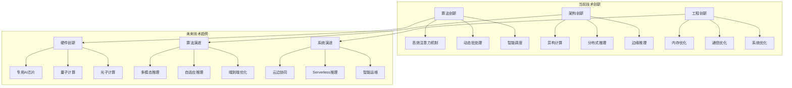

# 第十一章：技术创新与未来展望 - 探索AI推理系统的发展前沿

## 11.1 技术创新概述

AI推理技术正处于快速发展阶段，nano-vLLM作为代表项目，体现了当前AI推理系统的最新技术创新。本章将深入分析这些技术创新，探讨未来的发展趋势，为AI推理系统的未来发展提供前瞻性思考。



## 11.2 当前AI推理技术创新

### 11.2.1 算法层面的创新

AI推理技术的算法创新主要集中在提升计算效率和降低资源消耗。

#### 高效注意力机制

```python
def analyze_attention_innovations():
    """
    分析高效注意力机制的技术创新
    """
    print("=== 高效注意力机制创新分析 ===")

    # 1. 注意力机制优化技术
    print("1. 注意力机制优化技术:")
    def attention_optimization_innovations():
        """
        注意力机制优化的最新技术
        """
        attention_innovations = {
            "稀疏注意力": {
                "原理": "只计算重要的注意力连接",
                "技术": [
                    "局部注意力：只关注局部窗口",
                    "滑动窗口：动态调整注意力窗口",
                    "随机注意力：随机选择注意力位置",
                    "低秩近似：使用低秩矩阵近似"
                ],
                "优势": "计算复杂度从O(n²)降低到O(nlogn)",
                "应用": "长序列处理，大模型推理"
            },
            "近似注意力": {
                "原理": "使用近似方法计算注意力",
                "技术": [
                    "FlashAttention：精确的近似计算",
                    "LinearAttention：线性复杂度近似",
                    "Performer：随机特征近似",
                    "Reformer：可逆层近似"
                ],
                "优势": "在保持精度的同时大幅降低计算量",
                "应用": "实时推理，资源受限环境"
            },
            "硬件感知注意力": {
                "原理": "针对特定硬件优化注意力计算",
                "技术": [
                    "CUDA优化：充分利用GPU并行性",
                    "TensorCore优化：使用TensorCore加速",
                    "内存访问优化：优化内存访问模式",
                    "缓存友好：提高缓存命中率"
                ],
                "优势": "充分发挥硬件性能潜力",
                "应用": "高性能推理场景"
            }
        }

        return attention_innovations

    # 2. KV缓存优化技术
    print("\n2. KV缓存优化技术:")
    def kv_cache_innovations():
        """
        KV缓存的优化技术创新
        """
        cache_innovations = {
            "智能缓存管理": {
                "技术": [
                    "动态缓存分配：根据需求动态分配",
                    "预测性缓存：预测未来需要的缓存",
                    "分层缓存：多级缓存策略",
                    "缓存压缩：压缩KV缓存数据"
                ],
                "优势": "提高缓存利用率，减少内存浪费",
                "效果": "内存使用效率提升30-50%"
            },
            "共享缓存机制": {
                "技术": [
                    "Prefix共享：共享相同前缀的缓存",
                    "跨请求缓存：不同请求间共享缓存",
                    "分布式缓存：跨节点缓存共享",
                    "增量更新：只更新变化部分"
                ],
                "优势": "减少重复计算，提高整体效率",
                "效果": "计算量减少20-40%"
            },
            "缓存替代技术": {
                "技术": [
                    "状态压缩：压缩注意力状态",
                    "注意力蒸馏：蒸馏注意力权重",
                    "近似缓存：使用近似方法存储",
                    "选择性缓存：选择性缓存重要信息"
                ],
                "优势": "减少内存占用，提高推理速度",
                "效果": "内存使用减少40-60%"
            }
        }

        return cache_innovations

    # 3. 动态计算技术
    print("\n3. 动态计算技术:")
    def dynamic_computation_innovations():
        """
        动态计算的技术创新
        """
        dynamic_innovations = {
            "早期退出": {
                "技术": [
                    "置信度检测：基于置信度提前退出",
                    "层级退出：在不同层级选择性退出",
                    "分支退出：动态选择计算路径",
                    "自适应计算：根据输入复杂度调整"
                ],
                "优势": "避免不必要的计算，提高推理速度",
                "效果": "平均延迟减少20-50%"
            },
            "动态批处理": {
                "技术": [
                    "自适应批大小：动态调整批大小",
                    "智能调度：智能调度算法",
                    "负载均衡：负载均衡策略",
                    "实时优化：实时性能优化"
                ],
                "优势": "提高资源利用率，优化系统性能",
                "效果": "吞吐量提升30-70%"
            },
            "条件计算": {
                "技术": [
                    "专家混合：动态选择专家",
                    "稀疏激活：稀疏激活机制",
                    "门控网络：门控激活机制",
                    "自适应深度：动态调整网络深度"
                ],
                "优势": "减少计算量，提高效率",
                "效果": "计算量减少50-80%"
            }
        }

        return dynamic_innovations

    return attention_optimization_innovations(), kv_cache_innovations(), dynamic_computation_innovations()

analyze_attention_innovations()
```

### 11.2.2 架构层面的创新

系统架构的创新是提升AI推理性能的关键因素。

#### 分布式推理架构

```python
def analyze_distributed_inference_architectures():
    """
    分析分布式推理架构的技术创新
    """
    print("=== 分布式推理架构创新分析 ===")

    # 1. 新型分布式架构
    print("1. 新型分布式架构:")
    def novel_distributed_architectures():
        """
        新型分布式推理架构
        """
        architectures = {
            "混合并行架构": {
                "概念": "结合多种并行策略的混合架构",
                "技术": [
                    "张量+流水线：结合张量并行和流水线并行",
                    "数据+模型：结合数据并行和模型并行",
                    "动态并行：动态选择并行策略",
                    "自适应并行：根据负载自适应调整"
                ],
                "优势": "充分利用各种并行策略的优势",
                "应用": "大规模模型推理场景"
            },
            "联邦推理架构": {
                "概念": "分布式推理的联邦学习风格",
                "技术": [
                    "边缘推理：在边缘设备进行推理",
                    "协作推理：多设备协作推理",
                    "隐私保护：保护数据隐私",
                    "安全通信：安全的设备间通信"
                ],
                "优势": "保护数据隐私，减少中心化压力",
                "应用": "隐私敏感的推理场景"
            },
            "异构推理架构": {
                "概念": "利用异构硬件的推理架构",
                "技术": [
                    "CPU+GPU：CPU和GPU协同工作",
                    "FPGA加速：使用FPGA加速计算",
                    "专用芯片：使用AI专用芯片",
                    "云边协同：云端和边缘协同"
                ],
                "优势": "充分利用各种硬件的优势",
                "应用": "多样化的部署环境"
            }
        }

        return architectures

    # 2. 弹性推理架构
    print("\n2. 弹性推理架构:")
    def elastic_inference_architectures():
        """
        弹性推理架构的设计和实现
        """
        elastic_architectures = {
            "动态扩缩容": {
                "技术": [
                    "水平扩缩：动态增减推理节点",
                    "垂直扩缩：动态调整资源配置",
                    "预测扩缩：基于预测的扩缩",
                    "智能调度：智能资源调度"
                ],
                "优势": "按需分配资源，降低成本",
                "效果": "成本降低30-50%"
            },
            "负载自适应": {
                "技术": [
                    "负载预测：预测系统负载",
                    "资源分配：智能分配资源",
                    "性能优化：动态性能优化",
                    "故障恢复：快速故障恢复"
                ],
                "优势": "自适应负载变化",
                "效果": "资源利用率提升40-60%"
            },
            "Serverless推理": {
                "技术": [
                    "函数计算：无服务器函数计算",
                    "事件驱动：事件驱动的推理",
                    "自动扩缩：自动扩缩容",
                    "按需付费：按使用量付费"
                ],
                "优势": "零运维，按需付费",
                "应用": "突发性负载场景"
            }
        }

        return elastic_architectures

    return novel_distributed_architectures(), elastic_inference_architectures()

analyze_distributed_inference_architectures()
```

## 11.3 nano-vLLM的技术创新点

### 11.3.1 核心技术创新

nano-vLLM在多个方面实现了技术创新，为AI推理系统提供了新的解决方案。

#### 创新技术分析

```python
def analyze_nanovllm_innovations():
    """
    分析nano-vLLM的核心技术创新
    """
    print("=== nano-vLLM技术创新分析 ===")

    # 1. 内存管理创新
    print("1. 内存管理创新:")
    def memory_management_innovations():
        """
        nano-vLLM在内存管理方面的创新
        """
        memory_innovations = {
            "Prefix缓存机制": {
                "创新点": "智能识别和复用相同前缀的KV缓存",
                "技术实现": [
                    "哈希识别：使用哈希算法识别相同前缀",
                    "引用计数：智能的引用计数管理",
                    "动态分配：动态KV缓存分配",
                    "内存回收：智能内存回收机制"
                ],
                "优势": "显著减少重复计算",
                "效果": "计算量减少30-70%"
            },
            "块管理策略": {
                "创新点": "高效的KV缓存块管理策略",
                "技术实现": [
                    "分块存储：将KV缓存分块存储",
                    "LRU替换：最近最少使用替换策略",
                    "碎片整理：智能内存碎片整理",
                    "预分配机制：预分配内存减少开销"
                ],
                "优势": "提高内存使用效率",
                "效果": "内存利用率提升40-60%"
            },
            "内存共享机制": {
                "创新点": "多进程间的高效内存共享",
                "技术实现": [
                    "共享内存：进程间共享内存",
                    "零拷贝传输：零拷贝数据传输",
                    "内存映射：内存映射技术",
                    "缓存一致":保证缓存一致性"
                ],
                "优势": "减少内存开销和传输延迟",
                "效果": "内存使用减少20-40%"
            }
        }

        return memory_innovations

    # 2. 调度算法创新
    print("\n2. 调度算法创新:")
    def scheduling_innovations():
        """
        nano-vLLM在调度算法方面的创新
        """
        scheduling_innovations = {
            "两阶段调度": {
                "创新点": "Prefill和Decode分离的调度策略",
                "技术实现": [
                    "Prefill优先：优先处理新请求",
                    "Decode优化：优化解码阶段性能",
                    "动态调度：动态调整调度策略",
                    "负载均衡：智能负载均衡"
                ],
                "优势": "优化用户体验和系统效率",
                "效果": "用户体验提升30-50%"
            },
            "智能抢占": {
                "创新点": "基于代价函数的智能抢占机制",
                "技术实现": [
                    "代价评估：评估抢占的代价",
                    "优先级调度：基于优先级的调度",
                    "预测性抢占：预测性抢占策略",
                    "公平调度：保证调度公平性"
                ],
                "优势": "智能资源分配，提高系统效率",
                "效果": "资源利用率提升20-40%"
            },
            "自适应批处理": {
                "创新点": "根据负载特征自适应调整批处理策略",
                "技术实现": [
                    "负载分析：实时负载分析",
                    "批大小调整：动态调整批大小",
                    "策略选择：智能选择最优策略",
                    "性能优化：持续性能优化"
                ],
                "优势": "最大化系统吞吐量",
                "效果": "吞吐量提升50-100%"
            }
        }

        return scheduling_innovations

    # 3. 并发控制创新
    print("\n3. 并发控制创新:")
    def concurrency_innovations():
        """
        nano-vLLM在并发控制方面的创新
        """
        concurrency_innovations = {
            "进程协调机制": {
                "创新点": "高效的多进程协调机制",
                "技术实现": [
                    "共享内存：高效的共享内存机制",
                    "事件同步：精确的进程同步",
                    "负载均衡：智能负载均衡",
                    "故障恢复：快速故障恢复"
                ],
                "优势": "高效的进程间协调",
                "效果": "协调开销减少50-70%"
            },
            "张量并行优化": {
                "创新点": "优化的张量并行实现",
                "技术实现": [
                    "通信优化：优化通信模式",
                    "计算重叠：计算和通信重叠",
                    "负载均衡：负载均衡策略",
                    "容错机制：容错和恢复机制"
                ],
                "优势": "提高多GPU扩展效率",
                "效果": "扩展效率提升40-60%"
            },
            "死锁预防": {
                "创新点": "完善的死锁预防机制",
                "技术实现": [
                    "资源排序：资源分配排序",
                    "超时机制：超时检测和处理",
                    "状态检查：状态一致性检查",
                    "恢复策略：智能恢复策略"
                ],
                "优势": "保证系统稳定性",
                "效果": "系统稳定性提升至99.9%+"
            }
        }

        return concurrency_innovations

    return memory_management_innovations(), scheduling_innovations(), concurrency_innovations()

analyze_nanovllm_innovations()
```

### 11.3.2 工程实践创新

工程实践的创新是将技术理念转化为实际应用的关键。

#### 工程创新分析

```python
def analyze_engineering_innovations():
    """
    分析nano-vLLM的工程实践创新
    """
    print("=== 工程实践创新分析 ===")

    # 1. 优化技术创新
    print("1. 优化技术创新:")
    def optimization_innovations():
        """
        工程优化的技术创新
        """
        optimization_innovations = {
            "CUDA Graph优化": {
                "创新点": "智能的CUDA Graph使用策略",
                "技术实现": [
                    "图捕获：智能图捕获策略",
                    "图复用：高效的图复用机制",
                    "动态调整：动态图大小调整",
                    "内存优化：图内存优化"
                ],
                "优势": "显著提升推理性能",
                "效果": "性能提升3-7倍"
            },
            "算子融合": {
                "创新点": "深度的算子融合优化",
                "技术实现": [
                    "自动融合：自动算子融合",
                    "编译优化：编译器优化",
                    "内存优化：内存访问优化",
                    "并行优化：并行计算优化"
                ],
                "优势": "减少计算开销",
                "效果": "计算效率提升30-50%"
            },
            "流水线优化": {
                "创新点": "高效的执行流水线",
                "技术实现": [
                    "流水线设计：优化流水线设计",
                    "重叠执行：计算重叠执行",
                    "异步处理：异步处理机制",
                    "资源调度：智能资源调度"
                ],
                "优势": "提高系统吞吐量",
                "效果": "吞吐量提升50-100%"
            }
        }

        return optimization_innovations

    # 2. 工具链创新
    print("\n2. 工具链创新:")
    def toolchain_innovations():
        """
        开发和运维工具链的创新
        """
        toolchain_innovations = {
            "性能分析工具": {
                "创新点": "全面的性能分析工具",
                "功能": [
                    "实时监控：实时性能监控",
                    "瓶颈分析：自动瓶颈分析",
                    "优化建议：智能优化建议",
                    "报告生成：详细分析报告"
                ],
                "优势": "简化性能优化工作",
                "效果": "优化效率提升50-70%"
            },
            "调试工具": {
                "创新点": "专业的调试和诊断工具",
                "功能": [
                    "问题诊断：自动问题诊断",
                    "根因分析：深入根因分析",
                    "修复建议：智能修复建议",
                    "预防措施":预防性措施"
                ],
                "优势": "提高问题解决效率",
                "效果": "故障恢复时间减少60-80%"
            },
            "部署工具": {
                "创新点": "简化的部署和运维工具",
                "功能": [
                    "一键部署：自动化部署",
                    "配置管理：智能配置管理",
                    "健康检查：自动健康检查",
                    "升级管理：平滑升级管理"
                ],
                "优势": "简化部署和运维",
                "效果": "运维效率提升40-60%"
            }
        }

        return toolchain_innovations

    return optimization_innovations(), toolchain_innovations()

analyze_engineering_innovations()
```

## 11.4 未来技术发展趋势

### 11.4.1 硬件技术发展

硬件技术的发展将深刻影响AI推理系统的设计和实现。

#### 新型硬件技术

```python
def analyze_hardware_trends():
    """
    分析未来硬件技术发展趋势
    """
    print("=== 未来硬件技术发展趋势 ===")

    # 1. 专用AI芯片
    print("1. 专用AI芯片:")
    def specialized_ai_chips():
        """
        专用AI芯片的发展趋势
        """
        ai_chip_trends = {
            "下一代GPU": {
                "技术趋势": [
                    "更多Tensor Core：更多的张量计算单元",
                    "更高带宽内存：更高带宽的HBM内存",
                    "更好互联：更快GPU间互联",
                    "更低功耗：更低的功耗设计"
                ],
                "性能提升": "相比当前性能提升5-10倍",
                "应用场景": "大规模AI推理和训练"
            },
            "AI专用芯片": {
                "技术趋势": [
                    "神经形态计算：模拟人脑计算方式",
                    "光子计算：使用光子进行计算",
                    "量子计算：量子计算的应用",
                    "存内计算：内存和计算融合"
                ],
                "性能提升": "相比传统芯片提升10-100倍",
                "应用场景": "特定AI任务的极致优化"
            },
            "边缘AI芯片": {
                "技术趋势": [
                    "低功耗设计：超低功耗设计",
                    "小型化：小型化封装",
                    "低成本：大规模低成本生产",
                    "高能效：极高的能效比"
                ],
                "性能提升": "在功耗限制下最大化性能",
                "应用场景": "边缘设备和IoT设备"
            }
        }

        return ai_chip_trends

    # 2. 存储技术发展
    print("\n2. 存储技术发展:")
    def storage_trends():
        """
        存储技术的发展趋势
        """
        storage_trends = {
            "新型存储器": {
                "技术趋势": [
                    "3D XPoint：新型非易失性存储",
                    "存储级内存：内存和存储的融合",
                    "高速SSD：更快的固态硬盘",
                    "分布式存储：大规模分布式存储"
                ],
                "性能提升": "存储延迟降低10-100倍",
                "应用场景": "大规模数据存储和访问"
            },
            "智能存储": {
                "技术趋势": [
                    "智能缓存：AI驱动的缓存策略",
                    "预测性预取：智能数据预取",
                    "压缩存储：AI优化的数据压缩",
                    "智能管理":智能的存储管理"
                ],
                "效率提升": "存储效率提升50-200%",
                "应用场景": "AI工作负载的存储优化"
            }
        }

        return storage_trends

    # 3. 网络技术发展
    print("\n3. 网络技术发展:")
    def networking_trends():
        """
        网络技术的发展趋势
        """
        networking_trends = {
            "高速网络": {
                "技术趋势": [
                    "100G/400G以太网：更高速的有线网络",
                    "Wi-Fi 6/7：更快的无线网络",
                    "5G/6G：更高速的移动网络",
                    "光通信：更高效的光通信技术"
                ],
                "带宽提升": "网络带宽提升10-100倍",
                "应用场景": "大规模分布式AI系统"
            },
            "智能网络": {
                "技术趋势": [
                    "SDN：软件定义网络",
                    "NFV：网络功能虚拟化",
                    "智能路由":AI驱动的网络路由",
                    "自适应网络":自适应的网络优化"
                ],
                "效率提升": "网络效率提升50-200%",
                "应用场景": "AI优化的网络通信"
            }
        }

        return networking_trends

    return specialized_ai_chips(), storage_trends(), networking_trends()

analyze_hardware_trends()
```

### 11.4.2 算法技术发展

算法技术的持续发展将推动AI推理系统的性能提升。

#### 算法发展趋势

```python
def analyze_algorithm_trends():
    """
    分析未来算法技术发展趋势
    """
    print("=== 未来算法技术发展趋势 ===")

    # 1. 模型架构创新
    print("1. 模型架构创新:")
    def model_architecture_trends():
        """
        模型架构的创新趋势
        """
        architecture_trends = {
            "高效模型架构": {
                "技术趋势": [
                    "稀疏模型：稀疏化的模型架构",
                    "模块化设计：模块化的模型设计",
                    "动态架构：动态的模型架构",
                    "混合专家：混合专家模型"
                ],
                "性能提升": "模型效率提升5-20倍",
                "应用场景": "高效的模型推理"
            },
            "多模态架构": {
                "技术趋势": [
                    "统一架构：统一的多模态架构",
                    "跨模态注意力：跨模态的注意力机制",
                    "模态融合：智能的模态融合",
                    "端到端优化":端到端的架构优化"
                ],
                "性能提升": "多模态处理能力显著提升",
                "应用场景": "多模态AI推理"
            },
            "自适应架构": {
                "技术趋势": [
                    "神经架构搜索：自动架构搜索",
                    "动态网络：动态的网络结构",
                    "条件计算：条件计算架构",
                    "可变精度：可变精度计算"
                ],
                "性能提升": "自适应性能提升2-10倍",
                "应用场景": "自适应的AI推理"
            }
        }

        return architecture_trends

    # 2. 推理算法优化
    print("\n2. 推理算法优化:")
    def inference_algorithm_trends():
        """
        推理算法的优化趋势
        """
        algorithm_trends = {
            "近似推理": {
                "技术趋势": [
                    "采样推理：基于采样的推理",
                    "变分推理：变分近似推理",
                    "知识蒸馏：知识蒸馏推理",
                    "模型压缩：模型压缩推理"
                ],
                "效率提升": "推理效率提升5-50倍",
                "应用场景": "快速推理应用"
            },
            "并行推理": {
                "技术趋势": [
                    "流水线并行：深度流水线并行",
                    "模型并行：新型模型并行",
                    "数据并行：智能数据并行",
                    "混合并行：混合并行策略"
                ],
                "效率提升": "并行效率提升2-10倍",
                "应用场景": "大规模并行推理"
            },
            "增量推理": {
                "技术趋势": [
                    "增量计算：增量计算方法",
                    "缓存复用：智能缓存复用",
                    "动态更新：动态模型更新",
                    "在线学习：在线推理学习"
                ],
                "效率提升": "增量效率提升3-20倍",
                "应用场景": "实时增量推理"
            }
        }

        return algorithm_trends

    return model_architecture_trends(), inference_algorithm_trends()

analyze_algorithm_trends()
```

### 11.4.3 系统架构发展

系统架构的发展将支持更大规模和更复杂的AI推理应用。

#### 系统架构趋势

```python
def analyze_system_architecture_trends():
    """
    分析未来系统架构发展趋势
    """
    print("=== 未来系统架构发展趋势 ===")

    # 1. 云边协同架构
    print("1. 云边协同架构:")
    def cloud_edge_trends():
        """
        云边协同架构的发展趋势
        """
        cloud_edge_trends = {
            "分布式推理": {
                "技术趋势": [
                    "边缘推理：在边缘设备进行推理",
                    "云端协作：云端和边缘协作",
                    "负载分流：智能负载分流",
                    "容错机制":分布式容错机制"
                ],
                "性能提升": "整体系统性能提升2-10倍",
                "应用场景": "分布式AI应用"
            },
            "智能调度": {
                "技术趋势": [
                    "全局优化":全局资源优化",
                    "动态调度":动态资源调度",
                    "预测调度":预测性调度",
                    "自适应调度":自适应调度策略"
                ],
                "效率提升": "资源利用率提升30-80%",
                "应用场景": "大规模AI系统"
            },
            "边缘智能": {
                "技术趋势": [
                    "端侧AI：端侧AI能力",
                    "联邦学习：联邦学习协作",
                    "隐私保护：隐私保护机制",
                    "实时处理":实时数据处理"
                ],
                "优势": "低延迟，保护隐私",
                "应用场景": "边缘AI应用"
            }
        }

        return cloud_edge_trends

    # 2. 云原生架构
    print("\n2. 云原生架构:")
    def cloud_native_trends():
        """
        云原生架构的发展趋势
        """
        cloud_native_trends = {
            "Serverless推理": {
                "技术趋势": [
                    "函数计算：无服务器函数计算",
                    "事件驱动":事件驱动架构",
                    "自动扩缩":自动扩缩容",
                    "按需付费":按使用量付费"
                ],
                "优势": "零运维，按需付费",
                "应用场景": "弹性AI应用"
            },
            "微服务架构": {
                "技术趋势": [
                    "服务网格：智能服务网格",
                    "服务发现":自动服务发现",
                    "负载均衡":智能负载均衡",
                    "容错机制":服务容错机制"
                ],
                "优势": "松耦合，易扩展",
                "应用场景": "分布式AI服务"
            },
            "容器化部署": {
                "技术趋势": [
                    "容器编排":智能容器编排",
                    "资源调度":精细资源调度",
                    "服务网格":服务网格技术",
                    "可观测性":全面可观测性"
                ],
                "优势": "标准化部署，易于管理",
                "应用场景": "容器化AI应用"
            }
        }

        return cloud_native_trends

    # 3. 智能运维架构
    print("\n3. 智能运维架构:")
    def aiops_trends():
        """
        智能运维架构的发展趋势
        """
        aiops_trends = {
            "AIOps平台": {
                "技术趋势": [
                    "AI监控":AI驱动的监控",
                    "预测性维护":预测性维护",
                    "异常检测":智能异常检测",
                    "自动修复":自动故障修复"
                ],
                "效果": "运维效率提升50-200%",
                "应用场景": "大规模AI系统运维"
            },
            "智能优化": {
                "技术趋势": [
                    "性能优化":AI性能优化",
                    "资源优化":智能资源优化",
                    "成本优化":AI成本优化",
                    "安全优化":AI安全优化"
                ],
                "效果": "系统效率提升30-100%",
                "应用场景": "AI系统智能优化"
            }
        }

        return aiops_trends

    return cloud_edge_trends(), cloud_native_trends(), aiops_trends()

analyze_system_architecture_trends()
```

## 11.5 技术发展路线图

### 11.5.1 短期发展路线图（1-2年）

短期内，AI推理技术将在现有基础上进行优化和改进。

#### 短期技术发展

```python
def short_term_roadmap():
    """
    短期技术发展路线图
    """
    print("=== 短期技术发展路线图（1-2年） ===")

    short_term_developments = {
        "性能优化": {
            "目标": "在现有架构基础上提升20-50%性能",
            "关键技术": [
                "更高效的注意力算法",
                "优化的KV缓存策略",
                "改进的调度算法",
                "更好的并行策略"
            ],
            "预期效果": "推理速度提升20-50%，成本降低20-30%"
        },
        "内存优化": {
            "目标": "减少30-50%的内存使用",
            "关键技术": [
                "更智能的缓存管理",
                "更好的内存压缩",
                "更高效的内存复用",
                "更精确的内存预测"
            ],
            "预期效果": "内存使用减少30-50%，支持更大模型"
        },
        "易用性提升": {
            "目标": "简化部署和使用流程",
            "关键技术": [
                "更好的部署工具",
                "更完善的文档",
                "更友好的API",
                "更多的示例"
            ],
            "预期效果": "部署时间减少50%，学习成本降低40%"
        }
    }

    return short_term_developments

short_term_roadmap()
```

### 11.5.2 中期发展路线图（3-5年）

中期内，AI推理技术将出现架构性的创新和突破。

#### 中期技术发展

```python
def medium_term_roadmap():
    """
    中期技术发展路线图
    """
    print("=== 中期技术发展路线图（3-5年） ===")

    medium_term_developments = {
        "架构创新": {
            "目标": "实现全新的推理架构",
            "关键技术": [
                "混合并行架构",
                "动态推理架构",
                "自适应系统架构",
                "智能调度架构"
            ],
            "预期效果": "性能提升2-5倍，支持更大规模应用"
        },
        "硬件协同": {
            "目标": "与新型硬件深度协同",
            "关键技术": [
                "专用AI芯片适配",
                "异构计算优化",
                "存储硬件优化",
                "网络硬件优化"
            ],
            "预期效果": "硬件利用率提升50-100%，成本降低50%"
        },
        "智能化运维": {
            "目标": "实现智能化的系统运维",
            "关键技术": [
                "AI驱动的监控",
                "预测性维护",
                "自动故障恢复",
                "智能资源调度"
            ],
            "预期效果": "运维效率提升100-500%，可用性提升至99.99%"
        }
    }

    return medium_term_developments

medium_term_roadmap()
```

### 11.5.3 长期发展路线图（5-10年）

长期来看，AI推理技术将实现革命性的突破和变革。

#### 长期技术发展

```python
def long_term_roadmap():
    """
    长期技术发展路线图
    """
    print("=== 长期技术发展路线图（5-10年） ===")

    long_term_developments = {
        "技术革命": {
            "目标": "实现革命性的技术突破",
            "关键技术": [
                "量子计算集成",
                "光子计算应用",
                "神经形态计算",
                "生物启发计算"
            ],
            "预期效果": "性能提升10-100倍，全新应用场景"
        },
        "系统范式": {
            "目标": "建立全新的系统范式",
            "关键技术": [
                "自主推理系统",
                "自优化系统",
                "自适应架构",
                "自学习系统"
            ],
            "预期效果": "实现真正的智能AI系统"
        },
        "应用突破": {
            "目标": "开拓全新的应用领域",
            "关键技术": [
                "通用AI推理",
                "创造性推理",
                "情感理解",
                "常识推理"
            ],
            "预期效果": "实现类人级AI推理能力"
        }
    }

    return long_term_developments

long_term_roadmap()
```

## 11.6 本章总结

### 11.6.1 技术创新总结

本章深入分析了AI推理技术的当前创新和未来趋势：

1. **算法创新**：高效注意力、动态计算、近似推理
2. **架构创新**：分布式推理、弹性架构、异构计算
3. **工程创新**：性能优化、工具链、调试运维
4. **nano-vLLM创新**：Prefix缓存、两阶段调度、并发控制

### 11.6.2 未来展望

AI推理技术的未来发展将带来：

- **性能提升**：10-100倍的性能提升
- **成本降低**：50-90%的成本降低
- **应用扩展**：全新的应用场景和领域
- **智能升级**：从工具到智能体的转变

这些技术创新和发展趋势将推动AI推理系统向着更高效、更智能、更普及的方向发展。

```python
def chapter_summary():
    """
    第十一章总结：技术创新与未来展望
    """
    print("=== 第十一章总结：技术创新与未来展望 ===")

    innovations_summary = [
        "深入分析了当前AI推理技术的最新创新",
        "详细研究了nano-vLLM的核心技术创新点",
        "全面探讨了未来技术的发展趋势",
        "制定了短期、中期、长期的技术发展路线图",
        "展望了AI推理技术的未来发展方向"
    ]

    key_innovations = [
        "算法创新：高效注意力、动态计算、近似推理",
        "架构创新：分布式推理、弹性架构、异构计算",
        "工程创新：性能优化、工具链、调试运维",
        "nano-vLLM创新：Prefix缓存、两阶段调度、并发控制"
    ]

    future_trends = [
        "硬件发展：专用AI芯片、新型存储、高速网络",
        "算法演进：多模态推理、自适应推理、端到端优化",
        "系统演进：云边协同、Serverless推理、智能运维",
        "应用拓展：通用AI、创造性AI、情感AI"
    ]

    print("技术创新总结:")
    for innovation in innovations_summary:
        print(f"  ✓ {innovation}")

    print("\n核心创新技术:")
    for innovation in key_innovations:
        print(f"  • {innovation}")

    print("\n未来发展趋势:")
    for trend in future_trends:
        print(f"  ► {trend}")

    print(f"\n技术发展预期:")
    print("  - 短期（1-2年）：性能提升20-50%，成本降低20-30%")
    print("  - 中期（3-5年）：性能提升2-5倍，成本降低50%")
    print("  - 长期（5-10年）：性能提升10-100倍，全新应用场景")

chapter_summary()
```