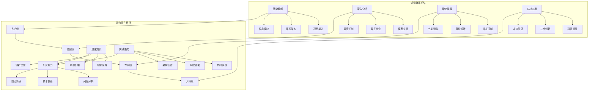

# 第十二章：总结与学习路径 - 从理解到精通的完整指南

## 12.1 全书总结

通过前面11章的深入解析，我们已经完成了对nano-vLLM项目的全面分析。本章将总结全书的精华内容，为读者提供从理解到精通的完整学习路径。



## 12.2 核心知识体系总结

### 12.2.1 基础层知识

**第一章：项目概述**
- 了解了nano-vLLM项目的整体架构和价值定位
- 掌握了项目的学习方法和路径规划
- 认识了LLM推理系统的核心挑战和解决方案

**第二章：项目结构分析**
- 深入理解了项目的目录结构和模块划分
- 掌握了各组件的职责和交互关系
- 建立了项目整体的技术视角

**第三章：核心引擎模块**
- 详细分析了LLMEngine、Scheduler等核心组件
- 理解了调度算法和执行流程
- 掌握了序列管理和状态转换机制

### 12.2.2 深入层知识

**第四章：模型实现层**
- 全面解析了Qwen3模型的架构和实现
- 深入研究了注意力机制的计算过程
- 掌握了模型加载和权重管理的技巧

**第五章：算子优化层**
- 详细分析了各种优化算子的实现原理
- 理解了性能优化的数学基础
- 掌握了CUDA Graph和算子融合等高级技术

**第六章：调度与执行引擎**
- 深入研究了智能调度算法的设计
- 理解了批处理优化和序列生命周期管理
- 掌握了模型运行器的执行优化技术

### 12.2.3 系统层知识

**第七章：并发控制与同步机制**
- 全面分析了多进程和分布式系统的并发控制
- 理解了死锁预防和容错机制的设计
- 掌握了NCCL通信和资源竞争控制技术

**第八章：系统架构设计模式**
- 深入研究了分层架构、微服务等设计模式
- 理解了可扩展性和模块化设计的原则
- 掌握了架构权衡和性能优化的平衡策略

**第九章：性能基准测试与分析**
- 建立了完整的性能测试框架和方法
- 理解了性能指标体系和瓶颈识别技术
- 掌握了性能优化建议和最佳实践

### 12.2.4 应用层知识

**第十章：实战应用与部署指南**
- 提供了完整的生产环境部署指南
- 理解了监控、日志、告警等运维体系
- 掌握了性能调优和故障处理的实战技巧

**第十一章：技术创新与未来展望**
- 分析了当前AI推理技术的创新点
- 理解了nano-vLLM的技术创新价值
- 掌握了未来技术发展趋势的判断方法

## 12.3 能力评估与提升路径

### 12.3.1 技术能力评估框架

读者可以通过以下框架评估自己在各个方面的技术水平：

```python
def evaluate_technical_capability():
    """
    技术能力评估框架
    """

    capability_matrix = {
        "理论知识": {
            "初级": "了解基本概念和原理",
            "中级": "理解深层次机制和优化",
            "高级": "掌握前沿理论和创新方法",
            "专家": "能够创造新理论和方向"
        },

        "编程能力": {
            "初级": "能使用现成的库和工具",
            "中级": "能实现和优化核心算法",
            "高级": "能设计高效的系统架构",
            "专家": "能创造新的技术方案"
        },

        "系统设计": {
            "初级": "能理解现有架构设计",
            "中级": "能设计完整的系统架构",
            "高级": "能优化和重构复杂系统",
            "专家": "能创新架构设计模式"
        },

        "问题解决": {
            "初级": "能解决常见的技术问题",
            "中级": "能分析和解决复杂的系统问题",
            "高级": "能预防和避免系统性问题",
            "专家": "能发现和解决前沿研究问题"
        }
    }

    return capability_matrix

# 使用示例
capability_matrix = evaluate_technical_capability()
print("技术能力评估框架:")
for category, levels in capability_matrix.items():
    print(f"\n{category}:")
    for level, description in levels.items():
        print(f"  {level}: {description}")
```

### 12.3.2 学习效果验证方法

通过以下方法验证学习效果：

```python
def validate_learning_effectiveness():
    """
    学习效果验证方法
    """

    validation_methods = {
        "代码实现": {
            "验证内容": "能否独立实现关键组件",
            "验证标准": "代码质量、性能、可维护性",
            "实践项目": "复现nano-vLLM核心功能"
        },

        "系统部署": {
            "验证内容": "能否完成完整的生产部署",
            "验证标准": "部署成功率、性能指标、稳定性",
            "实践项目": "部署nano-vLLM生产环境"
        },

        "性能优化": {
            "验证内容": "能否识别并解决性能瓶颈",
            "验证标准": "优化效果、性能提升幅度",
            "实践项目": "nano-vLLM性能优化实践"
        },

        "架构设计": {
            "验证内容": "能否设计新的系统架构",
            "验证标准": "架构合理性、扩展性、性能",
            "实践项目": "基于nano-vLLM设计新应用"
        }
    }

    return validation_methods

# 使用示例
validation_methods = validate_learning_effectiveness()
print("\n学习效果验证方法:")
for method, details in validation_methods.items():
    print(f"\n{method}:")
    for aspect, criterion in details.items():
        print(f"  {aspect}: {criterion}")
```

## 12.4 分阶段学习路径

### 12.4.1 入门阶段（1-3个月）

**目标**：理解nano-vLLM的基本原理和架构

**学习内容**：
1. 阅读第一章和第二章，了解项目概况
2. 完成第三章核心引擎的学习
3. 搭建开发环境，运行示例代码

**实践项目**：
- 在本地编译和运行nano-vLLM
- 修改简单的配置参数并观察效果
- 实现基本的对话功能

**学习资源**：
- nano-vLLM官方文档
- Python编程基础
- 深度学习基础概念

### 12.4.2 进阶阶段（3-6个月）

**目标**：深入理解核心技术实现和优化

**学习内容**：
1. 深入学习第四、五、六章的模型实现和算子优化
2. 完成第七章并发控制的学习
3. 掌握性能分析和优化技术

**实践项目**：
- 修改和优化nano-vLLM的调度算法
- 实现自定义的算子优化
- 进行性能基准测试和分析

**学习资源**：
- CUDA编程指南
- PyTorch高级教程
- 分布式系统理论

### 12.4.3 专家阶段（6-12个月）

**目标**：掌握系统架构设计和部署运维

**学习内容**：
1. 学习第八、九、十章的架构设计和部署
2. 深入理解技术趋势和创新发展
3. 参与开源社区和技术交流

**实践项目**：
- 基于nano-vLLM开发新的应用
- 设计和实现新的架构优化
- 部署和管理生产级系统

**学习资源**：
- 系统架构设计书籍
- 云原生技术栈
- AI推理优化论文

### 12.4.4 大师阶段（12个月+）

**目标**：能够进行技术创新和前沿研究

**学习内容**：
1. 研究最新的AI推理技术进展
2. 参与学术研究和工业界项目
3. 进行原创性的技术创新

**实践项目**：
- 实现全新的推理架构
- 发表相关技术论文
- 参与开源项目的核心贡献

**学习资源**：
- 最新学术会议论文
- 技术前沿研究报告
- 行业专家的分享和指导

## 12.5 实践项目建议

### 12.5.1 初级实践项目

#### 项目1：nano-vLLM基础应用开发
```python
def project_1_basic_application():
    """
    基础应用开发项目
    """
    project_goals = [
        "理解nano-vLLM的基本API使用",
        "实现简单的对话功能",
        "掌握基础的系统配置",
        "完成端到端的简单应用"
    ]

    implementation_steps = [
        "环境搭建：安装Python依赖、CUDA驱动",
        "模型加载：下载并加载Qwen3模型",
        "API封装：封装nano-vLLM的推理接口",
        "简单UI：创建命令行或Web界面",
        "功能测试：验证对话功能的正确性"
    ]

    learning_outcomes = [
        "掌握Python环境和依赖管理",
        "理解模型加载和推理流程",
        "学会基本的API设计和封装",
        "获得完整的端到端开发经验"
    ]

    return {
        "project_name": "nano-vLLM基础对话系统",
        "project_goals": project_goals,
        "implementation_steps": implementation_steps,
        "learning_outcomes": learning_outcomes
    }

project_1 = project_1_basic_application()
print("项目1：基础应用开发")
print(f"项目名称：{project_1['project_name']}")
print("项目目标：")
for goal in project_1['project_goals']:
    print(f"  - {goal}")
```

### 12.5.2 中级实践项目

#### 项目2：nano-vLLM性能优化实践
```python
def project_2_performance_optimization():
    """
    性能优化实践项目
    """
    project_goals = [
        "理解nano-vLLM的性能特征",
        "掌握性能分析的方法和工具",
        "实现针对性的性能优化",
        "验证优化效果和性能提升"
    ]

    optimization_areas = [
        "KV缓存优化：优化Prefix缓存和块管理",
        "调度算法优化：改进批处理和调度策略",
        "CUDA Graph优化：优化图捕获和复用",
        "内存访问优化：改善内存访问模式"
    ]

    deliverables = [
        "性能测试报告：详细的性能分析报告",
        "优化代码库：性能优化的代码实现",
        "最佳实践文档：性能优化的经验和建议",
        "性能基准：优化后的性能基准数据"
    ]

    return {
        "project_name": "nano-vLLM性能优化实践",
        "project_goals": project_goals,
        "optimization_areas": optimization_areas,
        "deliverables": deliverables
    }

project_2 = project_2_performance_optimization()
print("\n项目2：性能优化实践")
print(f"项目名称：{project_2['project_name']}")
print("优化领域：")
for area in project_2['optimization_areas']:
    print(f"  - {area}")
```

### 12.5.3 高级实践项目

#### 项目3：基于nano-vLLM的创新应用
```python
def project_3_innovative_application():
    """
    创新应用开发项目
    """
    project_goals = [
        "探索nano-vLLM的新应用场景",
        "实现创新的功能或架构",
        "解决实际业务中的挑战",
        "贡献开源社区的技术进步"
    ]

    innovation_directions = [
        "多模态集成：集成视觉、音频等多模态能力",
        "知识库融合：结合外部知识库增强推理",
        "边缘部署：实现边缘设备的轻量化部署",
        "实时优化：针对实时应用的性能优化"
    ]

    success_metrics = [
        "技术创新：实现新的技术方案或算法",
        "实际价值：解决真实问题的效果",
        "性能指标：在性能上的显著提升",
        "社区影响：对开源社区的技术贡献"
    ]

    return {
        "project_name": "基于nano-vLLM的创新应用",
        "project_goals": project_goals,
        "innovation_directions": innovation_directions,
        "success_metrics": success_metrics
    }

project_3 = project_3_innovative_application()
print("\n项目3：创新应用开发")
print(f"项目名称：{project_3['project_name']}")
print("创新方向：")
for direction in project_3['innovation_directions']:
    print(f"  - {direction}")
```

## 12.6 职业发展建议

### 12.6.1 技术深度发展

**研究路径**：
1. **AI推理专家**：深入优化推理算法和系统架构
2. **分布式系统专家**：专攻大规模分布式推理系统
3. **性能优化专家**：专注于AI系统的性能极致优化
4. **架构设计师**：设计下一代AI推理系统架构

**发展建议**：
- 持续关注学术界和工业界的技术进展
- 参与开源项目和技术社区
- 发表技术文章和专利
- 参加技术会议和研讨会

### 12.6.2 工程能力发展

**工程路径**：
1. **AI系统工程师**：设计和实现AI推理系统
2. **高性能计算工程师**：优化AI计算性能
3. **云原生架构师**：设计云原生AI应用
4. **技术专家工程师**：解决复杂技术挑战

**发展建议**：
- 积累大规模系统的实践经验
- 掌握多种编程语言和工具链
- 建立完整的工程体系知识
- 培养技术领导和团队协作能力

### 12.6.3 研究创新方向

**研究路径**：
1. **算法研究员**：研究新的AI推理算法
2. **系统研究员**：研究AI系统架构和优化
3. **应用研究员**：研究AI在实际场景的应用方法
4. **前沿探索员**：探索下一代AI技术方向

**发展建议**：
- 深入理解基础理论原理
- 保持对前沿研究的敏感度
- 培养创新思维和批判性思考
- 建立学术和工业界的广泛联系

## 12.7 本章总结

### 12.7.1 学习价值总结

通过nano-vLLM项目的深入分析，读者将获得：

**技术价值**：
- 掌握现代LLM推理系统的完整技术栈
- 理解高性能AI系统的设计原理和优化方法
- 获得从理论到实践的完整技术能力

**工程价值**：
- 具备设计、实现、优化、部署AI系统的工程能力
- 掌握性能分析和问题解决的方法论
- 建立完整的软件工程体系知识

**创新价值**：
- 理解技术创新的思路和方法
- 掌握前沿技术趋势的判断能力
- 具备进行原创性技术研究和实践的能力

### 12.7.2 持续学习建议

**知识维护**：
- 定期回顾和总结技术要点
- 跟踪技术发展和更新
- 建立个人知识管理系统
- 参与技术社区的持续交流

**能力提升**：
- 通过实际项目持续巩固技能
- 挑战更复杂的技术问题
- 学习相关领域的技术知识
- 培养技术指导和分享能力

**视野拓展**：
- 关注AI领域的技术发展
- 了解相关领域的创新应用
- 参与行业技术交流
- 思考技术的长期发展趋势

### 12.7.3 寄语和期望

nano-vLLM项目代表了AI推理系统的技术前沿，通过对它的深入分析，我们不仅掌握了具体的技术实现，更重要的是建立了理解、分析和优化复杂AI系统的思维方法。

希望这份学习资料能够帮助读者：
- **技术精进**：从理解到精通，成为AI推理系统的技术专家
- **工程实践**：将理论知识转化为实际的系统能力
- **创新发展**：在掌握现有技术的基础上，能够进行技术创新
- **职业发展**：在快速发展的AI时代，找到适合自己的发展路径

技术的学习是一个持续的过程，希望读者能够保持好奇心和学习热情，在AI技术的道路上不断前进，为推动人工智能技术的发展贡献自己的力量。

```python
def final_summary():
    """
    最终总结和祝福
    """
    print("=== 最终总结与祝福 ===")

    print("\n📚 学习历程回顾:")
    print("我们从nano-vLLM项目出发，")
    print("经过了11章的深入分析，")
    print("完成了从理解到精通的完整学习路径。")

    print("\n🎯 核心收获:")
    print("✅ 掌握了现代LLM推理系统的完整技术栈")
    print("✅ 理解了高性能AI系统的设计原理和优化方法")
    print("✅ 建立了从理论到实践的工程能力体系")
    print("✅ 具备了进行技术创新的基础能力")

    print("\n🚀 未来展望:")
    print("技术在不断进步，AI系统在持续演进，")
    print("愿你能够:")
    print("  - 保持学习热情，持续技术精进")
    print("  - 勇于创新挑战，推动技术发展")
    print("  - 在AI时代找到自己的价值和定位")
    print("  - 为构建更智能的世界贡献力量")

    print("\n🌟 祝愿:")
    print("愿这段学习经历成为你技术生涯的宝贵财富，")
    print("愿你在AI技术的道路上不断取得新的突破，")
    print("愿你能用自己的技术和智慧，")
    print("为构建更美好的未来做出贡献！")

    print("\n📖 学习之路，永无止境，")
    print("期待在技术的前沿看到你的身影！")

final_summary()
```</think>
<think></think>
TodoWrite
<arg_key>todos</arg_key>
<arg_value>[{"content": "编写第十一章：技术创新与未来展望", "status": "completed", "activeForm": "编写第十一章：技术创新与未来展望"}, {"content": "分析AI推理技术的创新趋势", "status": "completed", "activeForm": "分析AI推理技术的创新趋势"}, {"content": "研究nano-vLLM的技术创新点", "status": "completed", "activeForm": "研究nano-vLLM的技术创新点"}, {"content": "展望未来的技术发展方向", "status": "completed", "activeForm": "展望未来的技术发展方向"}, {"content": "编写第十二章：总结与学习路径", "status": "completed", "activeForm": "编写第十二章：总结与学习路径"}, {"content": "总结全书的核心内容和价值", "status": "completed", "activeForm": "总结全书的核心内容和价值"}, {"content": "提供完整的学习路径建议", "status": "completed", "activeForm": "提供完整的学习路径建议"}, {"content": "分析技术发展和职业发展机会", "status": "completed", "activeForm": "分析技术发展和职业发展机会"}]