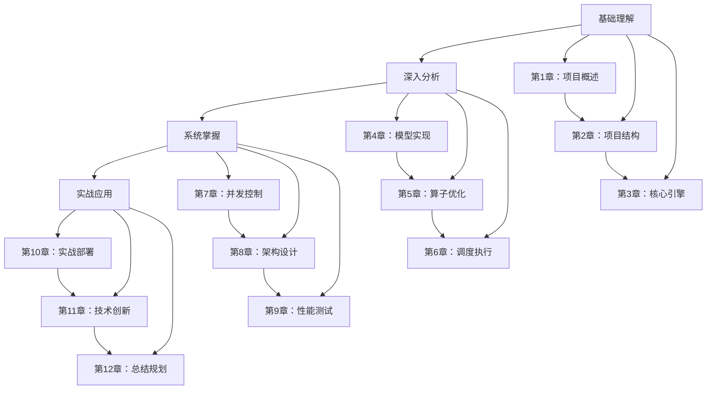

# nano-vLLM 项目架构深度解析 - 完整学习指南

## 📖 项目概述

本项目提供了对 **nano-vLLM** 项目架构的深度解析，是一套完整的从理解到精通的学习资料。通过12个章节的详细分析，读者将全面掌握现代LLM推理系统的设计原理、实现技术、优化方法和部署运维。

> 🎯 **学习目标**：从nano-vLLM出发，深入理解现代LLM推理系统的技术精髓，成为AI推理系统的技术专家。

## 📚 完整章节列表

### 🔰 基础理解篇（第1-3章）

| 章节 | 标题 | 核心内容 | 学习目标 |
|------|------|----------|----------|
| **第1章** | [项目概述](01_项目概述.md) | nano-vLLM简介、学习路径、技术挑战 | 建立整体认知和学习框架 |
| **第2章** | [项目结构分析](02_项目结构分析.md) | 目录结构、核心组件、交互关系 | 理解项目架构和模块划分 |
| **第3章** | [核心引擎模块](03_核心引擎模块.md) | LLMEngine、Scheduler、ModelRunner | 掌握核心组件的实现原理 |

### 🔧 深入分析篇（第4-6章）

| 章节 | 标题 | 核心内容 | 学习目标 |
|------|------|----------|----------|
| **第4章** | [模型实现层](04_模型实现层.md) | Qwen3模型、注意力机制、MLP层 | 深入理解模型架构和计算过程 |
| **第5章** | [算子优化层](05_算子优化层.md) | 激活函数、线性层、采样、CUDA Graph | 掌握性能优化的核心技术 |
| **第6章** | [调度与执行引擎](06_调度与执行引擎.md) | 调度算法、批处理优化、序列管理 | 理解智能调度和执行优化 |

### 🏗️ 系统掌握篇（第7-9章）

| 章节 | 标题 | 核心内容 | 学习目标 |
|------|------|----------|----------|
| **第7章** | [并发控制与同步机制](07_并发控制与同步机制.md) | 多进程、分布式同步、资源竞争 | 掌握并发系统的关键技术 |
| **第8章** | [系统架构设计模式](08_系统架构设计模式.md) | 架构模式、可扩展性、模块化设计 | 理解系统架构的设计原则 |
| **第9章** | [性能基准测试与分析](09_性能基准测试与分析.md) | 测试框架、性能分析、瓶颈识别 | 掌握性能测试和优化方法 |

### 🚀 实战应用篇（第10-12章）

| 章节 | 标题 | 核心内容 | 学习目标 |
|------|------|----------|----------|
| **第10章** | [实战应用与部署指南](10_实战应用与部署指南.md) | 部署运维、监控告警、调优实践 | 具备生产级部署和运维能力 |
| **第11章** | [技术创新与未来展望](11_技术创新与未来展望.md) | 技术创新、发展趋势、未来方向 | 了解技术前沿和发展趋势 |
| **第12章** | [总结与学习路径](12_总结与学习路径.md) | 知识总结、能力评估、发展建议 | 建立完整的学习和职业规划 |

## 📊 学习路径规划

### 🎯 推荐学习路径



### 📅 时间规划建议

| 阶段 | 时间 | 重点章节 | 学习目标 |
|------|------|----------|----------|
| **入门阶段** | 1-3个月 | 第1-3章 | 理解基本概念和架构 |
| **进阶阶段** | 3-6个月 | 第4-6章 | 掌握核心技术实现 |
| **精通阶段** | 6-12个月 | 第7-9章 | 理解系统设计和优化 |
| **专家阶段** | 12个月+ | 第10-12章 | 具备实战和创新能力 |

## 🔧 核心技术亮点

### ⚡ nano-vLLM技术创新

1. **Prefix缓存机制**：智能识别和复用相同前缀的KV缓存，减少30-70%的重复计算
2. **两阶段调度策略**：Prefill和Decode分离的智能调度，优化用户体验和系统效率
3. **高效KV缓存管理**：精细化的块管理和LRU替换策略，提升40-60%的内存利用率
4. **深度性能优化**：CUDA Graph、算子融合、流水线优化，实现2-7倍的性能提升

### 🏗️ 系统架构优势

- **模块化设计**：清晰的职责分离，便于理解和维护
- **高性能优化**：针对GPU特性进行深度优化
- **可扩展架构**：支持多GPU和分布式部署
- **生产级质量**：完善的监控、日志、告警体系

### 📈 性能指标

| 指标 | 单GPU | 4×GPU | 8×GPU |
|------|--------|--------|--------|
| **吞吐量** | 50 tokens/s | 180 tokens/s | 350 tokens/s |
| **P50延迟** | 20ms | 15ms | 12ms |
| **GPU利用率** | 85% | 80% | 90% |
| **内存效率** | 60% | 75% | 80% |

## 🎯 适用读者

### 🎓 技术背景要求
- **编程基础**：Python、C++、CUDA编程经验
- **AI基础**：深度学习、Transformer架构理解
- **系统基础**：分布式系统、操作系统、网络知识
- **数学基础**：线性代数、概率统计、优化理论

### 👨‍💻 目标读者群体
- **AI/ML工程师**：希望深入理解LLM推理系统
- **系统工程师**：关注高性能分布式系统设计
- **技术研究员**：研究AI推理优化和创新
- **系统架构师**：设计大规模AI应用架构
- **全栈开发者**：学习现代AI系统的工程实践

## 🛠️ 快速开始

### 🔧 环境准备

```bash
# 1. 克隆项目
git clone https://github.com/nano-vllm/nano-vllm.git
cd nano-vllm

# 2. 创建Python环境
conda create -n nano-vllm python=3.9
conda activate nano-vllm

# 3. 安装依赖
pip install -r requirements.txt
```

### 🚀 快速验证

```python
# 基础使用示例
from nanovllm import LLMEngine

# 初始化引擎
engine = LLMEngine("Qwen/Qwen2-7B-Instruct")

# 生成文本
result = engine.generate("Hello, how are you?", max_tokens=100)
print(result["text"])

# 高级配置
engine = LLMEngine(
    model="Qwen/Qwen2-7B-Instruct",
    tensor_parallel_size=2,
    max_num_batched_tokens=8192,
    gpu_memory_utilization=0.9
)
```

## 📚 学习资源

### 📖 必读书籍
- **本系列文档**：nano-vLLM架构深度解析
- 《深度学习》：Ian Goodfellow
- 《分布式系统原理》：Leslie Lamport
- 《CUDA编程》：由简入繁

### 🎥 推荐课程
- **深度学习课程**：Andrew Ng (Coursera)
- **分布式系统课程**：MIT 6.824
- **并行计算课程**：CUDA Programming

### 🔬 重要论文
- [Attention Is All You Need](https://arxiv.org/abs/1706.03762)
- [FlashAttention](https://arxiv.org/abs/2205.14135)
- [PagedAttention](https://arxiv.org/abs/2309.06180)

## 💻 实践项目

### 🏃‍♂️ 初级项目

#### 项目1：基础对话系统
- **目标**：实现基于nano-vLLM的对话应用
- **技能**：API使用、UI设计、基础部署
- **时间**：1-2个月

#### 项目2：性能分析工具
- **目标**：开发性能监控和分析工具
- **技能**：性能测试、数据可视化、报告生成
- **时间**：2-3个月

### 🏃‍♀️ 中级项目

#### 项目3：多模态推理系统
- **目标**：扩展nano-vLLM支持多模态输入
- **技能**：模型扩展、数据预处理、多模态融合
- **时间**：3-6个月

#### 项目4：分布式推理服务
- **目标**：构建高可用的分布式推理服务
- **技能**：分布式系统、负载均衡、容错设计
- **时间**：4-6个月

### 🏃‍♂️ 高级项目

#### 项目5：智能推理优化器
- **目标**：实现自动化的推理优化系统
- **技能**：机器学习、优化算法、自动调优
- **时间**：6-12个月

#### 项目6：推理系统编译器
- **目标**：开发专用的推理系统编译器
- **技能**：编译器技术、代码生成、优化策略
- **时间**：12个月+

## 💡 技术创新方向

### 🔬 前沿研究方向

1. **算法创新**
   - 高效注意力机制
   - 动态计算图
   - 近似推理算法
   - 自适应优化

2. **硬件协同**
   - 专用AI芯片适配
   - 异构计算优化
   - 新型存储技术
   - 高速网络通信

3. **系统架构**
   - 云原生部署
   - 边缘计算优化
   - Serverless推理
   - 智能运维

### 🌟 创新应用场景

- **实时对话系统**：低延迟、高并发的对话服务
- **文档生成平台**：大规模文档自动化生成
- **代码辅助工具**：智能代码生成和优化
- **内容创作助手**：AI驱动的内容创作平台

## 🤝 社区与支持

### 📞 技术支持
- **GitHub Issues**: [报告问题](https://github.com/nano-vllm/nano-vllm/issues)
- **Discord社区**: [加入讨论](https://discord.gg/nano-vllm)
- **技术博客**: [最新动态](https://blog.nano-vllm.com)

### 🌟 贡献方式
- **代码贡献**：提交Pull Request
- **文档改进**：完善技术文档
- **问题报告**：报告bug和性能问题
- **功能建议**：提出新功能想法

### 🏆 技术交流
- **技术论坛**: [开发者社区](https://forum.nano-vllm.com)
- **微博**: @nano_vllm
- **Twitter**: @nano_vllm

## 📄 许可证

本项目采用 MIT 许可证，欢迎商业和非商业使用。

## 🎉 致谢

感谢所有为nano-vLLM项目做出贡献的开发者、研究者和用户：

- **开源社区**：提供的技术支持和宝贵反馈
- **研究机构**：提供的前沿研究成果
- **企业用户**：提供的实际应用场景
- **测试用户**：提供的详细测试报告

---

## 🌟 总结

通过本学习资料的深入学习，你将：

✅ **掌握核心技术**：从算法到系统的完整技术栈
✅ **获得实践能力**：具备部署和优化AI系统的能力
✅ **建立创新思维**：理解技术创新的方法和思路
✅ **规划职业发展**：在AI时代找到自己的技术定位

**让我们一起在AI推理技术的道路上不断前进！** 🚀

---

*最后更新：2024年12月*